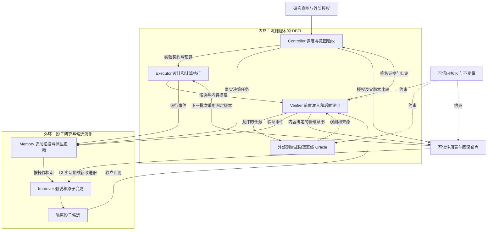

# 基于五机双循环与因果账本的下一代受控自演进科学智能体（RSI-AI4S）系统架构规范

版本：1.0 · 日期：2026-09-12 · 类型：研究架构提案与可证伪实验规范

关联任务：`task_7f468fc6c6675ccf9242005aef`。本文件是第 8 章的理论补充，不代表系统已经实现、实验已经复现或架构裁定已经接受。文中 MUST 表示拟议系统的强制契约，SHOULD 表示可有理由偏离的建议；这些词不扩大当前任务权限。

## 摘要

固定表征与固定搜索规则能够提供可重复的科学计算，却不能保证其假设覆盖目标适应度景观。本规范提出把科学任务执行与研究系统变更分离：Executor、Verifier、Controller 形成 Design–Build–Test–Learn（DBTL）内环；Memory 与 Improver 形成以可证伪诊断、原子变更和独立评测为中心的外环。两环共享版本化事件证据，但不共享写权限。本文给出五机服务接口、混合状态机与转移矩阵、反事实归因协议、信息价值目标、晋级与回滚事务，以及约束保持的条件性证明。核心边界是：不可修改的评测权限不等于评测永远正确，事件血缘不等于因果识别，有限代性能上升不等于严格递归自我改进。近期目标为受控 L2 系统演化；L3 必须另行证明新改进器进入下一代、资源归一后的改进能力增长与跨任务保留。本规范不新增蛋白质实验结果，也不提供湿实验操作流程。

## 1. 证据来源与研究问题

### 1.1 指定材料的提炼与使用边界

| 来源 | 提炼出的机制 | 本规范如何使用 | 不支持的推论 |
|---|---|---|---|
| Brain 五机笔记 [B1] | 三机内环、记忆与改进外环、假设与补丁成对、影子回归 | 五机职责与权力隔离 | 五机是公认标准；架构已证明 RSI |
| Brain EaaS 笔记 [B2] | 固定服务隔离可变对象；研究者整体版本化 | 契约、调用信封、谱系与注册回下一代 | 接口服务化本身产生因果识别 |
| Brain OpenRSI 笔记 [B3] | 四类操作、执行反馈、按操作检索经验 | 将草拟、改进、调试、重组作为候选操作 | 论文分数能直接迁移到蛋白质任务 |
| Harness 系列 06 草稿 [B4] | 意图与局部执行分层、验收返回原始证据 | Controller 的意图验收与证据抽样 | 某个具体模型在所有场景最适合任 CEO |
| 本项目报告第 8 章 [P1] | 表征瓶颈、四假说、五机及路线图 | 转为诊断实验、形式化契约和交付阶段 | 该章愿景已经是经证明的系统能力 |

公开一手资料核对了 OpenRSI 的四算子与受限元进化定位；项目明确没有宣称解决通用 RSI。[OpenRSI 官方仓库](https://github.com/FrontisAI/OpenRSI) 本次未复现其训练或基准。另有来源差异：B3 frontmatter 的作者列表以 Ruihan Qin 开头，而当前 arXiv v1 页面与官方仓库引文以 Junlin Yang 开头；本文参考文献采用后一署名。arXiv 摘要使用 OpenMLE-RL，代码目录使用 OpenMLE-ERL，二者不能被误写成两套独立训练系统。[Frontis-MA1 原文摘要](https://arxiv.org/abs/2607.28568v1)

本次只读取 P1 第 8 章，没有检查实验原始数据和实现源码，故不能独立确认 AAV 平台期的主因，也不能给现有组件作已实现能力认证。源文件摘要和内容哈希见同目录 `source-manifest.json`；外部文献为访问时核对，链接可能后续变化。

### 1.2 修正第 8 章的论证强度

第 8 章所说的瓶颈应限定为“固定的低阶假设类可能存在表达误差”。确定性是相同输入产生相同输出的性质，与函数表达阶数没有必然关系；确定性算法同样可以计算复杂的高阶模型。成对模型也是受限假设类，不能保证解释全部高阶相互作用。蛋白质景观中的上位效应为研究动机提供领域依据，但不能单独证明本项目某次停滞的原因。[Wu 等，2016 原始研究](https://pmc.ncbi.nlm.nih.gov/articles/PMC4985287/)

本规范将四个强断言改为可检验命题：结构化记忆是否减少重复错误与上下文成本；有干预支持的归因是否优于直接超参数搜索；分相晋级是否减少评测篡改与回归；决策相关信息价值是否在同预算下提高发现收益。不声称探索税已达理论下界、任意景观上全局收敛、数学上完全免疫 Goodhart，或代理分数就是物理真值。

## 2. 对象、时间尺度与自演进等级

令候选序列为 \(s\in\mathcal X\)，真实实验响应为 \(f^*(s,e)\)，其中 \(e\) 表示环境和测量条件。观测 \(y=f^*(s,e)+\epsilon\) 可能含批次效应、异方差和检测限。\(D_t\) 保存截至内环轮次 \(t\) 可用的观测、缺失机制和测量来源。预测模型 \(\hat f_{\theta_k}\) 只是代理，代际版本 \(k\) 在一个内环实验周期内冻结。

完整可执行系统定义为

\[
A_k=(E_k,V_{\mathrm{dev},k},C_k,M_{\mathrm{view},k},I_k,\theta_k,\rho_k),\qquad
K=(V_{\mathrm{root}},\mathcal I,\mathrm{ACL},\mathrm{registry},\mathrm{auditRoot}).
\]

\(\rho_k\) 包含提示、工具 schema、依赖、运行时与预算政策；\(K\) 是不受候选修改的可信内核。记忆视图可优化，原始证据的持久化与完整性根属于 \(K\)。开发验证器可提出新检查，但正式评价指标、准入门和隐藏数据在一个评测周期内由 \(K\) 固定。五机是逻辑角色，未要求五个模型、五个进程或五套微服务。

本规范沿用 B1 的证据等级：L2 表示受控的持久系统组件改进；L3 表示改进器自身变更且用于后续代际研究。它们与 B1 的四种“修改表面层号”不同，为避免混淆，后者在本文记为 P（提示）、T（工具）、H（调度/算法）、R（改进与检索规则）。

普通演化为 \(A_{k+1}=\operatorname{Select}(I_0(A_k),A_k)\)。具备递归接口的演化为

\[
(A'_k,I'_k)=I_k(A_k,I_k;\mathcal F_k,B_k),\quad
(A_{k+1},I_{k+1})=
\begin{cases}(A'_k,I'_k),&G_k=1,\\(A_k,I_k),&G_k=0.\end{cases}
\]

其中 \(\mathcal F_k\) 是被允许读取的证据切片，\(B_k\) 是研究预算，\(G_k\) 是独立晋级判据。该递推只定义递归依赖，没有证明 \(I'_k\) 更强。MUST 在注册表与下一代执行信封中核实实际加载的 \(I_{k+1}\) 摘要，不能以改进器自述代替加载凭证。

## 3. 五机双循环拓扑与 DBTL 映射



Design 由 C 明确目标、约束和停止条件，E 在受限空间设计候选；Build 表示生成计算工件或提交受授权实验请求；Test 由 V 对接独立评价与测量；Learn 由 M 保存数据、E 更新本轮允许训练的参数，C 决定下一轮。I 的职责是改变“以后如何学习与搜索”，而不是每遇到低分就修改生产代码。参数拟合属于当前算法内环，假设类、特征管线或拟合规则的变更属于外环。物理测试可跨多个软件轮次异步返回，所有结果绑定提交时版本。

Controller 的 CEO 语义层持有任务意图、候选摘要、反证与预算；状态机执行层依据结构化证书驱动转换。语义层可以判定候选偏离研究目标，但不能覆盖硬性拒绝；所谓强模型负责判断是来自 B4 的组织经验，模型选型仍需独立任务评测。M 不是永久正确的知识库：新的反证保留旧事实并追加限定或纠正事件，派生检索视图显示当前证据状态。

## 4. EaaS 五机接口契约

### 4.1 公共调用信封

所有服务调用 MUST 带有下列字段；CLI、本地进程与远端 API 都可以实现同一逻辑契约。

```text
ExecutionEnvelope {
  schemaVersion, requestId, idempotencyKey,
  taskRef, decisionClaimRef, actorPrincipal, capabilityRef,
  generation, serviceVersion, parentArtifactDigest,
  inputArtifactDigests[], datasetSplitRef, evaluationProtocolDigest,
  environmentDigest, seedSetRef, resourceReservationRef,
  deadline, traceId, expectedRegistryVersion
}
ServiceResult {
  requestId, status, outputArtifactDigests[], provenanceRef,
  resourceUsage: {tokens, cpuSeconds, gpuSeconds, wallSeconds, money, assays},
  error: {code, retryable, evidenceRef}, completedAt
}
```

字段必须被调用服务验证，而非信任调用者声称的权限。摘要指向完整内容；路径只是定位器。错误码最少包括 `INVALID_INPUT`、`PERMISSION_DENIED`、`STALE_PARENT`、`BUDGET_EXCEEDED`、`EVALUATOR_FAILURE`、`INVARIANT_VIOLATION`、`TIMEOUT`。评价器失败不是生物学低适应度，MUST 独立计数。随机种子有助于回放但不保证远端模型、硬件或物理实验完全确定；不可确定来源必须标注。

### 4.2 接口定义与读写权限

| 机器/操作 | 输入 | 输出与后置条件 | 写权限和禁止项 |
|---|---|---|---|
| E `execute(plan)` | 冻结版本、可见数据、候选空间、预算令牌 | 候选工件、运行回执、失败签名；不自行标注通过 | 仅工作沙箱与自己工件；无评测答案、生产注册表写权限 |
| V `preflight(candidate)` / `evaluate(pair)` | 内容固定的候选、父本、评价协议 | 前置许可或拒绝；独立评分、置信区间、校验摘要 | 只写评价证据；根评测与隐藏集对 E/I 不可写不可读 |
| C `schedule(intent)` / `promote(cert)` | 研究目标、证据、余额、有效证书 | 任务计划、预算保留、版本交换或拒绝理由 | 在授权范围写计划和请求晋级；无权伪造 V 证书 |
| M `append(event)` / `query(slice)` | 身份、版本预期、证据对象；查询按算子与权限 | 追加确认、内容 pin、有出处的最小证据包 | 追加事件及可重建视图；禁止覆盖原始测量、跨 split 泄漏 |
| I `propose(hypothesis)` / `mutate(parent)` | 失败族、候选因果模型、授权修改面 | 可证伪假说、原子 diff、预期效应、评测计划、回滚父本 | 只写候选分支；无自批准、扩权、改根评价器能力 |

`preflight` MUST 在外部副作用发生前校验候选摘要、合法请求和资源；`evaluate` 在执行后校验结果与目标。单一后置门无法撤销已发生的物理副作用。服务发现清单还应公布输入 schema 摘要、兼容范围、隔离等级、所需权限和可用性；不要求为了命名而部署网络微服务。

### 4.3 候选与晋级证书

候选包 MUST 包含 `hypothesisRef`、`parentDigest`、`mutationSurface`、`diffDigest`、`dependencyLockDigest`、`expectedEffect`、`falsifier`、`rollbackRef`、`evaluationPlanDigest`。重组候选保存两个父本，且将无法拆分的联合作用作为整体干预，不能把其增益任意分给单个修改。

V 证书绑定候选、父本、数据切分、协议、环境、资源计量、结果、签发者及有效期。C 调用 compare-and-swap 仅当生产父摘要和预期版本仍相等才生效；过期候选需重评，禁止静默套用到新父本。并发预算先保留再消费再结算；进程重试不能重发物理实验，幂等键必须贯穿外部适配器。不确定是否已执行的请求进入人工/外部对账状态，不以自动重试推测。

## 5. 五机状态机与数学转移矩阵

### 5.1 内环：受观测约束的离散控制

状态取

\[
z_t=(q_t,D_t,b_t,r_t,\theta_k,\ell_t),\quad
q_t\in\{P,X,V,L,H\},
\]

分别为 Plan、Execute、Verify、Learn、Halt；\(b_t\) 是剩余资源向量，\(r_t\) 为累计风险状态，\(\ell_t\) 为账本位置。E 在 X 状态内先产生候选并取得 V 的 preflight 许可，再执行副作用；V 状态负责后置验证。\(D_t\) 只合入具有来源和质量标签的观测；有质量问题的数据保留原件并隔离，而不是删除。

以行表示源状态、列表示目标状态，允许边的邻接矩阵为

\[
\mathsf A_{\mathrm{in}}=
\begin{array}{c|ccccc}
 &P&X&V&L&H\\\hline
P&0&1&0&0&1\\
X&0&1&1&0&1\\
V&1&0&0&1&1\\
L&1&0&0&0&1\\
H&0&0&0&0&1
\end{array}.
\]

该矩阵是允许性关系，不是概率转移矩阵。实际动作必须满足守卫：P→X 需要有效意图、版本固定和预算保留；X→X 仅允许有界等待或同一幂等请求的计算重试；X→V 需工件和回执完整；V→L 需结果验证通过；V→P 仅用于可修复且无未决副作用的失败；L→P 需完成证据追加；任一非终态在超时、资源耗尽、完整性或硬约束失败时转 H。停止守卫优先于所有正常守卫。H 不在同一运行内自行恢复；恢复要创建新的、外部授权的运行实例。

\[
a_t=\pi_C(z_t;\theta_k),\quad
z_{t+1}=F_K(z_t,a_t,o_{t+1}),\quad
b_{t+1}=b_t-c_t\succeq0,\qquad \theta(t)=\theta_k.
\]

这里 \(o_{t+1}\) 包含执行结果与验证证据，所有成本包含失败和重试。冻结条件只约束算法版本；若算法契约允许依据 \(D_t\) 拟合参数，则拟合所得参数快照必须单独版本化。软件失败可以调试，生物学负结果进入正常学习，二者不可混为一个 reward。

### 5.2 外环：诊断、候选、影子、晋级、回滚

状态为 \(\{O,D,S,G,C,R,H\}\)：Observe、Diagnose、Shadow、Gate、Canary、Rollback、Halt。

\[
\mathsf A_{\mathrm{out}}=
\begin{array}{c|ccccccc}
 &O&D&S&G&C&R&H\\\hline
O&1&1&0&0&0&0&1\\
D&1&0&1&0&0&0&1\\
S&0&1&0&1&0&0&1\\
G&1&0&0&0&1&0&1\\
C&1&0&0&0&0&1&1\\
R&1&0&0&0&0&0&1\\
H&0&0&0&0&0&0&1
\end{array}.
\]

O→D 的触发器包括多个窗口净收益低、重复错误率高或校准漂移，并需要剩余诊断预算；平台期本身不是因果结论。D→O 表示证据不足或不值得修改；D→S 需要已登记的假说、干预计划与变更范围。S→D 的重试计入候选搜索总预算。G→C 需要独立证书、语义验收与原子版本交换；G→O 表示拒绝并保留失败证据。C→O 表示完成预定观察窗口；C→R 表示回归或运行完整性异常；R→O 需恢复可验证的父版本，否则 R→H。

五机参与关系由如下职责矩阵表示，1 表示主要责任，a 表示辅助证据提供：

| 外环状态 | E | V | C | M | I |
|---|---|---|---|---|---|
| O | a | a | 1 | 1 | a |
| D | 0 | a | a | 1 | 1 |
| S | 1 | 1 | a | a | 1 |
| G | 0 | 1 | 1 | a | 0 |
| C | 1 | 1 | 1 | a | 0 |
| R/H | 0 | 1 | 1 | 1 | 0 |

外环可以并行运行影子计算，但只能在内环批次提交边界改变生产版本。至少设置一个完整批次的驻留期，具体窗口由延迟和漂移诊断确定，避免短时噪声导致版本抖动。时间尺度分离有助于解释和控制，但在未知非平稳景观中不构成一般稳定性证明。

## 6. 因果事件拓扑与 Fact–Decision DAG

### 6.1 三种不同的图

MUST 区分运行事件图、治理关系图和科学因果图。事件图记录哪个输入导致哪次计算被调度；治理图记录事实如何支持决策、决策如何派生任务；科学因果图表达对可干预机制的假设。只有第三种图在明确识别条件下才允许解释 `do` 干预效应。所有图采用不可变修订节点；同一语义对象的新修订可以指向旧修订，不能覆盖旧节点来制造环。


图中箭头表示概念上的证据与工作流方向，不是可直接写入 Harness 的关系类型。规范事件结构为

```text
Event {
  eventId, entityRef, revision, parents[], logicalSequence,
  actor, occurredAt, recordedAt, kind, payloadDigest,
  inputDigests[], outputDigests[], protocolDigest, splitLabel,
  generation, resourceUsage, evidenceStatus, signature
}
Fact {
  factId, statement, population, conditions, measurementRef,
  estimate, uncertainty, sourceDigest, evidenceGrade, limitations
}
Decision {
  decisionId, question, chosen[], rejectedWithReasons[], claimRefs[],
  evidencePins[], authority, acceptanceStatus, falsifier, downstreamRefs[]
}
```

哈希 \(h_v=H(\operatorname{canon}(payload_v)\Vert\operatorname{sort}(parentDigests_v))\) 配合外部锚点和权限控制，使事后修改可检测。仅有哈希链不阻止拥有所有写权限的人重写整条链，也不能证明数据测量正确。MUST 使用追加存储、分离签名权限、定期外部锚定与可恢复备份。时间戳不决定科学因果方向；并发事件用逻辑序号与父依赖确定回放顺序。

### 6.2 从观察到反事实证据

设模型假设类为 \(A\)，采样策略为 \(Q\)，门禁为 \(G\)，任务景观为 \(Z\)，随机性与批次为 \(U\)，终端效用为 \(Y\)。候选结构因果模型为

\[
D_{t+1}=f_D(D_t,A,Q,G,Z,U_t),\qquad
Y=f_Y(D_{0:T},A,Q,G,Z,U_{0:T}).
\]

观察“换模型后更好”会同时受后续采样分布、预算和数据量影响。归因目标必须预先确定：固定同一历史数据衡量表征的直接预测效应，或从同一初始数据重新运行闭环衡量策略的总效应。把前者直接解释成后者会忽略干预改变采样的中介路径。干预与条件观察的区分遵循结构因果分析的基本框架。[Pearl，《Causality》作者资料](https://bayes.cs.ucla.edu/BOOK-2K/)

对冻结的任务块与初始快照做成对重复，令

\[
\widehat\tau_A=\frac1n\sum_{j=1}^n
\left[Y_j(\operatorname{do}(A=a_1),Q=q_0,G=g_0)
-Y_j(\operatorname{do}(A=a_0),Q=q_0,G=g_0)\right].
\]

共享的是任务块、初始可见数据和随机种子方案，不强制不同策略访问相同后续样本。采用同预算策略可估计该任务分布下的平均系统效应，不能给某条历史运行补造未曾观测的真实反事实。观察研究需给出可交换性、正值性、一致性等识别前提；缺少支持时，输出“未识别”，不生成高置信因果事实。

### 6.3 AAV 平台期的诊断实验矩阵

| 竞争假说 | 最小隔离干预 | 核心读数 | 反证与混杂控制 |
|---|---|---|---|
| 表征表达不足 | 固定训练快照，比较预登记假设类 | 分组留出误差、校准及尾部排序 | 新模型无稳定增益；控制训练算力和数据量 |
| 采样规则病理 | 固定模型族，从同一初始状态重跑采样策略 | 同预算发现曲线、有效样本比例 | 仅增加预算有效；不得偷用未来 oracle 标签 |
| 门禁过窄 | 仅在离线环境对软知识门作消融 | 被过滤候选的机会成本与覆盖率 | 硬安全门不可参与关闭消融；无覆盖改善则否定 |
| 测量/切分问题 | 固定模型策略，核对批次和相似性分组 | 漂移、缺失率、跨组性能 | 清洗改变标签定义时必须作为独立干预 |

第一轮比较单因素，发现交互后再做预登记的 \(2\times2\) 模型族×采样策略实验。交互量 \(\tau_{AQ}=Y_{11}-Y_{10}-Y_{01}+Y_{00}\) 用来防止把联合效果全部归给表征升级。所有比较只是计算科学验证，不从 AAV 标识推导具体湿实验操作或临床效用。

### 6.4 映射到当前 Harness

本规范新增的 Hypothesis、Patch、Evaluation 是逻辑 schema，不代表当前已注册实体种类。初期可作为任务工件保存并以内容 pin 引用。实际治理 MUST 使用当前目录声明的关系：`task --produces--> fact`；`decision/<claim> --evidenced-by--> fact`。后一关系的存储方向与上图“事实支持决策”的叙事方向相反。决策直接派生任务时使用 `derives`，事后关联用 `relates`，决策修订才用 `refines`；写入前确认三元组有效。发现新关系需求先由独立架构裁定授权，不能为适配图示绕过 schema。

事实默认追加：测得某指标、读到何种来源差异、验证了什么产物可成为 Fact；“应当采用五机”“可以实现严格 RSI”属于判断或假说，不能冒充实测 Fact。本文提出的架构也不因文档被提交而自动成为已接受 Decision。

## 7. 信息价值、探索税与资源约束

定义终端决策效用 \(U(d,f)\)，当前最优贝叶斯决策价值为

\[
V(D)=\max_{d\in\mathcal D}\mathbb E[U(d,f)\mid D].
\]

对候选实验批次 \(B\)，净信息价值定义为

\[
\operatorname{VoI}(B\mid D)=
\mathbb E_{y_B\mid D}[V(D\cup\{B,y_B\})]-V(D)-\lambda^\top c(B).
\]

成本向量分别记录计算、token、时间、资金和实验次数，权重 \(\lambda\) 的单位与业务偏好需事先登记，不能把不同资源直接相加。若代理后验失配，则 VoI 是模型条件下估计，可能自信但错误；须保留校准诊断与分布外拒绝机制。

互信息 \(I(f;y_B\mid D)=H(f\mid D)-\mathbb E[H(f\mid D,y_B)]\) 衡量不确定性缩减，可作为近似采集指标，但“知道更多”不一定改变最终决策。成本归一的信息增益不等价于净 VoI。对有限离线候选池可比较蒙特卡洛估计的决策增益与互信息代理，不能凭术语替代数值验证。

实际选择遵守

\[
B_t\in\arg\max_{B\subseteq\mathcal X_{\mathrm{admissible}}}
\widehat{\operatorname{VoI}}(B\mid D_t),\quad
c(B)\preceq b_t,\quad
\Pr(g_j(B)<0\mid D_t)\le\delta_j.
\]

其中概率约束是需要校准的风险估计，MUST 与不可协商的硬准入条件相交。未知约束的安全优化理论依赖特定正则性、初始安全集合与置信假设，不能直接搬成未知蛋白质景观的绝对保证。[Sui 等，SafeOpt，2015](https://proceedings.mlr.press/v37/sui15.html)

“探索税”在本文操作化为成对同预算下，探索政策相对登记的利用基线在早期累计已观测效用上的差额，并同时报告后期终端收益。它可能为负；不把它当普适非负常数。若声称压低探索税，必须固定预算、起始集、测量定义和比较窗口，报告早期损失与最终收益的联合区间。历史数据中没有被测量的池外候选不得被补成零分。

## 8. 晋级门、统计验证与递归增益

### 8.1 三层数据隔离与固定比较

数据至少分为开发集、晋级验证集、封存审计/迁移集。生物序列按预定相似性组、变异距离或批次进行适用的隔离；确切分组方案取决于数据特征，本任务未审计数据，不虚构分组已经完成。相同序列不同 ID、家族近邻和跨轮记忆摘要都可能造成泄漏，去重必须覆盖可读取记忆与外部工件。

开发集支持反复诊断；晋级验证集仅通过受控接口提供有限反馈，记录查询次数；封存审计集只在预定里程碑打开。只读不防自适应过拟合，反复查询同一隐藏基准仍会消耗其独立性。评价协议必须预注册候选上限、最小有意义效应 \(\epsilon\)、置信预算、非劣界与缺失处理；用独立任务块作统计单元，不能把同一轨迹中的样本当作独立重复。

### 8.2 可计算的晋级函数

设 \(\Delta U\) 为候选相对父本的成对效用增益，\(\Delta C\) 为成本变化，\(\Delta\Omega\) 为可维护性复杂度变化。复杂度分别记录代码规模、依赖数、提示 token 和状态数，权重在看到结果之前固定。拟议门为

\[
G_k=\mathbf1\{\text{integrity}\land\text{invariants}\land\text{independentReview}\}
\mathbf1\{\operatorname{LCB}_{1-\alpha_k}(\Delta U-\lambda^\top\Delta C-\mu\Delta\Omega)>\epsilon\}
\mathbf1\{\forall j,\operatorname{LCB}_{1-\alpha_{k,j}}(\Delta U_j)\ge-\eta_j\}.
\]

第一项是硬门，后两项是预登记的资源调整收益与关键子组非劣门，不能用高平均收益购买硬违规。采用单侧置信区间并分配总体错误预算，例如 \(\sum_k\alpha_k+\sum_{k,j}\alpha_{k,j}\le\alpha_{\mathrm{total}}\)，前提是各检验本身在所用选择与采样机制下有效；该记账不能修复无效 p 值。重复查看结果必须使用适当的序贯方法或固定停止日；没有足够样本时结论是“不确定”，不得把不显著当作等效。

资源允许时用任务块的配对重采样估计区间，报告任务数、种子数和两种方差，不能凭增加同一任务种子数替代跨任务覆盖。样本量由预实验方差和 \(\epsilon\) 决定，文档不杜撰功效数值。若使用严格 Pareto 晋级，则所有目标不劣且至少一个改善；上式有加权权衡与非劣容忍，不能称为严格 Pareto 优越。

### 8.3 L3 必须额外验证研究者

对相同起始系统集合 \(\mathcal A\)、任务分布 \(\mathcal T\) 与总预算 \(B\)，定义

\[
J(I;\mathcal A,\mathcal T,B)=
\mathbb E[U(\operatorname{ChampionAfterSearch}(I,A,T,B))-U(A)],
\quad \Gamma_k=J(I_{k+1})-J(I_k).
\]

\(J\) 评价完整搜索与候选选择后的保留结果，计算所有失败、调试、诊断、模型调用和正式评价成本。\(\Gamma_k>0\) 才与“改进器变强”有关；必须用匹配的起始状态对照，不能给新改进器更多数据或更好初始系统后归因于递归能力。

递归组与固定 \(I_0\) 组从相同初始系统运行多个预登记代际，比较每代 \(\Gamma_k\)、净收益曲线、保留率、跨任务迁移和累计开销。允许代际效应衰减或失败；多代复合增益只是研究结果，不预设指数增长。代数 \(U_K-U_0=\sum_{k=0}^{K-1}(U_{k+1}-U_k)\) 只是恒等式，不是复利证明。新 improver 实际加载证据与其效用评价缺一不可。

## 9. 绝对不变量与自毁免疫机制

### 9.1 “绝对”的准确含义

绝对不变量表示在授权系统模型内不能被候选优化权衡掉的条件。物理规律不因软件修改而改变，但软件传感、模型和检查器可能误判；本系统无法证明任意未知生物后果都安全。可信内核不可由 RSI 候选改变，正常维护则通过独立外部流程创建新的内核版本和评价周期，不能把“永久冻结所有软件”作为可靠性策略。

| 不变量 | 执行位置 | 验收证据 |
|---|---|---|
| 根评测、隐藏标签及签名密钥不进入候选写权限 | OS/容器权限、服务身份、只读镜像 | 越权故障注入被拒及审计记录 |
| 未经前置准入不产生外部副作用 | 适配器能力令牌与请求摘要 | 伪造/过期令牌不能执行 |
| 原始测量、物理单位和实验边界不可被改写为有利指标 | 数据入口、单位检查、协议 pin | 原始数据可追溯；单位冲突直接拒绝 |
| 预算余额不可为负，运行不得无限自递归 | 外部配额、超时、递归深度上限 | 重试、并发和子调用合计仍受限 |
| 候选不能自己签发晋级授权 | 独立 V 身份、C 授权与注册表 CAS | 自签、旧证书、父版本冲突被拒 |
| 已承诺版本与恢复路径可校验 | 内容寻址工件、环境锁和回滚快照 | 恢复演练可重现软件服务契约 |

物理守恒、单位一致性和仪器量程只能在其适用条件下作为检查项，不能拿“能量守恒”直接判定序列活性或风险。硬条件未知或无法观测时转入停止/外部判读，不由语言模型补造通过结果。知识库中经验性“不可行序列模式”属于可研究的软门，未经验证不得提升为永远正确的物理定律。

### 9.2 条件性保持命题

令安全状态集合为 \(\mathcal S_K=\{z:\bigwedge_i\mathcal I_i(z)\}\)。假设：初态在 \(\mathcal S_K\)；所有可产生副作用的通路都经过 K；权限隔离与验证实现满足各自契约；每个允许转换满足 \(z\in\mathcal S_K\Rightarrow F_K(z,a,o)\in\mathcal S_K\)；超时和验证失败进入也属于安全集合的 H。则对所有有限步 \(t\)，\(z_t\in\mathcal S_K\)。证明仅是初态成立加一步封闭性的归纳。

负担在于验证“每条实际转换受守卫约束”，不是公式本身。该命题不保证发现更优蛋白、不保证代理校准、不保证黑箱评价器无漏洞、不覆盖 OS 失陷、恶意管理员和未建模物理效应。“自毁免疫”因此是针对已建模违规和软件自破坏的可验证遏制机制，而非无条件安全定理。

### 9.3 攻击与失效矩阵

| 失效机制 | 检测和遏制 | 残余风险 |
|---|---|---|
| 修改打分脚本伪造增益 | 根评价器异身份、哈希 pin、独立重算 | 原评价指标本身不代表目标 |
| 隐藏集经日志或记忆泄漏 | 结果脱敏、split 标签传播、查询预算 | 聚合反馈仍会自适应泄漏 |
| 提示规则堆积和依赖膨胀 | 复杂度惩罚、最小 diff、回归 | 复杂度指标不等价于可理解性 |
| 删除失败、改写事实 | 追加账本、外部锚点、纠正事件 | 上游测量可能已被污染 |
| 改进器移除门禁或扩大工具权限 | 权限允许列表及不可继承特权 | 隔离设施漏洞 |
| 晋级后性能回退或服务失活 | Canary、外部看门狗、恢复父版本 | 检测延迟造成已发生损失 |
| 并发晋级与计费竞态 | CAS、预算保留、幂等提交 | 外部服务无法完整支持幂等 |

### 9.4 回滚是一项恢复事务

回滚顺序为停止新调度、撤销未使用能力令牌、对账在途请求、恢复父版本及环境、检查读写 schema 兼容、独立验证健康、追加回滚事件、再开放新批次。账本与已经获得的观测不回滚；新观测带版本标记，若不能用于父模型则隔离保存。修改存储格式的候选必须提供兼容读取或影子迁移方案，Git revert 不能恢复数据库、外部服务状态或已经完成的实验。

Canary 在近期阶段仅用于计算环境和离线任务。软件回滚不能逆转已发生的物理过程，未来接入物理系统必须依靠前置约束与外部应急控制；本规范不把它纳入自动部署权限。

## 10. 可复核实验方案与四假说验收

| 假说 | 对照设计 | 主要终点 | 失败判据 |
|---|---|---|---|
| H1 状态与上下文解耦 | 同模型预算，完整历史 vs 按操作证据切片 | 单位成本成功率、重复错误率、出处覆盖 | 无净改善或关键反证丢失 |
| H2 账本支持归因 | 平台期任务，直接搜索 vs 竞争假说干预 | 对可控植入故障的诊断准确率与后续效用 | 解释好听但选错干预；不能识别混合故障 |
| H3 分相受控演化 | 固定算法 vs L2 外环；门禁做故障注入 | 净发现收益、越权拦截、回归恢复时间 | 增益来自预算膨胀或评价污染 |
| H4 决策信息价值 | 同起始集同预算，利用、信息增益、VoI 近似 | 最终效用和早期探索税联合报告 | 只缩减无关熵或显著增加无效实验 |

实验首先在有可控机制的合成景观验证归因，再在项目的离线蛋白质任务验证迁移；合成高阶项能说明诊断是否识别植入机制，不能证明真实 AAV 遵循同一生成模型。使用至少模型族×策略的匹配消融，明确从未读取的测试标签；数据分组与成本审计通过之后才能生成正式科学结论。

研究报告必须公开失败候选数量、所有资源开销、评价失败和缺失、选择偏差处理、任务/种子层统计、环境与版本 pin。归因解释由独立人员或评价器检查其证据是否支持，不以解释文本长度或模型自信作为成功指标。首次研究应保留固定 improver 基线；若没有递归组实际加载记录和 \(\Gamma\) 的独立检验，只能发表 L2 结果。

## 11. 工程落地阶段与 CEO 三条核心结论

阶段一建立 EaaS 最小契约与可信边界：把当前能执行的计算流程包装成版本固定的服务，接入原始证据、Fact 与任务产物，完成预算、幂等、越权与回放验收。此阶段不需要自改模型；关键出口是证据与执行权限可区分。

阶段二开放单一 L2 修改面：先让 Improver 提出一类原子变更，在冻结数据与协议下比较父本，完整经历影子评价、独立审查、批次边界晋级、失败留存和恢复。出口为同预算净增益及跨任务非劣证据，失败时保留当前版本。阶段三再研究 R 修改面与 L3：新改进器作为完整 Agent Service 注册回下一代，以固定改进器对照验证研究效率。物理系统接入和广义自主发现另立任务，不能凭离线验证自动获得权限。

供 CEO 决策的三条结论如下；它们是本任务的建议，尚非已接受的治理裁定。

1. **近期先批准可审计的 L2 演化实验。** 五机双循环应以版本、权限和证据接口落地；是否增加模型复杂度由同预算干预结果决定。进入 L3 的前提是能实际版本化、注册和独立评价 Improver，不能以多轮循环作为替代。
2. **优先建设证据与独立评测边界。** 账本负责保留事实、反证和决策理由；因果结论由对照干预支持。根评价器与隐藏数据不可由候选更改，同时需约束重复查询、审计指标错位和记录评价失败，防止只读基准仍被过拟合。
3. **以净科学效用与恢复能力验收。** 同预算发现、保留、迁移、研究者增益一起报告；安全硬门不参与性能权衡。只有原子晋级与恢复演练通过才扩大修改面，不能从 AAV 平台期或单次更高分推导通用 RSI 已成立。

## 12. 限制、未决问题与第 8 章接入方式

本规范的贡献是工程综合与形式化，不是新算法优越性定理。尚待研究的负担包括：真实景观的因果可识别性，适应性搜索下稳健的统计评价，物理响应与离线代理的外推误差，黑箱模型版本漂移，记忆压缩对反证的丢失，以及复杂度和科学效用之间的权重选择。未执行新实验，因此没有虚构置信区间、RSI 增益或安全拦截率。

第 8 章可将本文作为附录：8.1 的确定性归因改为固定假设类限制；8.2 对应第 10 节的四项预注册假说；8.3 引用第 3–6 节接口、转移矩阵与三图分离；8.4 对应第 11 节有出口条件的分阶段路线。对“不可篡改”“数学免疫”“热部署”的描述分别限定为威胁模型内可检测的追加证据、条件不变量保持、批次边界的原子版本交换。本任务没有修改原科学报告，避免把研究建议悄然写成既成结论。

## 参考文献与本地来源

[B1] 内部架构笔记：《RSI：智能体递归自我改进的五机架构与 Meta-Improver 设计》，2026-08-28，更新 2026-09-09。路径：`/Users/lizeyu/Documents/ZeYu-AI-Brain/03-KNOWLEDGE/01-READING/01-DOMAINS/Agent-RSI/2026-08-28-rsi-five-machine-meta-improver-architecture.md`。

[B2] 知识库综合笔记：《从 Self-Evolve 到 RSI：Everything as Service 与递归改进接口》，2026-08-05，更新 2026-09-09。路径：`/Users/lizeyu/Documents/ZeYu-AI-Brain/03-KNOWLEDGE/01-READING/01-DOMAINS/Agent-RSI/2026-08-05-from-self-evolve-to-rsi-everything-as-service.md`。本文使用已给定本地笔记，不将其综合框架作为领域标准。

[B3] 论文笔记：《OpenRSI：把递归自我改进收缩为可执行的元进化闭环》，2026-08-17。路径：`/Users/lizeyu/Documents/ZeYu-AI-Brain/03-KNOWLEDGE/01-READING/01-DOMAINS/Agent-RSI/2026-08-17-openrsi-executable-meta-evolution-loop.md`。作者元数据与一手来源的差异见第 1 节。

[B4] 内部文章草稿：《最强的模型不写代码，只管人》。路径：`/Users/lizeyu/Documents/ZeYu-AI-Brain/06-PERSONAL-DOCS/06-生活记录/文章创作/drafts/Harness系列-06-最强的模型不写代码只管人（精修稿）.md`。作为组织经验来源，不用其模型评价作普适能力结论。

[P1] 本项目：《面向蛋白质定向进化的受控自演进科学智能体研究报告》，`reports/scientific_report_v1.0.md`，仅第 8 章；本次工作树文件不是已核验的原始实验。

[R1] Yang, Junlin, et al. *Frontis-MA1: Training an AI4AI Model towards Recursive Self-Improvement in Machine Learning Engineering*. arXiv:2607.28568v1, 2026. [论文](https://arxiv.org/abs/2607.28568v1)。本次核对摘要与元数据，未独立复现实验。

[R2] FrontisAI. *OpenRSI / OpenMLE*. [官方仓库](https://github.com/FrontisAI/OpenRSI)。本次核对 README 的机制定位、接口与引文；不作为独立复现证据。

[R3] Pearl, Jude. *Causality: Models, Reasoning, and Inference*, 2nd ed., 2009. [作者资料](https://bayes.cs.ucla.edu/BOOK-2K/)。支持观察、干预与反事实的概念区分，不证明本文具体因果模型正确。

[R4] Sui, Yanan, et al. *Safe Exploration for Optimization with Gaussian Processes*. ICML, PMLR 37:997–1005, 2015. [论文入口](https://proceedings.mlr.press/v37/sui15.html)。用于限定安全优化保证的假设边界。

[R5] Wu, Nicholas C., et al. *Adaptation in protein fitness landscapes is facilitated by indirect paths*. eLife, 2016, 5:e16965. [原始研究全文](https://pmc.ncbi.nlm.nih.gov/articles/PMC4985287/)。支持上位效应与适应路径的领域动机，不替代本项目因果诊断。
