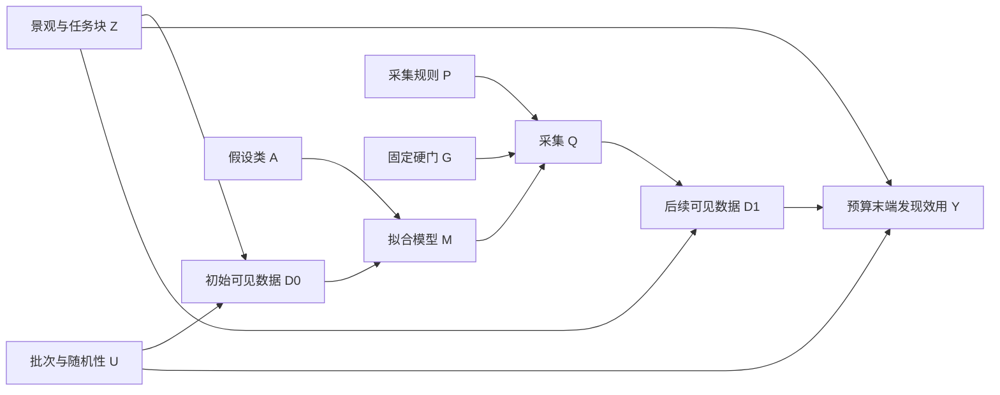
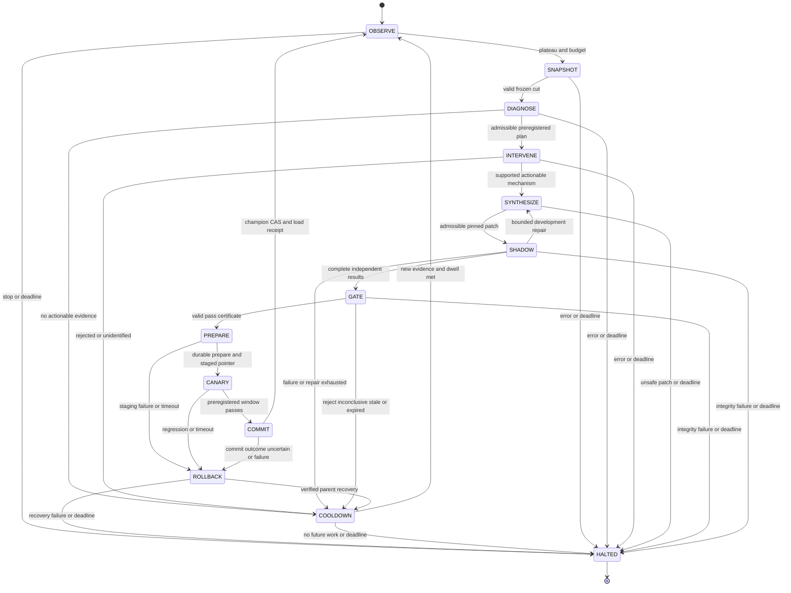

# 因果反事实归因状态机与影子沙箱自演进工程蓝图

版本 1.0 · 2026-09-12 · 任务 `task_ad43836db4be99ab3e3b1cebd5`

本蓝图是待实施、待独立审查的架构提案。交付范围为计算平台的设计规范、可执行数据契约和静态验收证据；没有运行新的蛋白质实验，没有证明平台期原因，也没有部署自动修改生产代码的服务。MUST 是拟议实现的强制要求，不扩大当前任务授权。

## 1. 设计结论与来源边界

系统应自动完成“检测平台期 → 登记竞争假说 → 受控反事实实验 → 合成最小模型补丁 → 独立影子回归 → 批次边界晋级或回滚”。正常已授权计算循环无需人类诊断或手写 Potts；无法识别、预算耗尽和可信内核故障均是合法停止结果，不强制编造改进。自治范围由一次预先接受的 policy 固定；根 Verifier、评测定义、预算、隐藏答案和晋级权限不属于变异面。

| 输入 | 本次提炼 | 转为工程要求 | 证据限制 |
|---|---|---|---|
| S1 Memory 编译器与本能假说，§4–7 | 准入效用、行动效用、四层状态、来源失效传播 | 审计事件与选择性知识视图分离；按状态差分触发；无收益时静默 | 笔记明确 Instinct 内部架构是作者假说，不是已验证产品实现 |
| S2 RSIBench-Data，§1、4、6、8 | 固定外围栈、受控修改面、历史最佳、停止与回滚 | 每次只改一个机制；保留 champion；独立留出与资源对等 | 原工作研究数据策略，不能直接证明模型代码自改成功；本蓝图未复现实验 |
| S3 五机系统规范，§4–6、8–9 | 三图分离、干预 estimand、签名证书、CAS、恢复事务 | 将 O/D/S/G/C/R/H 细化成可执行调度状态与协议 | 属于研究提案，不等于仓库已有能力 |
| S4 plateau-breaking-methods，§0、3 | 交互特征与采集的竞争解释；先固定数据换代理 | 先做低成本表达力消融，再决定是否补测覆盖 | 里面的已知峰、排名和效果为事后观察；不能进入在线上下文 |
| S5 Harness 治理及 decision-writing | Fact 是观察，Decision 是裁定，Task 是工作 | 所有结论带证据 pin；不自审；关系用 canonical ID | 设计中的逻辑对象不自动成为已注册 Harness 实体 |

S4 把 kNN/GBM 与加性模型并列归为表达力不足，这个概括不能作为算法事实：树模型与 kNN 可以表达非加性关系，其实际能力受拟合、覆盖和外推限制。这里将它改为可证伪的“当前拟合器未捕获任务相关交互”，而非“这些模型数学上必然加性”。成对模型也不能保证识别纯三阶效应。

本地来源的绝对定位与 SHA256 保存在 `source-manifest.json`。S3 从 canonical root 读取，worker checkout 中该路径缺失；不将工作树 HEAD 当作该来源的内容证明。外部补充仅核对概念/API：观察、干预与反事实的区分参照 [Pearl 作者资料](https://bayes.cs.ucla.edu/BOOK-2K/)；S2 的文献身份见 [RSIBench-Data 原文入口](https://arxiv.org/abs/2607.25886)。不在此重复未独立复验的排行榜或数值。

## 2. 权限、内外环与记忆编译

可信内核 K 持有：append-only 账本、签名密钥、冻结 policy、数据分区、oracle broker、配额、生产注册表和外部 watchdog。Controller 只按 K 授权安排任务；Improver 只生成候选；独立 Verifier 评价并签证；Registry 验证证书并做条件交换。五个角色可由少数服务实现，但不能共享候选进程的可写地址空间。

内环以 generation 固定代码、特征转换、采集规则和数据契约；拟合参数在允许的 Learn 操作中更新并记录独立 digest。外环从已提交批次快照读取，影子中独立拟合，不修改在途批次。一次 model 干预可以包含必要的特征器与拟合器代码，作为一个完整机制处理；同时改变采集策略就必须升级为联合干预。

| 记忆层 | 内容及保留规则 | 读写边界 |
|---|---|---|
| 瞬时摄入 | 工具输出暂存、解析失败详情，按 retention policy 清理 | 不允许在证据对象持久化前删除可复现原始数据 |
| 语义账本 | 已签 Observation/Fact、拒绝、成本、版本迁移、证据 digest | K 追加写；I 无覆盖、删改或签名权限 |
| 信念图谱 | 当前支持/反驳/未识别的假说及压缩程序性经验 | 可重建、版本化；依赖失效时级联退役 |
| 承诺暂存 | 诊断 episode、预算 reservation、deadline、事务阶段 | CAS/租约管理；进程崩溃后从日志重建 |

准入效用只选择进入“高效检索视图”的知识，不能筛掉失败实验、负结果、预算消费、原始测量与安全事件。纠正事实用新事件指向旧事实；历史记录保留，派生假说和未执行证书失效。哈希链只是可检测篡改：必须配合分离签名身份、不可覆盖对象存储、外部签名锚点及恢复备份；不宣称能抵抗可信管理员或 OS 全面失陷。

行动效用为 `预期决策收益 − 诊断/补丁/评价成本 − 风险代价`，权重与单位预注册。以新批次、新反证、新健康状态为触发；定时器仅负责 deadline/watchdog。相同 `generation + ledger_cut + policy_digest` 不重复开 episode；COOLDOWN 要求新证据和最小驻留期，避免停滞触发无限自改。

## 3. 平台期检测与三个特征量

### 3.1 可审计平台期检测

入口是已完成且质量合格的批次，不是每条流式日志。令 `b_t` 为仅由已见测量计算的 incumbent；有测量噪声时使用预注册重复测量估计，不使用一次极值替代真实性能。每个长度 W 的不重叠窗口计算 `g_t=(b_t-b_{t-W})/已消费测量次数`，分别记录计算成本。单位、方向、W、最小有效样本数、实际有意义的改善阈值 ε、连续窗口数 K 在运行前固定。

只有窗口改善的单侧上界 `UCB(g_t) < ε` 连续 K 次、数据健康且剩余预算足以完成诊断和恢复，才输出 plateau_suspected。区间太宽是 INSUFFICIENT_DATA，不是停滞；缺失/超时是服务故障，不填零适应度。无重复数据且确定性 oracle 时可以用精确窗口增量作为操作性触发，不声称总体统计置信。建议初始工程配置 W=3 批、K=2、最多 3 个补丁、每个可重试步骤 1 次；这些只是待校准默认值，不是文献或实验最优值。ε、功效与预算由任务尺度设定，未配置时 fail closed。

上线前以独立合成/历史开发轨迹校准触发误报、漏报、检测延迟；监控多窗口时预注册有限观察次数和错误预算，或采用经过验证的序贯方法，不能对同一数据反复用普通 95% 区间宣称全程有效。

### 3.2 残差自相关度

采用分组 cross-fitting：`r_i=y_i−f_{−group(i)}(x_i)`，拟合、调参与归一化均不接触该组标签。组按序列簇/批次/同源来源预先定义。序列邻接矩阵 `w_ij` 在看标签前由归一化 Hamming 距离定义，`w_ii=0`；记录核半径和图 digest。用图上的 Moran 型统计量：

`I_r = (n / sum(w)) × sum_ij[w_ij(r_i−r̄)(r_j−r̄)] / sum_i(r_i−r̄)^2`。

同时记录按批次顺序的 lag-1 残差相关 `rho_batch`，以区别序列结构遗漏与时间漂移。零残差方差、无边、样本不足返回 null+reason。置换/区间须尊重实验块的可交换性；跨批次任意打乱不合法。显著结构残差只生成模型失配假说；批次混杂、异方差和采样选择也可能产生它。

### 3.3 变体汉明距离分布

同时输出 `HD(x,reference)` 直方图、最近已测样本距离分布、当批两两距离分布、重复率与 admissible pool 各 HD 层的覆盖分母。前者表示离参考序列多远，后两者表示探索新颖性和多样性；不能混用。参考序列、长度、比对版本必须固定；长度不一致直接报 INVALID_INPUT，不静默截断。

低多样性/大量重复支持采集塌缩；大量远邻且不确定性失准支持 OOD 采样风险；HD2 样本总量多不代表每个关键残基对有可识别覆盖。仅利用公开候选序列与已购标签，禁止计算隐藏峰排名、真峰距离或全池真实 regret 作为在线特征。

### 3.4 方差信噪比

对每个有 `m_i≥2` 次独立、可比重复的序列求组内方差；以自由度加权得 `sigma_noise² = Σ_i (m_i−1)s_i² / Σ_i(m_i−1)`。在预注册批次校正后，计算组均值间样本方差 `V_mean`，再令 `V_signal=max(0,V_mean−mean_i(sigma_noise²/m_i))`，`SNR=V_signal/sigma_noise²`。该式是同方差近似；明显异方差时改为冻结的层次测量模型，并报告方法 digest。

没有重复时 SNR 为 null，不能拿 ensemble disagreement 当测量噪声；分母为零时返回 `noise_free` 标签和 null 数值，避免 JSON Infinity。确定性查表 oracle 不提供真实测量噪声估计；可以另外报告模型 ensemble 方差/残差方差比，但名为 calibration_ratio，不冒充 SNR。低 SNR 优先检查重复测量/批次，高结构残差加充分覆盖才优先尝试交互模型；三个特征不构成确定性因果分类器。

## 4. 因果模型、上位赤字与反事实算法

### 4.1 科学 DAG 与证据 DAG 分离



这是一个 episode 的时间展开切片；下一轮 `D1→M1→Q1→D2` 使用新节点而不向 D0 回连。DAG 是假说，不是通过日志时间戳发现的真实因果结构。证据 DAG 另用 `Observation→Fact→Hypothesis→Intervention→Evaluation→Decision→NextTask` 的不可变修订保存输入输出血缘；其连边表示依赖而非科学因果。

### 4.2 竞争假说与隔离试验

| 假说 | 支持的诊断信号 | 最小干预 | 反证/未识别条件 |
|---|---|---|---|
| H_repr 当前交互表达赤字 | 分组残差有序列结构，噪声可控，成对覆盖充分 | 同 D0、split、算力、采集规则；加性/当前拟合器对照 regularized pairwise 或 FM | 新模型对分组留出无有意义增益；或增益全由训练成本增加产生 |
| H_cover 成对/高阶支持不足 | 残基对设计矩阵缺秩、特定 HD 层无支持、CI 宽 | 固定模型族，比较受配额覆盖补样与原采样 | 多数据才有效不能归因于模型代码；池内无覆盖则未识别 |
| H_policy 采集病理 | HD/新颖性塌缩或高 OOD 无效采样 | 固定模型，比较多样性/回溯/信任域采集 | 相同预算发现未改善；硬门禁止的候选不可作为“机会损失”诱导关门 |
| H_noise 测量噪声/漂移 | 低 SNR、batch 残差相关、缺失/单位异常 | 固定模型采集，质量审计及已授权重复观测 | 无独立重复不能识别噪声方差；服务错误不能解释为低适应度 |

多个假说可同时成立；输出 supported/rejected/unidentified/mixed，不强迫单标签。先排完整性/测量问题，再按预期信息价值与预算选实验，I 不能通过删掉竞争假说获得更高置信。

### 4.3 两个 estimand 与上位赤字

固定训练数据的直接预测效应定义为 `τ_pred=E_block[L(parent,D_hold)−L(candidate,D_hold)]`，正数表示误差减少。L、分组、超参搜索配额、种子与成本在看结果前固定。定义“可测上位赤字”为该匹配比较中从当前模型切换到交互模型的 τ_pred，必须附区间、支持域及验证集类型；这不是蛋白质生物机制的因果效应。

完整闭环效应定义为 `τ_loop=E_block,seed[Y(do(A=a1),P=p0,B)−Y(do(A=a0),P=p0,B)]`。每对运行共享初始 D0、候选池、任务块、预算上限和种子方案；后续选择可以不同。独立 broker 只对所查询的池内序列返回标签并计费，未测点不填假标签。比较最终已验证 incumbent 的提升或预登记曲线面积，不依赖已知全局峰。预测效果好不自动等于发现效果好。

若同时怀疑采集，以预登记 2×2 模型族×采集规则实验估计 `τ_AP=Y11−Y10−Y01+Y00`；联合提升不能全部算在模型头上。效应按任务块配对，种子嵌套于块；增加同一任务种子不增加独立任务数。样本量从开发 pilot 方差与最小效应确定，小样本返回未识别，不伪报功效。

历史轨迹单独不能重建未观测的反事实：除非具有已记录 propensity、重叠支持及经审查的离线评价估计器，否则不做 off-policy 因果结论。有限池独立重放支持该计算环境内的干预效果；不能外推真实实验、未知景观或个体级反事实。纯三阶交互在 HD≤2 上可能不可识别；这时输出 H_cover/unidentified，不无限提高成对模型复杂度。

### 4.4 可执行调度伪代码

```text
on_committed_batch(event):
    snapshot = K.read_verified_cut(event.cut)
    if episode_key(snapshot, policy) already handled: return existing_receipt
    features = diagnose_crossfit(snapshot, policy)  # no hidden labels
    append_observation(features, pins=snapshot.pins)
    if not healthy(features): return finish("measurement_or_integrity_issue")
    if not plateau_with_valid_uncertainty(features): return finish("observe")
    plan = preregister_competing_hypotheses(features, policy)
    reservation = K.reserve(plan.worst_case_cost + recovery_reserve)
    if reservation denied: return finish("budget_exhausted")
    for intervention in plan.bounded_priority_order:
        result = broker.paired_run(intervention, reservation)
        append_all_results_including_failures(result)
        if result.invalid: stop_or_bounded_retry_same_idempotency_key()
        update_hypotheses_with_scope_and_uncertainty(result)
    if no_supported_actionable_hypothesis: return cooldown("unidentified")
    candidate = synthesize_minimal_patch(allowed_evidence_only, pinned_recipe)
    return dispatch_shadow(candidate, preregistered_gate, reservation)
```

## 5. 数据结构与接口签名

以下为可导出 JSON Schema 的 Pydantic v2 契约草案；代码块可独立载入。字段校验不代替权限/签名/内容哈希校验。模型支持类型、约束验证及 schema 输出，参见 [Pydantic 官方模型文档](https://docs.pydantic.dev/latest/concepts/models/)。跨对象检查由 K 按后述规则执行。

```python
from typing import Annotated, Literal, Protocol
from pydantic import BaseModel, ConfigDict, Field, model_validator

Digest = Annotated[str, Field(pattern=r"^[0-9a-f]{64}$")]
Ref = Annotated[str, Field(min_length=1)]
Nat = Annotated[int, Field(ge=0)]
Pos = Annotated[int, Field(gt=0)]
Finite = Annotated[float, Field(allow_inf_nan=False)]
State = Literal["OBSERVE", "SNAPSHOT", "DIAGNOSE", "INTERVENE", "SYNTHESIZE",
                "SHADOW", "GATE", "PREPARE", "CANARY", "COMMIT", "ROLLBACK",
                "COOLDOWN", "HALTED"]

class Contract(BaseModel):
    model_config = ConfigDict(extra="forbid", frozen=True)

class Pin(Contract):
    ref: Ref
    digest: Digest

class Cost(Contract):
    assays: Nat
    cpu_seconds: Annotated[float, Field(ge=0, allow_inf_nan=False)]
    gpu_seconds: Annotated[float, Field(ge=0, allow_inf_nan=False)]
    tokens: Nat
    money: Annotated[float, Field(ge=0, allow_inf_nan=False)]

class Envelope(Contract):
    schema_version: Literal["causal/1"] = "causal/1"
    request_id: Ref
    idempotency_key: Ref
    task_ref: Ref
    actor: Ref
    capability: Pin
    generation: Nat
    ledger_cut: Pin
    policy: Pin
    environment: Pin
    reservation: Ref
    deadline_unix_ms: Pos
    expected_registry_version: Nat

class Estimate(Contract):
    value: Finite
    lower: Finite
    upper: Finite
    method: Pin
    independent_blocks: Pos
    alpha: Annotated[float, Field(gt=0, lt=1)]

    @model_validator(mode="after")
    def interval(self):
        if not self.lower <= self.value <= self.upper:
            raise ValueError("interval must contain estimate")
        return self

class Metric(Contract):
    value: Finite | None
    unavailable_reason: Ref | None = None

    @model_validator(mode="after")
    def missingness(self):
        if (self.value is None) != (self.unavailable_reason is not None):
            raise ValueError("null value requires exactly one reason")
        return self

class Features(Contract):
    source: Pin
    crossfit_protocol: Pin
    n_valid: Nat
    residual_graph_correlation: Metric
    residual_batch_correlation: Metric
    hamming_reference_counts: tuple[Nat, ...]
    nearest_measured_counts: tuple[Nat, ...]
    pairwise_distance_counts: tuple[Nat, ...]
    admissible_pool_counts: tuple[Nat, ...]
    duplicate_fraction: Annotated[float, Field(ge=0, le=1)]
    variance_snr: Metric
    plateau: Literal["suspected", "not_detected", "insufficient_data", "unhealthy"]

class EvidenceNode(Contract):
    id: Ref
    sequence: Nat
    kind: Literal["observation", "fact", "hypothesis", "intervention",
                  "patch", "evaluation", "decision", "task", "correction"]
    parents: tuple[Ref, ...]
    payload: Pin
    split: Literal["development", "promotion", "sealed_audit", "public"]
    issuer: Ref
    signature: Ref

class EvidenceDAG(Contract):
    nodes: tuple[EvidenceNode, ...]

    @model_validator(mode="after")
    def acyclic(self):
        seen = {}
        for node in sorted(self.nodes, key=lambda x: x.sequence):
            if node.id in seen:
                raise ValueError("duplicate node")
            for parent in node.parents:
                if parent not in seen or seen[parent] >= node.sequence:
                    raise ValueError("missing or nonpreceding parent")
            seen[node.id] = node.sequence
        return self

class Intervention(Contract):
    hypothesis_refs: tuple[Ref, ...]
    estimand: Literal["prediction_direct", "closed_loop_total", "factorial_interaction"]
    surface: Literal["model", "coverage", "acquisition", "measurement", "model_x_acquisition"]
    parent: Pin
    treatment: Pin
    visible_data: Pin
    split_protocol: Pin
    evaluation_protocol: Pin
    seed_plan: Pin
    budget_per_arm: Cost
    max_candidates: Pos
    minimum_effect: Finite
    falsifier: Ref
    assumptions: tuple[Ref, ...]

class Attribution(Contract):
    intervention: Pin
    status: Literal["supported", "rejected", "unidentified", "mixed"]
    effect: Estimate | None
    scope: Ref
    limitations: tuple[Ref, ...]
    evidence: tuple[Pin, ...]

class Patch(Contract):
    parent: Pin
    candidate: Pin
    diff: Pin
    dependency_lock: Pin
    recipe: Pin
    intervention: Pin
    changed_paths: tuple[Ref, ...]
    rollback_snapshot: Pin
    state_schema: Pin

class Certificate(Contract):
    candidate: Pin
    parent: Pin
    policy: Pin
    environment: Pin
    split_protocol: Pin
    evaluation_protocol: Pin
    result: Pin
    resource_receipt: Pin
    issued_unix_ms: Pos
    expires_unix_ms: Pos
    issuer: Ref
    signature: Ref
    verdict: Literal["pass", "reject", "inconclusive", "evaluator_failure"]

    @model_validator(mode="after")
    def expiry(self):
        if self.expires_unix_ms <= self.issued_unix_ms:
            raise ValueError("expiry must follow issuance")
        return self

class Transaction(Contract):
    id: Ref
    phase: Literal["prepared", "canary", "committed", "rolling_back", "rolled_back", "halted"]
    parent: Pin
    candidate: Pin
    certificate: Pin
    rollback_snapshot: Pin
    expected_registry_version: Nat
    fencing_token: Pos
    last_event: Pin
    deadline_unix_ms: Pos

class Services(Protocol):
    def diagnose(self, env: Envelope, snapshot: Pin) -> Features: ...
    def counterfactual(self, env: Envelope, plan: Intervention) -> Attribution: ...
    def synthesize(self, env: Envelope, result: Attribution, recipe: Pin) -> Patch: ...
    def shadow(self, env: Envelope, candidate: Patch) -> Certificate: ...
    def promote(self, env: Envelope, cert: Certificate, tx: Transaction) -> Transaction: ...
    def rollback(self, env: Envelope, tx: Transaction, reason: Ref) -> Transaction: ...
```

K MUST 额外检查：引用存在且字节摘要匹配；签名者有对应角色；父 revision 有效且来源未撤销；重复 request 的输入 digest 一致；科学 DAG 无环且 intervention 对应可改变量；数组非空条件与 HD 直方图样本计数匹配；split 标签沿依赖取最严格权限；假说 supported 必须有有效效应与试验证据；所有代码路径规范化、无 symlink 越界；证书 pin 与实加载对象一致；资源各维非负且不超 reservation。JSON Schema 无法证明这些关系，`frozen=True` 也不是持久账本不可篡改保证。

错误信封统一为 `{request_id, code, retryable, evidence_pin, consumed_cost}`。code 至少包含 INVALID_INPUT、UNIDENTIFIED、INSUFFICIENT_DATA、PERMISSION_DENIED、STALE_PARENT、BUDGET_EXCEEDED、INVARIANT_VIOLATION、EVALUATOR_FAILURE、TIMEOUT、UNKNOWN_SIDE_EFFECT、INTEGRITY_FAILURE。服务异常不得通过丢失结果样本改善均值。

## 6. 完备状态机与异常优先级



| 状态 | 正常出口守卫与持久写 | 失败、等待及恢复契约 |
|---|---|---|
| OBSERVE | 新批次计算 features；平台期且可保留完整预算→SNAPSHOT | 无触发等待下一事件；episode/run deadline→HALTED；不忙轮询 |
| SNAPSHOT | 校验 cut、分区、policy、parent；存 SnapshotPinned→DIAGNOSE | 不完整快照/来源失效→HALTED；不可补造数据 |
| DIAGNOSE | 写竞争假说与冻结试验计划→INTERVENE | 无净行动效用→COOLDOWN；错误/超时→HALTED |
| INTERVENE | 独立成对试验及 Attribution 追加；支持可改机制→SYNTHESIZE | 拒绝/未识别→COOLDOWN；无合法下一动作即结束；执行错误→HALTED |
| SYNTHESIZE | 有效依赖配方、允许面、最小 diff pin→SHADOW | 越权/无法生成/超时→HALTED；补丁数达到上限不再迭代 |
| SHADOW | 完整构建、开发回归、盲评结果→GATE | 仅开发失败允许计费重试→SYNTHESIZE；盲评拒绝/额度耗尽→COOLDOWN；完整性失败→HALTED |
| GATE | 全部硬门与统计门通过、certificate 未过期→PREPARE | 低增益/不确定/过期/旧 parent→COOLDOWN；签名/完整性异常→HALTED |
| PREPARE | 记录恢复快照，获得 fencing token，冻结新调度，写 PREPARED；隔离 canary 路由 CAS→CANARY | 从此任何错误/停止/撤销/超时→ROLLBACK；恢复完成前不得发生产任务 |
| CANARY | 仅计算流量，在预定完整批次窗口通过独立健康门→COMMIT | 回归/统计不确定/证书过期/超时→ROLLBACK；不能无限等待好结果 |
| COMMIT | K 验证有效证书、父本 CAS、读回实际载入版本、提交 outbox→OBSERVE | 不确定提交结果→ROLLBACK 先对账；不凭重发猜测成功 |
| ROLLBACK | 停调度、撤 token、对账、恢复兼容快照、验证父本、写 ROLLED_BACK→COOLDOWN | 最多一次恢复重试；失败或 deadline→HALTED（外部 watchdog 保持停调度） |
| COOLDOWN | 保存 no-op/失败经验；新 cut 且最小驻留满足→OBSERVE | 没新证据保持事件等待；预算不足/总 deadline/无后续任务→HALTED |
| HALTED | 追加原因、释放未用预算、冻结候选凭证，终态 | 同一 episode 不重启；故障解除后用外部已有 policy 创建新 episode，不覆盖旧结果 |

守卫优先级：完整性/授权撤销/硬不变量失败 > deadline/预算 > 正常结果。PREPARE/CANARY/COMMIT 的任何失败都先走 ROLLBACK；其他状态因同类失败走 HALTED。重复和乱序回调用 `expected_state_version + fencing_token` 拒绝旧写；同一幂等键仅返回既有 receipt。任一非终态都有硬 deadline；总候选/重试/episode 预算有限，所以存在通向 HALTED 的有限路径，等待状态不是无期限锁。

静态图可证明“所有节点从入口可达、都可到终态、没有无出口非终态”；不能仅凭连通性证明真实无死锁。运行期还需假设可信 watchdog 可调度、日志/注册表可恢复且外部调用有 deadline；验证报告明确区分静态通过与未做的实际故障注入。

## 7. 影子沙箱检索、代码合成与独立回归

### 7.1 从失败经验到模型补丁

检索键包括 `(hypothesis_family, operator, dataset_support, HD_coverage, noise_regime, interface_version, budget_class)`。返回版本固定的 recipe、适用条件、最小示例、失败案例、反证和 provenance；按可验证任务效用排序，不按故事相似度或最近使用排序。来源被撤销、使用隐藏答案、含答案峰硬编码的 recipe 立即剔除。

第一版允许 regularized pairwise、稀疏交互、低秩 FM 配方，限定在 surrogate/feature 插件接口；不要求整个现有仓库改为微服务，也不声称已有这些接口。候选暴露 `fit(visible_dataset, seed, budget)->model_artifact`、`predict(model_artifact, sequences)->(mean, uncertainty)`；数组维度、顺序、有限数、单位和不确定性定义是固定 ABI。无可校准不确定性时返回显式 unavailable，由冻结采集规则处理，不伪造零方差。

生成顺序为检索→登记假说和反证→生成 diff→校验允许路径/依赖→独立构建→开发测试→一次受控晋级评测。开发修复改变 candidate digest 并消耗候选配额；使用盲评反馈改 patch 属于新的搜索候选，不能作为免费 debug。没有合格 recipe 时保持 champion，追加缺口，不能临时联网安装任意包。

### 7.2 隔离协议及物理不变量

| 边界 | 强制控制 | 可验收拒绝示例 |
|---|---|---|
| 文件与进程 | rootless 隔离 VM/容器；candidate workspace 可写；根镜像、policy 只读；无 host mount、socket、设备、特权；独立 UID/内核边界 | 修改 evaluator、写宿主、symlink/path traversal、fork bomb 被拦截 |
| 隐藏数据 | 标签不挂载；在独立 evaluator 进程中评分；candidate 只输出预测/候选 ID | 读取 holdout、从日志/缓存/记忆恢复答案被拒 |
| 网络与依赖 | 默认无网络；构建依赖来自签名只读缓存，锁定 digest；生成者不能修改 lock allowlist | 下载包、DNS/HTTP 外传、依赖安装钩子越权失败 |
| 计算资源 | 外部 CPU/GPU/内存/PID/磁盘/时间配额，含所有子进程与失败尝试 | 超限由外部终止；候选无法改 quota 或 watchdog |
| oracle 与物理边界 | broker 校验固定池成员、序列 alphabet/长度、参考 HD 硬上限、单位、预算、幂等 token | 池外查询、越 HD、未授权实验、重复计费拦截 |
| 晋级与证据 | 签名密钥、账本及注册表不进入 sandbox；独立重算摘要、效用与证书 | 自签通过、伪造测量、删除失败、重放旧证书被拒 |

“物理不变量”必须是有适用域的可测约束：单位、合法输入域、测量协议、设备能力边界等。HD 上限和固定池是任务硬约束，不是自然定律；自然度/viability 代理是软知识，不能伪装成物理定律。每个外部副作用前由 broker preflight 检查，执行后 Verifier 检查测量完整性；事后校验无法撤销物理过程。此版本 canary 仅离线计算，不自动执行湿实验。

白名单路径不是安全隔离的替代品：恶意代码可通过合法模型文件尝试系统调用。必须在进程外执行权限与配额限制，candidate 没有修改 Verifier 进程的通路。Verifier 对 candidate 是只读且不可替换；可信维护者更新 Verifier 要走独立治理并开启新的评测周期。

### 7.3 晋级门与 Goodhart 防线

数据分三层：开发数据可反复读取；晋级分区仅有限次聚合反馈；封存审计/迁移分区按预注册里程碑消费。同序列不同 ID、近邻簇、跨 split 缓存、生成器记忆均纳入泄漏审计。当前研究者已读含答案的 S4，不能用本会话作为 answer-agnostic 试验 agent；后续运行必须从清洁上下文和干净证据视图启动。

所有 arms 从相同 parent 和 D0 开始，调参、诊断、编译、失败、重试、盲评和 canary 都计入总账；每 arm 预算匹配，提前停止按预注册规则处理。无变化补丁和 champion 重跑作为阴性/稳定性对照；全部失败计入可靠性指标，评价器故障单列并使本次比较无效。

晋级条件为：全部硬不变量通过；独立 root Verifier 的内容绑定证书通过；预登记主要效用 `LCB(ΔY − λ·Δcost)>ε`；关键旧任务/HD/噪声子组 `LCB(ΔY_j)≥−η_j`；复杂度、延迟、资源在上限内。权重单位、ε、η、组列表、缺失规则在结果前冻结。配对块 bootstrap 或其它已验证区间方法需满足对应抽样假设；不确定即不晋级。

每轮最多一个预先选定 finalist 使用新晋级块；若同一轮多个候选测试，分配 `Σ alpha_candidate + Σ alpha_subgroup ≤ alpha_total` 且使用对该选择机制有效的检验。查询次数限制和 alpha 记账不能修复反复自适应使用同一 holdout 的失效检验：下一轮用未消费分区，或用另行验证的 reusable-holdout 协议；没有剩余独立数据就停止晋级。隐藏标签只读不等于不会 Goodhart。

历史最佳 archive 保存 artifact、环境、状态 schema、证据与兼容快照；latest、champion、canary 是三个指针。新版本必须跨全部门才替换 champion，不选择最后一次尝试。漂移会使旧 champion 失效，因此“最佳”限定在协议/数据分布版本内，不宣称未来性能单调。

## 8. Rollback Transaction 与崩溃恢复

```text
prepare(cert, parent, candidate):
    require K.verify(cert) and live_parent == cert.parent
    freeze_new_batches(); reserve_recovery_resources()
    snapshot = persist_compatible_parent_state_and_environment()
    tx = WAL.append(PREPARED, pins, snapshot, fencing_token)  # durable first
    CAS(canary_pointer, expected_parent, candidate, fencing_token)
    WAL.append(CANARY_STARTED, loaded_digest_receipt)

commit(tx):
    require completed_canary_window and valid_cert_and_sources()
    K.atomic_registry_transaction(
        compare=expected_parent_and_version,
        write=champion_candidate_and_generation_and_committed_tx,
        outbox=promotion_event)
    require read_back_loaded_digest_matches()
    deliver_outbox_idempotently(); resume_at_next_batch()

rollback(tx, reason):
    freeze_new_batches(); revoke_unused_candidate_tokens()
    status = reconcile_registry_and_inflight_receipts(tx.id)
    if unknown_external_side_effect: WAL.append(HALTED); keep_frozen(); return
    # no blind revert over another transaction's newer generation
    require owns_current_fence_and_candidate_or_parent_pointer(status)
    restore_parent_code_environment_and_compatible_state(tx.snapshot)
    require independent_health_check_and_loaded_digest_match()
    K.atomic_registry_transaction(write=parent_pointer_and_rolled_back_tx,
                                  outbox=rollback_event)
    keep_all_observations_failures_and_costs(); settle_unused_reservation()
    resume_only_after_verified_recovery()
```

| 崩溃点 | 重启对账动作 |
|---|---|
| PREPARED 前 | 无指针交换；回收有过期租约的 reservation；不能假定外部工作没发生 |
| PREPARED 后、canary CAS 前 | 校验 journal 与实际指针，恢复/清理准备态；同 tx 幂等 |
| canary CAS 后、日志确认前 | 读取 registry 的 tx/fence 判断是否已交换，禁止二次启动副作用 |
| champion 提交后、事件投递前 | registry 的 committed tx 是提交真相；outbox 重投事件，不能重复晋级 |
| 回滚中或父本损坏 | watchdog 保持不发任务；有界恢复重试，失败 HALTED；不恢复一个无法验证的版本 |
| 别的事务已晋级 | CAS/fence 拒绝旧事务覆盖；冻结并交 K 对账，不把新版本误回滚 |

代码、配置、模型工件和可兼容状态可恢复；观测账本、已发生的外部调用与已消费预算不能倒退。候选改变持久格式时必须提供父本可读 shadow schema/兼容快照，第一版可直接禁止 schema 迁移。生产 pointer 与事务记录应在同一可信存储原子提交；账本异存储通过事务 outbox 最终一致，不声称跨系统天然 ACID。独立 watchdog 及恢复资源不受候选配额耗尽影响。

## 9. 验收矩阵、实施顺序与可证伪性

| 层级 | 用例/断言 | 本次状态与实施出口 |
|---|---|---|
| 文档契约 | Mermaid 存在；状态入口/出口/终态可达；Schema 可载入、导出 | 随附静态验证脚本和结果；不等于模型检查或 Mermaid 渲染验收 |
| 数据契约 | 拒绝循环/缺父 DAG、NaN、无理由 null、非法区间、证书过期时间顺序错误 | 随附负例验证；签名/ACL 运行期验证尚待实现 |
| 平台期检测 | 平滑进步不触发；平坦触发；高噪声不足不硬判；无重复 SNR=null | 待实现的合成轨迹基准，报告误报、漏报、延迟 |
| 因果识别 | 加性、成对、纯三阶、采集塌缩、批次漂移、混合故障景观 | 预登记可控植入机制；报告归因混淆矩阵及未识别率，不能只报成功案例 |
| 反事实对照 | 相同模型/no-op 效应接近零；预算膨胀被拒；预测改善但闭环无增益不晋级 | 待 broker 与块配对重放实现；先冻结统计协议 |
| 安全不变量 | 改 evaluator、读标签、外传、越池、越配额、伪证书、旧证书、依赖逃逸 | 逐个故障注入必须被进程外边界拒绝并留证；本次未执行 |
| 恢复与并发 | 在每个事务持久写/CAS 前后杀进程；重复请求、旧 fence、回滚失败 | 所有场景恢复父本或保持停机；验证不重复副作用、不删成本、不覆盖新代 |
| 泛化与保留 | 新任务块、历史任务、跨 HD、跨噪声迁移；固定 Improver 基线 | 有同预算独立增益才接受 L2；不据此宣称严格递归 RSI |

阶段 A：实现不可变事件与分区视图、Features 和操作性 plateau detector；只产诊断报告。出口是回放一致性、缺失语义、泄漏检查通过。

阶段 B：实现四假说干预 broker、支持域诊断、预测与闭环两个 estimand；只允许冻结 recipe，无自由代码变异。出口是合成已知机制能区分成功、混合和不可识别，且预算计量完整。

阶段 C：开放单一模型插件修改面，接入隔离构建、独立 gate、签名、事务和 canary；出口是上表越权与崩溃注入全通过，并有未消费任务块的净收益证据。上线自动计算晋级需要独立接受 policy；本任务只提交方案，不据此执行部署。

阶段 D：独立任务研究经验编译是否减少重复失败、成本及上下文量；比较完整历史与编译视图，检查来源撤销后无幽灵假说、刻意 no-op 被记录、失败经验不丢失。改进器自修改与 L3 另需独立实验，不属于本次模型补丁自治范围。

## 10. Harness 落盘、事实与裁定协议

文档中的 EvidenceDAG 不直接写为任意 Harness relation。实际使用已声明的 `task --produces--> fact` 与 `decision/<claim> --evidenced-by--> fact`；写前检查当前 triples。直接派生新工作用 derives，后识别关联用 relates，仅决策修订用 refines。Hypothesis/Patch/Evaluation 初期作为内容 pin 工件，不假定 entity kind 已注册。

事实记录“哪些指定材料已读”“契约与静态检查得到了什么结果”，不记录“已经证明真实上位瓶颈/完全免疫 Goodhart”。若接受此架构会改变下游工作，必须有独立接受的 canonical Decision，chosen/rejected/whyNot、负载 claim、来源 pin 与反证齐备；本蓝图的推荐不是自动接受。

交付采用 `ha task artifact add` 发布到 canonical task artifacts，公开可审阅副本随 worker 分支提交。已安装 CLI 的 `task amend` 仅接受元数据；closeout 通过 `ha doc sync --submit --path` 的 authored-root 相对路径发布，四个固定节不遗漏。记录带 task 的 Fact 后 submit 内容固定提交；独立 review-execution、owner review-consent、complete 遵循仓库权限顺序，本执行者不自审。

## 11. 残余风险

这个系统能约束已建模的自毁路径，不能无条件 Goodhart-proof：原指标可能偏离科学目标，隐藏集可能泄漏，OS/依赖隔离可能有漏洞，真实景观与噪声模型可能错误。控制措施是固定可读写边界、独立多指标验收、有限查询、新分区、完整失败账本和可验证停止/回滚。它们可测试，但本文未给出安全拦截率或真实蛋白质增益。

自治不等于必定升级：在样本不足、不可识别、高阶支持缺失、资源不足或不满足硬门时，保留 champion 并停止是设计内的成功控制结果。所有待实现接口、默认阈值、统计方法和隔离设施都需要上述验收后才能获得运行能力声明。
