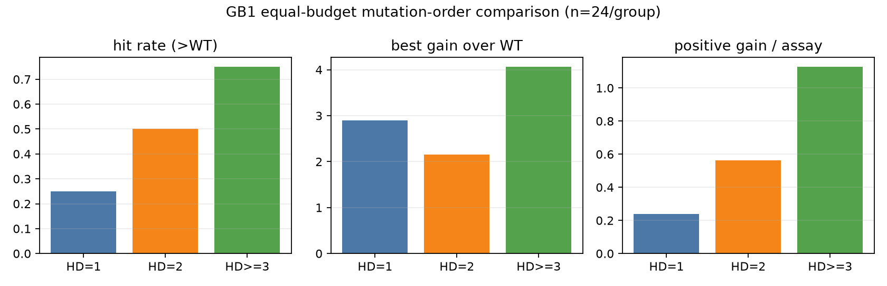

# 包 B：GB1 validation 选模与突变阶数评测协议

## 结论

H04 已从“有隔离池但 validation 无职责”补为可执行的四角色协议：外层池仍严格保持 5,000 / 50,000 / 94,361，不改任何既有口径；5,000 条历史训练池内部确定性拆为 4,000 条 train 与 1,000 条 validation。Ridge 的 alpha 只用 validation Spearman 选择，随后在 train + validation 上重拟合；query-test 用于开发期诊断，holdout 只在模型冻结后做一次最终评估。

B03 的同预算受控比较显示：在本次 GB1、one-hot Ridge 模型直推、每组 24 次 assay 的设置下，HD>=3 的命中率、最佳增益和单位预算正增益均最高。因此“多点突变值得花预算”在这个受控设置下成立，但不能外推成跨策略、跨 seed 或 AAV 的普遍因果结论。

## 四角色协议与 validation 接线

| 角色 | 样本数 | 职责 | 标签何时可见 |
|---|---:|---|---|
| train | 4,000 | 拟合候选超参数对应的模型 | 训练时 |
| validation | 1,000 | 仅按 Spearman 选择 Ridge alpha | 选模时 |
| query-test | 50,000 | 开发诊断与虚拟实验候选/查表 | 候选冻结后 |
| holdout | 94,361 | 冻结模型的一次最终评估 | 最后一次 |

外层 train_pool + query_pool + holdout 仍为 149,361 条且两两不交；train 与 validation 只是对原 5,000 条 train_pool 的内部拆分。WT `VDGV` 强制保留在 train。`select_ridge_alpha` 的函数签名不接收 holdout，因此选模路径不能误读最终标签；`evaluate_all` 先 `fit_ladder(train, validation)`，再分别对 query-test 和 holdout 调用只读评分。

行为证据来自真实 GB1 池和 80 维 one-hot：

```text
validation sensitivity: seed=42 alpha=0.01 score=0.509010;
validation sensitivity: seed=44 alpha=10.0 score=0.507889
label control: signal_spearman=0.509010; shuffled_spearman=-0.038747
4 passed in 1.30s
```

换 validation 集合后最优 alpha 从 0.01 变为 10.0，证明 validation 不是装饰字段。shuffle-label 阴性对照的 validation Spearman 从 0.5090 塌到 -0.0387，说明检测链能对破坏信号作出反应。

冻结选模结果后，以固定 seed 分别抽取 2,000 条 query-test 与 2,000 条 holdout；同一已拟合 ladder 先做开发诊断，随后只读取一次 holdout。实际 Spearman 如下：

| 模型 | query-test Spearman | final holdout Spearman |
|---|---:|---:|
| Ridge（validation alpha=0.01） | 0.4736 | 0.4904 |
| XGBoost | 0.4831 | 0.4957 |
| MLP | 0.4115 | 0.4173 |

holdout 的其他实测指标（Pearson / MSE / Top-1% 命中率）分别为 Ridge `0.4135 / 0.09245 / 0.40`、XGBoost `0.6825 / 0.05930 / 0.60`、MLP `0.8610 / 0.03038 / 0.65`。这是固定 2,000 行最终子样本的结果，不冒充全 94,361 行评估。

## 按突变阶数的同预算比较

开工审计了 `harness/reports/agentic-v0.1/aav/agentic.metrics.json`、`agentic-v0.2` 与 `agentic-v0.4/aav/*metrics.json`：它们只保留每轮聚合统计和 Top-10，没有保存每轮全部提名及 HD，不能从中恢复完整的同预算分组指标；而 AAV 现协议又以 HD<=2 为 cold start，未测候选本身全为 HD>=3。故没有重跑完整 campaign，而是预注册并执行一次最小 GB1 query-test 诊断：seed=42，one-hot 80d，validation 选择 alpha=0.01，5-seed Ridge ensemble；在 HD=1、HD=2、HD>=3 内分别按预测均值冻结 Top-24，再用真值查表。holdout 未用于该统计。

命中定义为真值 fitness > WT fitness 1.0；增益为 fitness - 1.0；预算效率为 `sum(max(增益, 0)) / assay 数`。

| 突变阶数 | 候选池 n | assay 预算 | >WT 命中 | 命中率 | 平均 fitness | 平均增益 | 最佳增益 | 单 assay 正增益 |
|---|---:|---:|---:|---:|---:|---:|---:|---:|
| HD=1 | 24 | 24 | 6 | 25.0% | 0.6102 | -0.3898 | 2.9015 | 0.2385 |
| HD=2 | 668 | 24 | 12 | 50.0% | 1.2591 | 0.2591 | 2.1583 | 0.5641 |
| HD>=3 | 49,308 | 24 | 18 | 75.0% | 2.0433 | 1.0433 | 4.0636 | 1.1277 |



完整 72 条提名、协议字段和未四舍五入指标见 `mutation_order.json`。本次数据表明，模型直推在高阶空间的单位预算正增益约为单点的 4.73 倍、双点的 2.00 倍；强上位性组合和大得多的候选空间共同贡献这一优势，不能把差异只归因于“突变更多”。

## 风险与下一步

- HD=1 的 query-test 候选恰好只有 24 条，故该组是穷举，而 HD=2/HD>=3 是模型挑选的 Top-24；assay 预算相等，但候选池机会数不等。
- 这是单 seed、one-hot Ridge、模型直推的描述性比较，没有置信区间或显著性检验，也不代表 LLM/知识增强 Agent 的分组效果。
- 历史 AAV 轨迹缺少完整提名清单。后续应在不改变策略逻辑的前提下，把每轮全量 `{sequence, hd, predicted_mean, true_fitness}` 作为审计附件保存，再做跨策略、跨 seed 的配对统计。
- 最终报告可据此申领“比较单点、双点、多点”加分项，但必须同时披露候选池不等与 GB1 限定条件。
