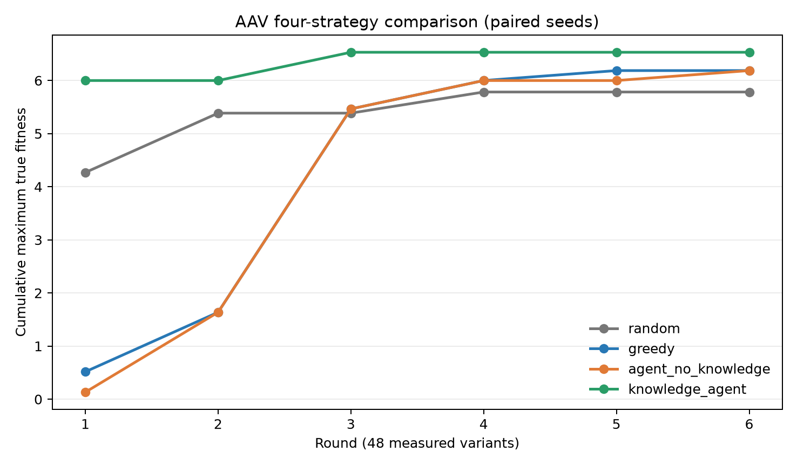

# AAV 知识增强消融：四策略对照与知识图谱接线

## 结论

本报告中的数值均为本次运行实测，不含估算。AAV 知识增强 Agent 相对无知识 Agent，在相同源候选池、cold-start、预算（每轮 48、6 轮、总计 288）、surrogate 和配对 seed（0/1/2）下，将 strong 变体均值从 **54.0 提高到 162.3**（配对差值 +111/+107/+107），将 `cum_top10_max` 从 **6.1862 提高到 6.5309**（每个 seed 均 +0.3447）。两组都没有命中候选池峰值 8.4162，达峰率均为 0/3。因此本次知识门禁对“strong 产量”是正结果，对“找峰”没有正证据。

推荐集合发生了实质变化：每个 seed 的 288 条推荐平均仅重合 56 条，平均 Jaccard 为 0.1077；知识组平均 HD 从 8.7095 降到 3.4132，平均 BLOSUM 均值从 0.0782 升到 0.1757。知识组的结果改善不能解释为图谱单独带来的增益：当前图谱在 `compose_batch` 的 Critic/解释环节查询已测关联并生成 rationale，而排序变化主要来自既定 HD/BLOSUM 门禁；没有做“门禁开、图谱关”的第二层消融。

本次 LLM 端点初始化成功，但 36/36 个 agent 轮次均超时，直接完成实验的 LLM 轮次为 0。实验于是使用同一套确定性自适应回退继续完成。因此下表能证明 **agent harness + 知识处理** 的差异，不能声称观察到了 LLM 推理带来的因果增益。

## 实验设计与唯一变量

- 数据：AAV FLIP clean substitution subset；源候选池 27,832，cold-start 10,433，知识门内候选 9,533。
- 口径：候选为源池中 HD > 2 的序列；预算每轮 48，共 6 轮，累计 288；strong 阈值 2.615913579904。
- 预测器：`EpistasisRidgePredictor`；配对 seeds 0、1、2。
- Oracle：每批推荐冻结后，才按序列从实验真值表查 fitness；候选标签不进入图谱或批次选择。
- 唯一处理变量：无知识组跳过知识门禁和图谱；知识组使用既定 `HD <= 4 && mean BLOSUM62 >= 0` 门禁，并对已选候选查询仅由历史已测变体构成的图谱。两组共享源池、cold-start、预算、surrogate、seed 和自适应采集逻辑。
- 对照锚点：v0.7 门内 greedy 的 `cum_top10_max=7.82896755134`、strong=166；UCB β=3 的 `cum_top10_max=8.41620513056`、strong=128；均为 288 条推荐，本次复现判定通过。该锚点使用 v0.7 门内策略，不与下表的全源池 greedy 混为同一实验线。

## 四策略结果

三 seed 均值如下；括号内给出逐 seed 实测值。

| 策略 | `cum_top10_max` | strong 数 | 达峰率 |
|---|---:|---:|---:|
| 随机突变 | 5.7829（5.8015 / 5.7424 / 5.8049） | 25.7（29 / 23 / 25） | 0/3 |
| 模型直接贪心 | 6.1862（3 seed 相同） | 69.0（3 seed 相同） | 0/3 |
| Agent，无知识 | 6.1862（3 seed 相同） | 54.0（53 / 55 / 54） | 0/3 |
| 知识增强 Agent | **6.5309**（3 seed 相同） | **162.3**（164 / 162 / 161） | 0/3 |



知识增强 Agent 第一轮即达到 5.9988，第三轮达到 6.5309；无知识 Agent 到第六轮才达到 6.1862。需要注意，固定门内 greedy 的 v0.7 锚点仍高于知识 Agent，说明本次自适应 Agent 回退并未胜过既有 greedy 基线。

## 有/无知识推荐差异与失败案例

| 指标 | 无知识 Agent | 知识增强 Agent |
|---|---:|---:|
| 推荐数/seed | 288 | 288 |
| 平均 HD | 8.7095 | 3.4132 |
| 平均 mean-BLOSUM | 0.0782 | 0.1757 |
| 平均 strong 数 | 54.0 | 162.3 |
| 平均 `cum_top10_max` | 6.1862 | 6.5309 |

逐 seed 交集为 56/52/60，Jaccard 为 0.1077/0.0992/0.1163。把无知识组的推荐在实验完成后按同一知识门禁回放，分别有 228/226/223 条会被拒，其中 strong 变体 19/19/16 条；被拒候选的最高 fitness 为 5.5985/5.2974/5.2974。这说明门禁提高了本次预算内 strong 密度，但确实会排除有价值候选，不能把它解释为普适安全规则。完整候选与事后真值位于 `rejected_candidates.json`；真值只用于事后失败分析，没有回灌推荐。

## 知识图谱接线与理由样例

`knowledge/validators.py` 现在提供两类查询：按位点聚合已测突变的样本数、平均/最大 fitness；按具体突变联合查询目标氨基酸的 charge、size、polarity。`agent/auto_researcher.py` 在知识组的 `compose_batch` 环节构建“位点—突变—性质—已测 fitness”图，并发出 `agent.tool.knowledge_graph` 事件。每次 oracle 测试后缓存立即失效，下一轮只用当时已测记录重建，避免候选真值泄漏。无知识组 0 次图谱事件；知识组三个 seed 各 6 次，共 18 次。

接线前，无知识组的批次理由只报告采集配额，例如：

> adaptive_default；exploit_ratio=0.8707；42 exploit + 6 explore。

接线后，知识组除相同采集信息外还产生候选级图谱理由，例如：

> KG: R5C (n=52, measured-association mean=0.470, max=6.124; target properties: charge=0, size=medium, polarity=polar); S17D (n=113, measured-association mean=1.831, max=7.836; ...). Associations are not causal effects.

这里的 fitness 是“含该突变的已测多突变序列”的关联统计，不能归因为该单突变的因果效应。当前图谱让理由可追溯，但查询发生在候选形成之后；因此没有证据表明图谱 rationale 本身改变了本次推荐。要回答图谱的独立决策价值，应另做“同门禁、图谱辅助重排开/关”的嵌套消融。

调用点证据可由以下命令复核：

```text
rg -n "query_position_mutations|query_mutation_context|knowledge_graph|execute_research_round" \
  knowledge/validators.py agent/auto_researcher.py
```

## 阴性对照与可重放证据

- 预测器观测标签 5-fold CV Spearman：0.905917。
- 固定 seed 20260912 的 shuffle-label 5-fold CV Spearman：0.025364，满足 `|rho| < 0.1`，阴性对照通过。
- `events.jsonl` 已由仓库原生 `EventStore.verify()` 验证：252 条完整事件，seq 1–252，链头 `9b09e372322c4d5586c46bc49e35441388ce619e45f83d037e5334f8e755d958`。
- 完整原始指标位于 `metrics.json`；图为 `knowledge_ablation.png`。

## 限制与风险

1. 上游 GB1 遗留清理任务 `task_ff24b0e33edb3412f4dd070e4b` 尚未完成。当前 `rules.yaml` 仍含 GB1 位点规则，validator 也保留 GB1 特定语义；AAV 路径主要使用 HD/BLOSUM `_gate`，但这是明确污染源。
2. BLOSUM62 表不完整：190 个无序氨基酸对中有 136 对缺失，当前 `_gate` 将缺失项按 0 处理。门禁效果可能被低估或错误放行，不能外推到完整 BLOSUM62。
3. LLM 端点的 60 秒逐轮超时导致 36/36 轮使用确定性回退；LLM Agent 的自然语言闭环效果未验证。
4. 三个 seed 足以满足任务下限，但不支持窄置信区间；且自适应回退在大部分排序上是确定性的，seed 间相关性较高。
5. 知识组的有效候选集为门内 9,533，无知识组可访问全部源候选 27,832。这正是本消融定义的知识处理变量，但结果是“过滤 + 图谱理由”的合并效应，不是图谱单因素效应。
6. 四策略中的全源池 greedy（6.1862/69）与 v0.7 门内 greedy 锚点（7.8290/166）候选空间不同，只能分别用于同图比较和入口复现，不能直接归因于策略实现退化。

## 复核命令

```text
LLM_TIMEOUT=60 OPENBLAS_NUM_THREADS=1 OMP_NUM_THREADS=1 VECLIB_MAXIMUM_THREADS=1 \
  PYTHONPATH=. .venv/bin/python -u -m knowledge.ablation \
  --out-dir lab/reports/knowledge-ablation --seeds 0,1,2 --budget 48 --n-rounds 6

PYTHONPATH=. .venv/bin/python -m pytest \
  tests/test_knowledge.py tests/test_auto_researcher_gate.py \
  tests/test_auto_researcher_compose.py tests/test_knowledge_ablation.py -q

PYTHONPATH=. .venv/bin/python -c \
  "from events.store import EventStore; EventStore('lab/reports/knowledge-ablation/events.jsonl').verify(); print('event chain verified')"
```
