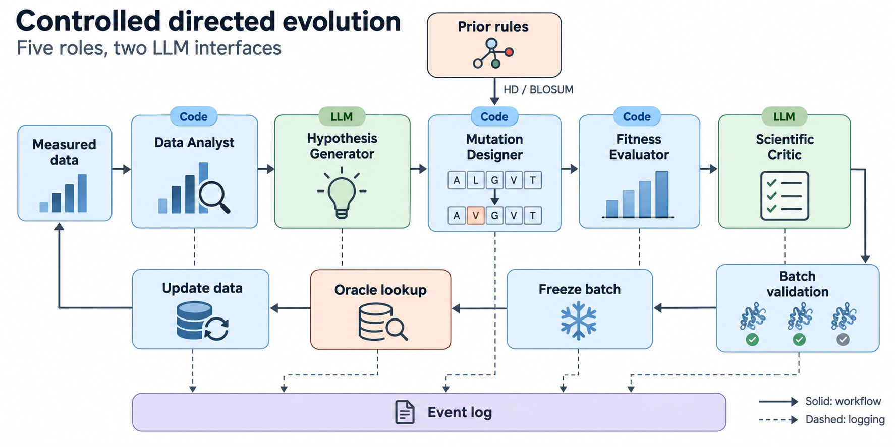
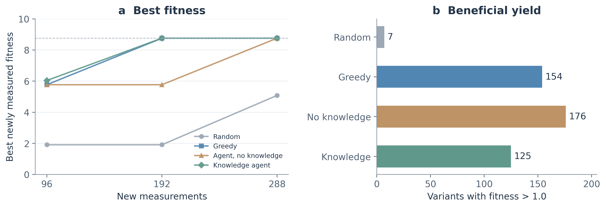
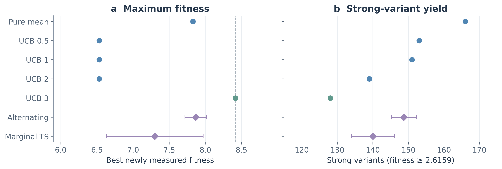
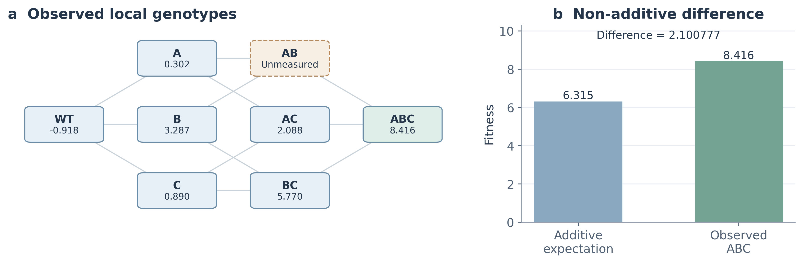
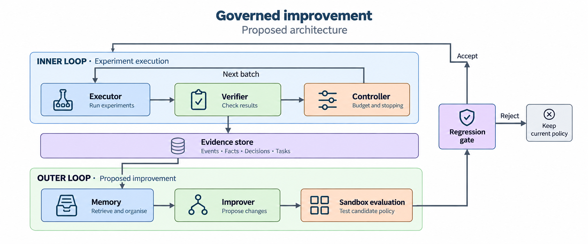

# 面向蛋白质定向进化的受控科学智能体研究报告

Zeyu Li　·　v0.5　·　2026-09-12 代码：<a href="https://github.com/FairladyZ625/protein-directed-evolution-agent">protein-directed-evolution-agent</a>

::: {.abstract}
**摘要**　针对有限实验预算下的蛋白质变体选样问题，本研究构建由适应度预测器、规则约束和语言模型接口组成的模块化流程，并在 GB1 与 AAV2 的固定实测候选池中开展回顾性虚拟定向进化评测。GB1 低阶冷启动实验中，知识增强智能体与模型贪心均在第 2 轮、累计 192 次新增测量内发现数据集最大值 8.761966；三轮有益变体产量分别为 125 和 154。AAV2 固定配置下，UCB（β=3）在第 3 轮发现未测候选池最大值 8.416205，但强变体产量为 128，低于纯均值策略的 166。确定性方法的 30 次记录对应同一条独立轨迹，不能解释为跨训练条件的稳健性证据。局部突变分析发现，关键双突变 AB 缺测使三阶上位性无法由现有标签唯一识别。结果表明，策略比较需要同时报告发现极值、候选产量及评价边界；现有证据尚不足以推断语言模型的一般能力边界。最后提出覆盖引导、目标驱动停止及受控外环改进的后续验证方案。

**关键词**　蛋白质工程；主动学习；适应度预测；知识增强；科学智能体
:::

::: {.cols}
## 1 背景与问题定义

### 1.1 从实验迭代到计算选样

定向进化通过构建突变文库、测定表型并保留候选变体来优化蛋白质性质。机器学习辅助定向进化根据已有序列与适应度数据安排后续实验，以减少无效测量[1]。DNA 重组与迭代饱和突变分别提供重组和局部位点组合的实验路线[2,3]。

对于含 $L$ 个可替换位点、每个位点取 20 种氨基酸的固定长度序列，理论空间为 $20^L$。不同位点的效应还可能依赖其他位点的状态，形成非加性的适应度关系。本研究关注在给定候选池中如何分配测量预算，不将池内搜索等同于对整个生物序列空间的优化。

### 1.2 虚拟定向进化协议

将实测序列集合分为初始已知集 $M_0$ 与未测候选池 $Q_0$。每轮根据已揭晓标签拟合预测器，从剩余候选中选取 $K$ 条，得到批次 $B_t$。批次通过规则校验并冻结后，才由 Oracle 查表揭晓实验标签，随后更新：

$$M_t=M_{t-1}\cup B_t$$
$$Q_t=Q_{t-1}\setminus B_t.$$

同一序列不重复计入新增测量预算。Oracle 使用既有实验分数，不是新的湿实验，也不是预测器自身打分。候选池的标签用于离线评价，不应进入在线提名、特征选择或超参数选择。

### 1.3 评价目标与边界

记所有新增测量的并集为 $S_T$，区分两个最高值：

$$f_{\mathrm{new}}(T)=\max_{x\in S_T} f(x),$$
$$f_{\mathrm{all}}(T)=\max_{x\in M_0\cup S_T} f(x).$$

另报告达到预设阈值的变体数量与首次发现候选池最大值的轮次。两种最高值不能混用，阈值产量也不能替代序列多样性指标。

AAV2 的初始已知最高值为 **9.536457**，高于未测池最大值 **8.416205**。因此，发现后者没有提高 $f_{\mathrm{all}}$。该实验评价的是受限池内的发现效率与新增强变体产量；多目标工程价值需要额外表型测量，不能由本次单指标实验直接推出。
:::
<!-- PAGE -->
## 2 数据集介绍

::: {.cols}
### 2.1 GB1 四位点突变数据

GB1 数据来自 Wu 等的四位点组合突变研究[4]。本地数据包含 149,361 条实测变体，理论组合数为 160,000。四个位点为 V39、D40、G41、V54，野生型四位点基序为 `VDGV`，对应适应度 1.000；数据集观测最大值由 `FWAA` 保持，为 8.761966。

缺少测量标签的 10,639 种组合不纳入 Oracle 候选池，不用插值结果替代真实标签。低阶冷启动实验使用全部汉明距离（HD）不超过 2 的 2,168 条变体，其余 147,193 条构成候选池。每轮测量 96 条，共三轮。

另有随机抽取 5,000 条作为冷启动的历史对照。该对照改变了训练数据构成，其轨迹不能与低阶冷启动结果拼接。本版主结果图仅使用低阶协议。

### 2.2 AAV2 衣壳突变数据

AAV 数据来自 Bryant 等对衣壳序列多样化与包装功能的研究[5]。本地清洗后包含 38,265 条、长度均为 28 的窗口序列。野生型窗口为：

DEEEIRTTNPVATEQYGSVSTNLQRGNR

该序列的本地分数为 −0.918194。初始已知集为 HD≤2 的 10,433 条；HD>2 的未测池为 27,832 条。施加 HD≤4 且平均 BLOSUM62≥0 的筛选后，门内候选为 9,533 条。每轮测量 48 条，共六轮。门内表示符合规则，并不意味着候选必然具有较高实验适应度。

本文使用窗口零基坐标。D0Q、S17E、V18A 均指上述 28 位点窗口中的替换，不是全长 VP1 的残基编号。
:::

表 1　数据集与闭环评测配置

| 协议 | 已知集 | 原始候选池 | 每轮 × 轮数 | 关键说明 |
|:--|--:|--:|:--:|:--|
| GB1 低阶冷启动 | 2,168 | 147,193 | 96 × 3 | 本文 GB1 主结果 |
| GB1 随机冷启动 | 5,000 | 144,361 | 96 × 3 | 独立历史对照，未并入主图 |
| AAV2 低阶冷启动 | 10,433 | 27,832 | 48 × 6 | 门内池 9,533；初始已知最优更高 |

::: {.cols}
### 2.3 清洗与标签访问边界

数据预处理检查序列长度、标准氨基酸字符、重复项和突变坐标，并保存输入文件指纹及划分信息。异常字符与终止符不作为正常候选。预测器使用当前已知标签，未测标签仅在批次固定后用于评价。

文件哈希可用于核对输入版本，事件链可支持记录完整性检查，但这两者不能单独证明没有标签泄漏。标签访问路径、提名前后时间顺序与重放结果需要分别审计。

### 2.4 与已有基准的关系

FLIP 与 ProteinGym 提供蛋白质适应度预测的数据及评价框架[6,7]。本文增加了固定预算下的多轮池式选样协议，结果不等同于这些基准的官方静态回归得分。

GB1 的结合适应度与 AAV2 的包装功能分数具有不同测量含义，不能直接比较数值大小。GFP 等景观研究可提供非加性效应的背景参考[8]，但本文未将其作为第三个闭环实验数据集。
:::
<!-- PAGE -->
## 3 适应度预测模型

::: {.cols}
### 3.1 表征与回归器

预测对照包括 one-hot 编码与预训练 ESM-2 表征，以及 Ridge、梯度提升树和 MLP 回归器。Ridge 通过 $L_2$ 正则化控制系数幅度[9]，目标为：

$$\min_w\ \|y-\Phi w\|_2^2+\lambda\|w\|_2^2.$$

固定输入与求解设置下，Ridge 可给出确定输出；这不意味着模型不会过拟合。梯度提升树通过非线性分裂拟合特征交互[10]。训练集的组成同样会影响模型的外推表现[11]。

ESM 系列将序列映射为预训练表征[12,13]。本报告的 GB1 对照使用 ESM-2 650M 的 1,280 维嵌入，与下游回归器组合评估。低样本工程和进化生成模型的相关工作[14,15]属于方法背景，不作为本系统已实现功能的证明。

### 3.2 GB1 跨突变阶数外推

表 2 区分随机划分与低阶训练、高阶测试的留出评测。在跨阶划分中，ESM-2 + MLP 的 Spearman 点估计为 0.493，高于 one-hot + MLP 的 0.278。

这些值支持在该划分下比较排序表现。旧版汇总未提供每个单元格对应的重复分布和置信区间，本版不据此使用“显著优于”或“完全没有退化”等统计推断。预测表征对照与闭环采集实验也应分别解释。
:::

表 2　GB1 预测性能对照：Spearman 秩相关系数

| 数据划分 | 特征 | Ridge | 梯度提升树 | MLP |
|:--|:--|--:|--:|--:|
| 随机划分 | One-hot | 0.484 | 0.474 | 0.389 |
| 随机划分 | ESM-2 | 0.493 | 0.377 | 0.491 |
| HD≤2 → HD≥3 | One-hot | 0.358 | 0.354 | 0.278 |
| HD≤2 → HD≥3 | ESM-2 | 0.404 | 0.352 | **0.493** |

来源：v0.4 报告的 GB1 预测汇总。本次修订保留原数值，不补造重复次数或误差条；该表不是 AAV 闭环预测器配置。

::: {.cols}
### 3.3 成对交互与可识别性

序列共变和上位性研究提示，突变效应可能依赖序列背景[16,17]。为比较加性与成对表示，可写为：

$$\hat f_{\mathrm{add}}(x)=b+\sum_i h_i(x_i),$$
$$\hat f_{\mathrm{pair}}(x)=\hat f_{\mathrm{add}}(x)+\sum_{i<j}J_{ij}(x_i,x_j).$$

交互项能表达成对非加性关系，但模型系数不等于生物物理机制。某类组合在训练数据中缺测时，其贡献可能无法由已有标签确定。第 7 章结合实际缺测节点说明这一限制。

### 3.4 AAV 预测器与采集函数

AAV 统一对照使用成对交互 Ridge。按固定 80/20 低阶划分选择正则化参数，网格为 {1, 10, 100, 300}；随后在全部已知数据上拟合均值。三个固定 bootstrap 模型（seeds 0、1、2）提供预测分歧，方差采用总体方差口径。

采集分数为 $a_t(x)=\hat{\mu}_t(x)+\beta\hat{\sigma}_t(x)$。预测均值来自全量已知集拟合，预测标准差来自 bootstrap 分歧；两者不是同一组预测的均值与样本标准差。该实现借鉴置信界采集思路[18]，但不自动继承 GP-UCB 的理论保证，也不声称分歧已校准为后验区间。期望提升[19]作为相关方法，未列入此次七配置矩阵。
:::
<!-- PAGE -->
## 4 LLM Agent 设计

<!-- FIGURE_1_START -->

<!-- FIGURE_1_END -->

::: {.cols}
### 4.1 五角色与调用边界

ChemCrow、Coscientist 等工作展示了语言模型与科研工具的组合方式[20,21]；更早的机器人科学家系统[22]则提供了自动化实验设计的背景。本文采用五个模块组织实验流程。

**Data Analyst** 汇总已测序列、适应度分布、位点和突变统计。**Hypothesis Generator** 结合摘要与规则，产生结构化候选假设及理由。**Mutation Designer** 将约束转换为候选组合并检查重复。**Fitness Evaluator** 调用代理模型计算分数。**Scientific Critic** 审查候选理由和规则冲突。

假设与审查模块提供 LLM 接口；数值计算、排序、字符检查和预算约束由代码完成。接口是可调用能力，不是每次实验必定实际调用的证明。GB1 主结果的记录标明实际模型为 `claude-sonnet-5`，通过 hypothesis port 接入；AAV 七配置统计矩阵没有调用 LLM。

### 4.2 规则校验与批次冻结

初筛根据突变数量和替换相容性约束候选。最终校验检查序列格式、候选池成员资格、重复提名与预算，再固定待测批次。若候选被拒绝，应记录原因及补位结果，不能在看到 Oracle 标签后修改提名。

BLOSUM 和净电荷等规则是筛选先验，不能保证蛋白质可以折叠或保留功能。语言模型给出的盐桥、结构稳定等理由应作为待检验假设，不能直接写成实验证实的机制。

### 4.3 结构化记录与解释

模块输出通过类型化数据结构传递，保存候选、分数、规则依据、接受或拒绝结果以及实验标签。SHA-256 链可检测在给定可信锚点下的记录改动；它不提供绝对不可篡改性，也不能仅凭链完整就证明因果关系或排除数据泄漏。

推荐理由应与可查证输入关联，例如“已有数据中该位点的若干替换分数较高，因此列入候选”；需要同时说明所用背景、规则和不确定性。模型生成的解释文本不等于其内部推理过程的完整记录。

### 4.4 如何评价 Agent 的贡献

评价重点是语言模型是否改变了候选构成，以及改变是否带来达峰轮次、产量或解释质量的收益。仅能调用预测器不构成“学会科学家思维”的证据。当前结果支持比较具体流程配置，不支持推断语言模型的一般数值优化能力。
:::
<!-- PAGE -->
## 5 知识增强方法

::: {.cols}
### 5.1 理化规则与替换先验

规则库描述氨基酸的电荷、疏水性、侧链大小及替换相容性，并限制一次引入的突变数量。BLOSUM62 根据保守区段中的替换统计构建[23]；本研究将其作为序列筛选先验，不将其分数解释为直接的折叠能或活性预测。

历史实现曾有 190 种无序异残基对中 136 种缺少查表项的问题，部分路径用零分兜底。该缺陷说明规则实现也需要完整性测试，不能仅凭“使用了知识库”判断先验可靠。报告比较应绑定规则版本及其查表行为。

### 5.2 知识图谱的作用与边界

知识可以组织为 Variant、Mutation、Position、AminoAcid 与 Property 等实体，以 contains、occurs_at、has_property 等关系关联候选、位点和属性。这样的结构有助于检索推荐依据和规则来源。

“突变—适应度”关联需要保留具体序列背景与数据来源，不应直接标记为普遍因果效应。图谱是否进入每次假设或审查调用，还需检查该实验的实际输入；存在图谱文件不代表闭环结果已经受它影响。

### 5.3 残基对覆盖缺口

AAV 门内候选涉及 11,130 种具体残基替换对，其中 7,937 种在冷启动库中未出现，占 **71.31%**。在 9,533 条门内候选中，6,852 条至少含一个未见替换对，占 **71.88%**。前者以替换对为分母，后者以候选变体为分母。

这说明位点已被观测不等于该位点上的所有氨基酸组合均有标签。如果一律排除包含未见对的候选，会缩小可探索空间；但未见对的存在本身也不证明该候选具有更高信息价值或适应度。

### 5.4 覆盖引导与结构先验提案

一种待评估方案是根据历史和当前批次的覆盖情况分配探索预算。设 $P(x)$ 为候选所含替换对，$n_t(p)$、$n_B(p)$ 分别为历史与批次中的出现次数，可定义启发式分数：

$$C_t(x\mid B)=\frac{1}{|P(x)|}\sum_{p\in P(x)}\frac{w_p}{1+n_t(p)+n_B(p)}.$$

该分数优先覆盖较少出现的组合，不等于经过校准的信息增益。需要与 UCB 等方法在固定预算和候选池下比较，并检查是否损害强变体产量。

结构信息还可为 $w_p$ 提供候选权重。若有可靠实验结构或经核查的预测结构[24]，可采用距离核 $w_{ij}=1+\exp[-(d_{ij}/d_0)^2]$。其中距离尺度 $d_0$ 是待验证超参数，不是普适的物理接触阈值。结构映射、链和残基编号、窗口覆盖率应先核对。

本版没有为覆盖引导或结构加权新增实验，也不沿用旧稿“已增强稳定性”的收益断言。
:::

方法状态说明：避免把后续设计写成已验证结果

| 内容 | 本文证据状态 | 解释边界 |
|:--|:--|:--|
| GB1 四策略；AAV 七采集配置 | 已有实验记录 | 仅覆盖指定协议与配置 |
| AAV 残基对覆盖率 | 已有描述统计 | 不直接证明采集收益 |
| 覆盖打分与三维结构软权重 | 本文作为待验证提案 | 不报告未经对照的收益 |
| 目标停止、多目标优化、自动改进外环 | 后续设计 | 不是已部署或实测结论 |
<!-- PAGE -->
## 6 虚拟定向进化实验结果
### 6.1 GB1：达峰效率与有益变体产量

<!-- FIGURE_2_START -->

<!-- FIGURE_2_END -->

表 3　GB1 三轮最高值与累计产量

| 策略 | 第 1 轮 | 第 2 轮 | 第 3 轮 | 有益变体 / 288 | 首次达峰 |
|:--|--:|--:|--:|--:|:--:|
| 随机 | 1.910588 | 1.910588 | 5.081244 | 7 | 未达 |
| 模型贪心 | 5.772032 | **8.761966** | 8.761966 | 154 | 第 2 轮 |
| 无知识智能体 | 5.772032 | 5.772032 | 8.761966 | **176** | 第 3 轮 |
| 知识增强智能体 | **6.042078** | **8.761966** | 8.761966 | 125 | 第 2 轮 |

::: {.cols}
### 6.2 成功结果及其限制

知识增强策略首轮的累计最高值为 6.042078，高于贪心与无知识智能体的 5.772032。第二轮知识增强和贪心均发现 `FWAA`，累计新增测量为 192 条；无知识智能体在第三轮发现同一变体。

知识增强相对无知识智能体在本次轨迹中提前一轮达峰，但没有相对贪心缩短达峰轮次。产量指标给出另一种排序：无知识智能体为 176 条，贪心为 154 条，知识增强为 125 条。因此，不能把单轮最高值的改善概括为所有目标上的优势。

随机策略三轮共获得 7 条优于野生型的变体，占 288 次新增测量的 2.43%。这是该轨迹的命中比例，不是关于所有随机策略或所有冷启动分布的长期效率结论。

### 6.3 读图与预算口径

图中纵轴统计新增测量，不包含冷启动变体；横轴仅累计新增查询。模型训练所用的 2,168 个初始标签属于既有数据，不应在描述样本效率时隐去。

当前汇总没有提供多次独立 LLM 运行的误差分布。图 2 与表 3 的数字用于描述此协议的观测结果，不作显著性推断。识别知识增强的因果作用，还需固定语言模型、预测器和调用设置，只改变知识输入并重复运行。
:::
<!-- PAGE -->
### 6.4 AAV：确定性配置与随机采集重复

<!-- FIGURE_3_START -->

<!-- FIGURE_3_END -->

表 4　AAV 七种采集配置：固定初始集、固定预测器，48 × 6 次预算

| 配置 | 新增最高值 | 强变体数 | 达峰 | 独立轨迹 |
|:--|--:|--:|:--:|:--:|
| 纯均值 | 7.8290 | **166** | 否 | 1 |
| UCB β=0.5 | 6.5309 | 153 | 否 | 1 |
| UCB β=1 | 6.5309 | 151 | 否 | 1 |
| UCB β=2 | 6.5309 | 139 | 否 | 1 |
| UCB β=3 | **8.4162** | 128 | 第 3 轮 | 1 |
| 均值/多样性交替 | 7.8681 ± 0.1490 | 148.73 ± 3.49 | 2/30 | 30 |
| 边际高斯 TS | 7.3017 ± 0.6684 | 140.03 ± 6.06 | 3/30 | 30 |

随机方法报告均值 ± 样本标准差，seeds 0–29 仅改变采集随机数；确定性方法的 30 次重复记录合并为一个结果。强变体：fitness ≥ 2.615913579904，为 clean 表第 90 百分位数，仅作事后评价，不进入采集或训练。所有计数不含冷启动。

::: {.cols}
### 6.5 两个目标对应不同排序

纯均值新增最高值为 7.8290，UCB β=3 达到池内最大值 8.4162；但后者少获得 38 条强变体。这里展示了指定配置下的目标权衡，不能推广为两种目标必然冲突。

交替策略命中率为 2/30，条件 Wilson 95% 区间为 1.8%–21.3%；边际高斯 TS 为 3/30，区间为 3.5%–25.6%。这些区间只针对固定数据、训练及门禁下的采集随机性。

### 6.6 重复实验的解释

确定性方法不使用采集随机数，因此改变采集 seed 不增加独立证据。Seed 42 的历史交替轨迹作为单独复现对照，不计入上述 30 个种子。

本矩阵没有调用 LLM，也没有改变 cold-start、训练划分或 bootstrap 种子。边际高斯 TS 按候选独立采样，忽略候选间后验相关性；其结果不能代表所有 Thompson Sampling 实现。
:::
<!-- PAGE -->
## 7 失败案例分析
### 7.1 缺测组合与候选排序失真

<!-- FIGURE_4_START -->

<!-- FIGURE_4_END -->

表 5　局部组合的观测标签与初始状态

| 组合 | 窗口零基突变 | 适应度 | 状态 |
|:--|:--|--:|:--|
| WT | 无 | −0.918194 | 初始已知 |
| A | D0Q | 0.302016 | 初始已知 |
| B | S17E | 3.287418 | 初始已知 |
| C | V18A | 0.889606 | 初始已知 |
| AB | D0Q + S17E | NA | 本地数据缺测 |
| AC | D0Q + V18A | 2.087894 | 初始已知 |
| BC | S17E + V18A | 5.770209 | 初始已知 |
| ABC | D0Q + S17E + V18A | **8.416205** | 初始未测，事后读取 |

::: {.cols}
### 7.2 加性偏差不等于三阶贡献

由 WT 和三个单点实测标签得到：

$$\hat f_{\mathrm{add}}(ABC)=f_A+f_B+f_C-2f_{WT}$$
$$=6.315428.$$

ABC 的实测值比该期望高 2.100777。三阶差分还需要三个双突变标签：

$$\begin{aligned}\epsilon_{ABC}={}&f_{ABC}-f_{AB}-f_{AC}-f_{BC}\\&+f_A+f_B+f_C-f_{WT}.\end{aligned}$$

由于 AB 缺测，该差分不能直接计算。因此不能将上述加性偏差全部归于三阶作用，也不能凭此证明结构折叠机制。

### 7.3 低估与竞争候选高估并存

历史机制分析中，ABC 的预测均值为 6.366779，初始排名为全池第 2,758、门内第 426。门内按均值选出的前 48 条预测均值约 11.31，事后实测均值约 2.88。目标被低估与竞争者被高估同时存在。

缺测 AB 的原始交互列不能提供拟合支持，但整个模型的背景项也影响预测。初始 UCB β=3 对 ABC 的门内排名为第 539，后续命中不意味着首轮已识别该点。结果支持研究覆盖缺口与闭环更新，不能将最终命中简化为单一静态排序机制。
:::
<!-- PAGE -->
::: {.cols}
### 7.4 历史 LLM 轨迹的有限结论

历史 Agentic FULL 的三条运行记录，新增最高值分别为 7.828968、6.530900 和 7.828968，均未在六轮内达到 AAV 未测池最大值。与指定 UCB β=3 结果比较，最好 FULL 轨迹的最高值差为：

$$\Delta f_{\max}=8.416205-7.828968$$
$$=0.587237.$$

旧版将该差值称为“探索税”。本版采用“最高值差”，因为相同预算本身不能排除实现版本、预测器、候选构成和调用配置的差异。没有匹配条件的干预对照时，该值不能识别探索行为的因果成本。

本任务是离散序列池选样，不是直接求解连续函数的梯度问题。上述轨迹不能证明语言模型缺乏微积分能力，也不能证明它在所有科学任务中应退出数值决策。

### 7.5 无约束生成的失败记录

早期原型记录了平均 HD 约 16.98、候选平均适应度约 −4.60 的批次。这表明该配置产生了较多低包装功能分数的序列，可作为限制候选空间的工程动机。

这些标签不足以区分折叠失败、表达下降、包装缺陷等生物机制。缺少结构或湿实验验证时，不应写成“破坏了衣壳亚基界面”。不同版本也不是只改变一个变量的消融链：v0.6 与 v0.7 均由 v0.5 分出，版本号不代表单调递进。

### 7.6 研究者角色与预测器角色的区分

将通用语言模型直接作为适应度预测器，还存在训练目标与任务目标之间的不匹配。其语言建模与知识整合能力，不等价于针对特定蛋白质、特定测定条件建立的序列—功能映射。流畅的解释或看似合理的残基替换理由，不能替代经实验标签检验的定量预测。

ESM 等蛋白质语言模型从大规模蛋白质序列中学习统计规律与表征[12,13]。这类领域先验可辅助下游预测，但预训练目标并不直接等同于本研究的结合或包装适应度。即使采用专门的蛋白质表征，高阶组合、数据分布差异与有限标签仍需要目标任务上的验证。本项目的局部结果既不能证明 ESM 普遍无效，也不能据此推导通用 LLM 必然表现更差；它提示的是，不应跳过任务验证而假定通用语言模型能直接给出可靠的适应度数值。

从科研工作分工看，人类研究者的职责是提出可检验问题、选择模型与测量方法、安排有信息价值的实验，并依据结果修正解释。研究者通常需要借助计算和实验工具判断复杂突变组合的功能，而非仅凭一般知识给出准确数值。因此，以研究者为参照设计 Agent 时，应优先实现工具选择、调用、验证和实验组织能力，而非要求其无工具猜测候选适应度。

基于这一考虑，本文主张将数值估计交给经目标数据验证的预测器，将测量事实交给实验或 Oracle；Agent 负责提出假设、选择和调用工具、检查适用范围与不确定性，并组织后续验证。这一分工不排除 Agent 参与预测流程，而是要求其预测结论具有可追溯的模型和实验依据。其收益仍需通过工具辅助与直接选样的匹配对照评估。

:::
<!-- PAGE -->
::: {.cols}
## 8 改进建议与未来拓展

### 8.1 可由当前结果支持的结论

第一，GB1 知识增强策略在指定轨迹中与贪心同轮达峰，但有益变体产量较低；知识增强的作用依赖评价指标。

第二，AAV 固定配置下，UCB β=3 找到未测池最大值，纯均值则获得更多强变体。最高值和产量应同时报告，不宜只保留支持某种策略的指标。

第三，低阶标签中的具体组合缺失会限制高阶候选的预测与解释。表 5 的缺测值属于证据边界，不应被模型插补值替代。

这些发现支持继续评估“代码负责可计算的采集，语言模型辅助假设与工作流”的分工方案；它仍需通过匹配条件的消融实验验证。

### 8.2 研究局限

**数据与任务。** 仅覆盖两个固定实测池；回顾性查表不包含真实实验中的新序列、测量延迟、批次效应及失败成本。发现池内最佳值不代表改进整个蛋白质空间。

**重复与泛化。** GB1 主结果为指定单轨迹；AAV 随机重复仅改变采集 seed。冷启动组成、训练随机性和跨蛋白质稳健性尚未由这些数据覆盖。

**机制与解释。** 模型参数、知识图谱边和语言模型理由不是生物因果证据。AB 缺测、标签噪声及表征冗余限制了对上位性的归因。

**系统状态。** 已有接口、运行时实际调用和效果收益是三个不同层次。覆盖加权、结构先验、停止准则及自动改进在本版作为待验证方案呈现。

### 8.3 目标驱动的停止建议

后续可在实验前确定目标、预算与确认标准。例如，多个工程属性达到阈值后，进入独立确认阶段。单指标基准中的已知池最大值不应成为真实实验的在线停止信号。

设 $V(D)$ 为数据 $D$ 下可取得的最大期望决策效用，批次信息价值可简写为：

$$\mathrm{EVI}(B)=\mathbb E_Y[V(D\cup\{B,Y\})]-V(D).$$

比较 EVI 与实验成本需要效用定义、成本模型及校准预测。它是决策建模方向，本研究没有验证该停止机制，也不能把某一候选批次的低 EVI 推广为所有后续实验都无价值。
:::
<!-- PAGE -->
### 8.4 受控双循环改进提案

<!-- FIGURE_5_START -->

<!-- FIGURE_5_END -->

::: {.cols}
**执行器、验证器和控制器**构成内环：执行实验、检查结果并安排下一批。**记忆器和改进器**构成外环：整理证据、比较解释并提出策略变化。事实、决策与任务记录用于保留来源和变更理由，不自动构成因果证明。

验证器评估当前结果，回归门评估候选改动，二者职责不同。外环不能直接替换正在执行的策略；候选改动需在冻结评价协议下验证，并保留失败时继续使用原策略的路径。

可检验的问题包括：外环提出的改动是否优于预先设定的参数搜索；收益是否在独立冷启动和未参与调参的任务上保持；额外模型调用成本是否抵消了实验预算收益。

### 8.5 多目标与生成设计扩展

多目标任务可分别测量活性、稳定性、表达及其他目标，再比较非支配候选集合。NSGA-II 等方法提供了相关优化框架[25]。本文没有这些联合标签，不能证明高阶突变已经改善多目标性能。

ProteinMPNN[26]、RFdiffusion[27]、深度网络幻觉设计[28]和 ProGen[29]可作为后续候选生成方案。引入生成模型后，现有实测池通常不再覆盖输出，需要独立评价器或湿实验测量；不能把池内查表协议直接延伸为生成序列的有效性证明。

### 8.6 自动化实验与验证顺序

自主实验室相关研究[30]为设计—测量闭环提供背景。后续对接实验设备时，应明确批次标识、测量单位、失败回执及人工确认环节，再评估自动化收益。

建议首先验证冷启动和训练扰动下的策略稳健性；其次在相同预算下比较有无知识、覆盖引导和语言模型接口；最后开展多目标与设备接入实验。每项扩展均需保留失败结果和独立评价条件。

### 数据、代码与辅助工具声明

数值沿用既有实验及本地证据，本版未新增湿实验或闭环优化实验。数据图由源数据程序化绘制；图 1、图 5 使用内置 ImageGen，按用户提供的学术插画要求生成并检查标签与流程。文字由 Codex 辅助审校。生图提示词、输入指纹、数据摘录和构建脚本随版本保存。

关键来源为 GB1 的 `gb1_summary.json`、AAV 多种子记录和局部峰机制分析；完整相对路径及校验和见交付目录的 `evidence/sources.json`。参考文献沿用已存档的出版信息，不将引用论文中的功能自动归入本系统。
:::

<!-- PAGE -->
<!-- REFERENCES -->
## 参考文献

::: {.refs}

[1] YANG K K, WU Z, ARNOLD F H. Machine-learning-guided directed evolution for protein engineering[J]. Nature Methods, 2019, 16(8): 687-694. [DOI: 10.1038/s41592-019-0496-6](https://doi.org/10.1038/s41592-019-0496-6)

[2] STEMMER W P C. Rapid evolution of a protein in vitro by DNA shuffling[J]. Nature, 1994, 370(6488): 389-391. [DOI: 10.1038/370389a0](https://doi.org/10.1038/370389a0)

[3] REETZ M T, CARBALLEIRA J D. Iterative saturation mutagenesis (ISM) for rapid directed evolution of functional enzymes[J]. Nature Protocols, 2007, 2(4): 891-903. [DOI: 10.1038/nprot.2007.72](https://doi.org/10.1038/nprot.2007.72)

[4] WU N C, DAI L, OLSON C A, et al. Adaptation in protein fitness landscapes is facilitated by indirect paths[J]. eLife, 2016, 5: e16965. [DOI: 10.7554/elife.16965](https://doi.org/10.7554/elife.16965)

[5] BRYANT D H, BASHIR A, SINAI S, et al. Deep diversification of an AAV capsid protein by machine learning[J]. Nature Biotechnology, 2021, 39(6): 691-696. [DOI: 10.1038/s41587-020-00793-4](https://doi.org/10.1038/s41587-020-00793-4)

[6] DALLAGO C, MOU J, JOHNSTON K E, et al. FLIP: Benchmark tasks in fitness landscape inference for proteins[C]//Proceedings of the Neural Information Processing Systems Track on Datasets and Benchmarks. 2021, 1. [会议原文](https://datasets-benchmarks-proceedings.neurips.cc/paper_files/paper/2021/file/2b44928ae11fb9384c4cf38708677c48-Paper-round2.pdf)

[7] NOTIN P, KOLLASCH A, RITTER D, et al. ProteinGym: Large-Scale Benchmarks for Protein Fitness Prediction and Design[C]//Advances in Neural Information Processing Systems. 2023, 36. [会议原文](https://proceedings.neurips.cc/paper_files/paper/2023/hash/cac723e5ff29f65e3fcbb0739ae91bee-Abstract-Datasets_and_Benchmarks.html)

[8] SARKISYAN K S, BOLOTIN D A, MEER M V, et al. Local fitness landscape of the green fluorescent protein[J]. Nature, 2016, 533(7603): 397-401. [DOI: 10.1038/nature17995](https://doi.org/10.1038/nature17995)

[9] HOERL A E, KENNARD R W. Ridge Regression: Biased Estimation for Nonorthogonal Problems[J]. Technometrics, 1970, 12(1): 55-67. [DOI: 10.1080/00401706.1970.10488634](https://doi.org/10.1080/00401706.1970.10488634)

[10] FRIEDMAN J H. Greedy function approximation: A gradient boosting machine[J]. The Annals of Statistics, 2001, 29(5): 1189-1232. [DOI: 10.1214/aos/1013203451](https://doi.org/10.1214/aos/1013203451)

[11] WITTMANN B J, YUE Y, ARNOLD F H. Informed training set design enables efficient machine learning-assisted directed protein evolution[J]. Cell Systems, 2021, 12(11): 1026-1045.e7. [DOI: 10.1016/j.cels.2021.07.008](https://doi.org/10.1016/j.cels.2021.07.008)

[12] RIVES A, MEIER J, SERCU T, et al. Biological structure and function emerge from scaling unsupervised learning to 250 million protein sequences[J]. Proceedings of the National Academy of Sciences, 2021, 118(15): e2016239118. [DOI: 10.1073/pnas.2016239118](https://doi.org/10.1073/pnas.2016239118)

[13] LIN Z, AKIN H, RAO R, et al. Evolutionary-scale prediction of atomic-level protein structure with a language model[J]. Science, 2023, 379(6637): 1123-1130. [DOI: 10.1126/science.ade2574](https://doi.org/10.1126/science.ade2574)

[14] BISWAS S, KHIMULYA G, ALLEY E C, et al. Low-N protein engineering with data-efficient deep learning[J]. Nature Methods, 2021, 18(4): 389-396. [DOI: 10.1038/s41592-021-01100-y](https://doi.org/10.1038/s41592-021-01100-y)

[15] FRAZER J, NOTIN P, DIAS M, et al. Disease variant prediction with deep generative models of evolutionary data[J]. Nature, 2021, 599(7883): 91-95. [DOI: 10.1038/s41586-021-04043-8](https://doi.org/10.1038/s41586-021-04043-8)

[16] HOPF T A, INGRAHAM J B, POELWIJK F J, et al. Mutation effects predicted from sequence co-variation[J]. Nature Biotechnology, 2017, 35(2): 128-135. [DOI: 10.1038/nbt.3769](https://doi.org/10.1038/nbt.3769)

[17] POELWIJK F J, SOCOLICH M, RANGANATHAN R. Learning the pattern of epistasis linking genotype and phenotype in a protein[J]. Nature Communications, 2019, 10(1): 4213. [DOI: 10.1038/s41467-019-12130-8](https://doi.org/10.1038/s41467-019-12130-8)

[18] SRINIVAS N, KRAUSE A, KAKADE S M, et al. Information-Theoretic Regret Bounds for Gaussian Process Optimization in the Bandit Setting[J]. IEEE Transactions on Information Theory, 2012, 58(5): 3250-3265. [DOI: 10.1109/tit.2011.2182033](https://doi.org/10.1109/tit.2011.2182033)

[19] JONES D R, SCHONLAU M, WELCH W J. Efficient Global Optimization of Expensive Black-Box Functions[J]. Journal of Global Optimization, 1998, 13(4): 455-492. [DOI: 10.1023/a:1008306431147](https://doi.org/10.1023/a:1008306431147)

[20] BRAN A M, COX S, SCHILTER O, et al. Augmenting large language models with chemistry tools[J]. Nature Machine Intelligence, 2024, 6(5): 525-535. [DOI: 10.1038/s42256-024-00832-8](https://doi.org/10.1038/s42256-024-00832-8)

[21] BOIKO D A, MACKNIGHT R, KLINE B, et al. Autonomous chemical research with large language models[J]. Nature, 2023, 624(7992): 570-578. [DOI: 10.1038/s41586-023-06792-0](https://doi.org/10.1038/s41586-023-06792-0)

[22] KING R D, ROWLAND J, OLIVER S G, et al. The Automation of Science[J]. Science, 2009, 324(5923): 85-89. [DOI: 10.1126/science.1165620](https://doi.org/10.1126/science.1165620)

[23] HENIKOFF S, HENIKOFF J G. Amino acid substitution matrices from protein blocks[J]. Proceedings of the National Academy of Sciences, 1992, 89(22): 10915-10919. [DOI: 10.1073/pnas.89.22.10915](https://doi.org/10.1073/pnas.89.22.10915)

[24] JUMPER J, EVANS R, PRITZEL A, et al. Highly accurate protein structure prediction with AlphaFold[J]. Nature, 2021, 596(7873): 583-589. [DOI: 10.1038/s41586-021-03819-2](https://doi.org/10.1038/s41586-021-03819-2)

[25] DEB K, PRATAP A, AGARWAL S, et al. A fast and elitist multiobjective genetic algorithm: NSGA-II[J]. IEEE Transactions on Evolutionary Computation, 2002, 6(2): 182-197. [DOI: 10.1109/4235.996017](https://doi.org/10.1109/4235.996017)

[26] DAUPARAS J, ANISHCHENKO I, BENNETT N, et al. Robust deep learning–based protein sequence design using ProteinMPNN[J]. Science, 2022, 378(6615): 49-56. [DOI: 10.1126/science.add2187](https://doi.org/10.1126/science.add2187)

[27] WATSON J L, JUERGENS D, BENNETT N R, et al. De novo design of protein structure and function with RFdiffusion[J]. Nature, 2023, 620(7976): 1089-1100. [DOI: 10.1038/s41586-023-06415-8](https://doi.org/10.1038/s41586-023-06415-8)

[28] ANISHCHENKO I, PELLOCK S J, CHIDYAUSIKU T M, et al. De novo protein design by deep network hallucination[J]. Nature, 2021, 600(7889): 547-552. [DOI: 10.1038/s41586-021-04184-w](https://doi.org/10.1038/s41586-021-04184-w)

[29] MADANI A, KRAUSE B, GREENE E R, et al. Large language models generate functional protein sequences across diverse families[J]. Nature Biotechnology, 2023, 41(8): 1099-1106. [DOI: 10.1038/s41587-022-01618-2](https://doi.org/10.1038/s41587-022-01618-2)

[30] HÄSE F, ROCH L M, ASPURU-GUZIK A. Next-Generation Experimentation with Self-Driving Laboratories[J]. Trends in Chemistry, 2019, 1(3): 282-291. [DOI: 10.1016/j.trechm.2019.02.007](https://doi.org/10.1016/j.trechm.2019.02.007)

:::
