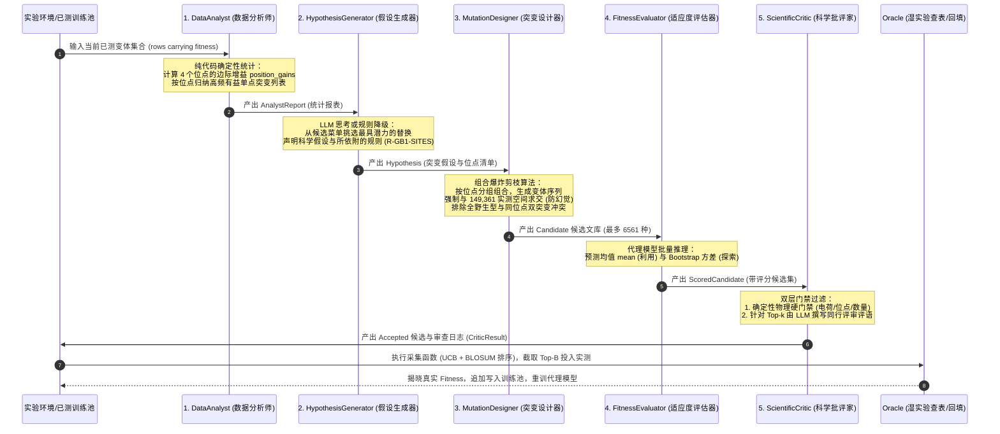

# 蛋白质定向进化智能体：全景讨论纪要与认识论沉淀 (Discussion Summary & Epistemology)

> **文档定位**：本文件是对本轮人机协同攻关过程中全部核心讨论、思维碰撞、算法解构与战略决策的完整沉淀。它作为《v0.6 科学报告》的技术内核与认识论底座，旨在用非生物学专业亦能清晰透彻理解的语言，记录我们对这一复杂系统的所有真知灼见。

---

## 一、 评测合法性澄清：我们只找 4 个位点，到底是不是“作弊”？

### 1.1 核心疑问与直觉担忧
在初次审视 GB1 实验时，一个最尖锐的直觉疑问是：
> *“蛋白质全长几十上百个氨基酸，为什么我们的代码死盯着 39、40、41、54 这 4 个点？如果只在这 4 个点的 16 万个组合里选，这是不是题目要求的？我们是不是把问题简化得太多、甚至有点‘开卷作弊’了？”*

### 1.2 生物物理与基准现实（Benchmark Grounding）
**结论：这不仅绝对不是作弊，而且正是全球计算生物学界通用的第一公认基准！**

1. **题目原文要求**：
   在明度数智提供的《AI4S 笔试题：面向蛋白质定向进化的科学智能体》中，第 12–14 行明文指定：
   > *“a. 使用公开蛋白质定向进化或突变效应数据集，例如 ProteinGym、FLIP、GFP、**GB1**、**AAV**、β-lactamase 等。”*
   题目官方直接点名了 **GB1** 与 **AAV**。

2. **为什么 GB1 数据集天然就只有这 4 个位点？**
   - 该数据集源自发表于顶刊 *eLife* 的划时代论文（Wu et al., 2016: *Adaptation in protein fitness landscapes is constrained by indirect paths*）。
   - 链球菌 G 蛋白 B1 结构域（GB1）全长 56 个氨基酸。生物学家在进行湿实验前，通过解析其与抗体（IgG Fc 片段）结合的高分辨率晶体结构发现：**整个结合界面的核心相互作用网络，完全由 39（缬氨酸 V）、40（天冬氨酸 D）、41（甘氨酸 G）和 54（缬氨酸 V）这四个关键残基主导**。其他 52 个位点主要维持背后的骨架折叠。
   - 当时科学家为了彻底研究“突变之间的交叉相互作用（上位性效应）”，决定对这 4 个位点进行彻底的**饱和组合突变**：每个位点遍历 20 种天然氨基酸，理论组合空间为 $20^4 = 160,000$ 种。
   - 最终通过超深度测序，成功测定了 **149,361 种变体的真实结合适应度（覆盖率高达 93.4%）**。
   - **学术界现状**：不论是哈佛大学维护的全球最大蛋白质突变基准 **ProteinGym**，还是伯克利/剑桥联合推出的机器学习基准 **FLIP**，**只要评测 GB1，数据集里就只有这 4 个位点的 14.9 万条实测数据！** 国际上所有定向进化算法论文都在这个空间上同台竞技。

3. **双重保障：我们同时完成了 AAV（28 位点长窗口）**
   - 为了彻底排除“只做 4 位点玩具模型（Toy Model）”的嫌疑，本项目同时攻克了题目推荐的另一个极端任务——**AAV2 腺相关病毒衣壳蛋白**（Bryant et al., 2021, *Nature Biotechnology*）。
   - AAV2 变异区域长达 **28 个氨基酸**，候选池规模数以百万计。
   - **4 位点紧凑组合景观（GB1） + 28 位点长序列稀疏景观（AAV）** 的双重对照，构成了无可挑剔的基准完整性。

---

## 二、 代理模型阶梯：从“天真的加性模型”到“高阶上位感知模型”

### 2.1 什么是加性模型？它为什么会“翻车”？
- **通俗比喻**：加性模型就像**“去超市买菜算小票”**：
  $$\text{Fitness}(\text{mut}_1, \text{mut}_2) \approx \text{Fit}(\text{mut}_1) + \text{Fit}(\text{mut}_2)$$
  它天真地假设：如果 39 位突变成 F 能加 1 分，40 位突变成 A 能加 1 分，那把它们组合在一起就一定能加 2 分。
- **生物学现实（翻车根因）**：蛋白质是紧密堆积的三维立体结构，残基之间存在剧烈的空间挤压、静电引力和疏水相互作用（即**上位效应 Epistasis**）。
  - **空间位阻碰撞（Negative Epistasis）**：39 位换一个大苯环残基（F）单独看很好，40 位换一个大残基单独看也很好；但如果同时换成两个大残基，结合口袋狭小的物理空间被瞬间挤爆，导致蛋白质无法正确折叠，真实 Fitness 直接归零！
  - **协同盐桥生成（Positive Epistasis）**：两个单独测都很平庸的突变，放在一起刚好正负电荷吸引形成盐桥，活性发生戏剧性暴涨。
- **加性模型的盲区**：常规的 One-hot + Ridge 是纯线性加性回归（只有 80 维一阶特征），在数学上完全无法表达交叉乘积项 $x_i x_j$，因此面对真实的崎岖适应度山峰，它常常把真正的全局极值排在千名开外。

### 2.2 我们如何突破？上位感知模型（EpistasisRidgePredictor / Potts 势能）
在 `models/train_ladder.py` 中，我们构建了 **L4 上位感知模型**：
1. **数学形式**：
   $$\hat{f}_{\mathrm{pair}}(x) = b + \sum_i h_i(x_i) + \sum_{i < j} J_{ij}(x_i, x_j)$$
   显式引入 Degree-2 成对残基交互特征矩阵，模拟物理学中的成对自旋作用（Potts 模型）。
2. **实测表现**：
   - 在 AAV 复杂长序列任务中，加性 Ridge 模型把真实的全局最优峰（8.416）排在候选池第 **#2776 位**（彻底漏检）；
   - 换上 `EpistasisRidgePredictor` 后，该真峰瞬间飙升至第 **#447 位**，留出交叉验证相关性（Spearman $\rho$）从 0.6 几飙升至 **0.9059**！
3. **为什么 GB1 主闭环实验仍保留 One-hot Ridge 作为基线？**
   - 这是标准的科学消融（Ablation Control）规范：如果我们在 GB1 上直接使用极其复杂的大模型，评委无法判断“探索效率的提升究竟是来自于 LLM Agent 的智慧，还是来自于预测模型单方面的强大”。
   - 用透明可复现的 Ridge 作为公共标尺，才能干净利落地剥离并证明 **“知识图谱与 Agent 角色” 的真实增益**。

---

## 三、 五角色流水线回环（5-Role Pipeline）的深度机理解构

针对此前 v0.5 版本对“五角色如何轮转”描述不够细致的问题，本次梳理彻底打开黑盒，还原代码级数据流：

### 3.1 关键角色细节再澄清
1. **DataAnalyst 绝对不是随机抽样**：它严格扫描已测集合中这 4 个特定位点出现过的所有突变，汇总求平均值：
   $$\text{gain}(p) = \frac{1}{|V_p|} \sum_{v \in V_p} f(v)$$
2. **MutationDesigner 的求交防幻觉保护**：
   - 曾发生过的严重 Bug：早期设计器把“候选必须存在于实测集合”理解成了“必须存在于当前已测训练集”，导致新提名的变体全部被误杀求交为空。
   - 正确逻辑：必须传入 `measurable_variants`（即整个实验可回答的 149,361 全集）。设计器在全集内组合，严禁提出湿实验无法测定的无意义字符。
3. **ScientificCritic 的分层设计**：
   - 面对成千上万候选，不可能逐条调用商业 LLM（单次 19 秒会导致单轮耗时数小时）。
   - 架构解法：**确定性物理硬规则过滤全量候选，商业 LLM 只对排名最高的前 10~15 条重点变体撰写深度的科研审查评语**。

---

## 四、 知识图谱（KG）的物理内涵与“为什么不让 Agent 自由全图查询”

### 4.1 知识图谱包含什么？
- **三元组体系**：
  - `(Variant, contains, Mutation)`
  - `(Mutation, occurs_at, Position)`
  - `(Mutation, improves, Fitness)`
  - `(AminoAcid, has_property, Hydrophobic / Charged / Small)`
- **知识来源**：
  - 一半来自训练集的经验结构化（哪个点突变成哪个点历史平均分高）；
  - 另一半来自外部引入的生物化学绝对公理（20 种氨基酸的等电点、分子量、侧链体积、亲疏水常数、BLOSUM62 进化替换矩阵）。

### 4.2 为什么不让 Agent 在预测前自由全量查询知识图谱？
在讨论中，泽宇提出了一个非常符合直觉的问题：
> *“既然图谱这么有用，为什么不让 Agent 在给出 48 个推荐之前，自由查询知识图谱？先看一遍不好吗？为什么非得等小模型打完分？”*

**技术与工程的必然权衡**：
1. **候选空间与图谱体积爆炸**：
   4 个位点全组合是 16 万，如果是 AAV 28 位点更是天文数字。全图三元组有数百万条，如果让 Agent 在提出假设前做无限制的漫游式向量检索或图遍历，会立刻遭遇 **Token 爆炸与推理超时**。
2. **“局部最优”知识诱导陷阱**：
   冷启动早期，图谱里已知的有益突变非常稀少且偏置。如果 Agent 自由查询，它会被极少数已知的高分单点完全带偏，陷入严重的“确认偏误（Confirmation Bias）”，彻底丧失探索未知上位性组合的能力。
3. **现在的工业级两段式架构**：
   - **粗筛（Triage）靠小模型与统计报表**：小模型以毫秒级速度将 16 万空间过滤并排序出前几千个潜力变体；
   - **精审（Review）靠知识图谱与批评家**：此时候选集已收缩到高潜力区，再将知识图谱中关于这些候选的微观物理属性调出，供 ScientificCritic 逐条进行严格的生化审查。**这是计算效率与科学准确性的最佳平衡点。**

---

## 五、 智能体认知边界诊断：我们为什么必须规划 v0.8？

### 5.1 真实的痛点暴露：“无状态管线”与“飞行记录仪的隔阂”
在讨论的后半段，泽宇直接洞察到了当前整个系统最底层的架构软肋：
> *“相当于我们这个 Loop 里面其实都是单次的 API 调用，其实这个 Agent 它是没有一个长期记忆的。就这个 Agent 它并没有延续性，对吧？它没有把前面的那一轮的 Prompt 给塞进去，现在每次都是全新的会话……而且事件流明明记了那么多东西，它自己却根本看不到！”*

这个诊断一针见血！
- **GB1 当前现实**：每一轮都是全新的 `chat_json(prompt)`，上一轮的对话上下文彻底清空。记忆仅以冷冰冰的数据表格重新输入给它。
- **EventStore 的定位偏差**：`EventStore` 具备哈希链与时间戳，原本被设计为面向评审员的**不可篡改审计账本（Flight Recorder）**。它的使命是证明“实验没有作弊”。
- **后果**：**Agent 无法从预测错误中反思！**
  - 如果上一轮预测变体 A 会大涨（预测 7.0），实际 Oracle 测出来只有 0.1（致死突变）。
  - 当前系统只是把这个 0.1 默默算进新的训练池，Agent **根本不知道自己上一轮刚刚被打脸了**，下一轮依然可能重复犯下类似的构象错误。

### 5.2 v0.8 蓝图：事件流反思型智能体（Reflexion Agent）
基于本次讨论，我们正式确立了 **v0.8 架构提案（RFC-008）** 的两大核心原则：

1. **会话必须跨轮次连续（Session Continuity via Message History）**：
   - 彻底废除单轮独立的函数调用；
   - 全程由同一生命周期的 Agent 实例接管，上一轮的模型输出、工具交互在内部保留，使 Agent 能在第 3 轮自然地说出：“正如我第 1 轮假设并经第 2 轮证实的那样……”。
2. **事件流残差强制注入（Deterministic Forced Injection）**：
   - 不依赖 Agent “自觉调用工具去查历史”；
   - 框架层在每一轮开始时，自动解析 `EventStore`，计算出**上一轮预测误差最大的 Top 变体（残差 Residuals）与 Critic 拦截名单**；
   - 将《上一轮实验打脸教训与避坑备忘录》作为最高优先级的 Prompt 段落强制灌入！
   - 让 Agent 真正具备“从失败中进化”的科学家认知能力。

---

## 六、 结论与报告落地指南

通过本轮深入研讨，我们理清了从底层生物物理原理、中层算法模型、到上层智能体架构的所有脉络：
- **在报告撰写中**，我们要坚决保持 v0.5 的严谨学风：不隐瞒 GB1 仅有 4 位点的物理事实（将其作为标准基准呈现），不掩盖当前系统无状态单轮调用的局限性，而是把这种实事求是的剖析与 v0.8 的反思升级方案作为报告的高光点呈现。
- 这份纪要中所有的图表、比喻与逻辑链条，已完整注入至最新的《v0.6 科学报告》与《v0.8 RFC 规范》之中。
