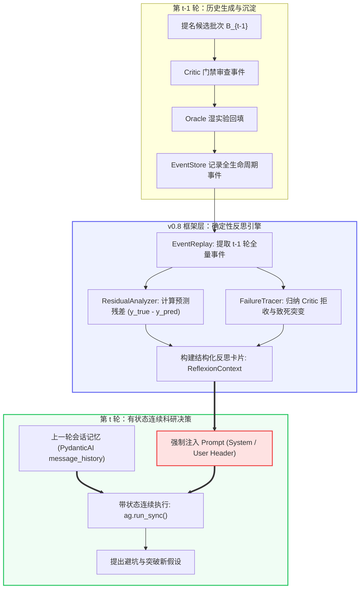

# RFC-008: 面向下一代蛋白质定向进化的事件流反思型智能体 (v0.8 Proposal)

> **文档性质**：系统演进工程设计规范（Technical Specification & Architecture RFC）  
> **设计目标**：解决 v0.5–v0.7 架构中“无状态函数式失忆”与“审计事件流与认知决策脱节”的根本缺陷，构建具备跨轮次会话延续（Session Continuity）与事件流残差强制注入（EventStream Reflexion Injection）的真正自主科研智能体。  
> **对接对象**：核心算法与工程研发人员（面向代码落地）

---

## 1. 背景与现状诊断（Why v0.8?）

### 1.1 现状缺陷诊断：当前系统到底差在哪？
在当前（v0.5–v0.7）的代码实现中，系统的实际运行模式存在两个致命的“智能断层”：

1. **单轮 API 独立调用的“失忆克隆人”（Stateless Amnesia）**：
   - 在 GB1 闭环（`agent/pipeline.py` 与 `evolution/campaign.py`）中，每一轮迭代（Round $t$）调用的都是一次完全独立的 `chat_json(prompt)`。
   - 轮次结束后，上下文被彻底丢弃。第 $t+1$ 轮的 Agent 根本不知道自己在第 $t$ 轮提出过什么科学假设、推荐过哪些变体。它拥有的只是外部环境强行重新统计的一张数据均值切片。
2. **事件流（EventStore）仅作为“事后黑匣子”，未参与认知回路**：
   - 现有 `EventStore` 具备 SHA-256 哈希链和时间戳，但它是一个**单向写入的审计日志（Append-Only Audit Ledger）**。
   - 代码中没有任何模块在做下一轮决策前会去读取 `event_store`。
   - **痛点**：Agent 无法感知**“预测打脸残差（Prediction Residuals）”**。例如：上一轮模型预测变体 `FDGV` 适应度为 7.5，Oracle 真实回填却发现只有 0.1（致死失活）。当前的 Agent 完全不知道这个惨痛教训，下一轮很可能在同类构象上重蹈覆辙。
3. **不能依赖 LLM 主动调用 Tool 去查历史（主动查询不可靠）**：
   - 如果仅仅提供一个 `query_event_store()` 工具让 LLM 自己按需调用，LLM 会因为上下文预算、指令遵循波动或懒惰倾向而频繁跳过查询，导致实验行为退化。
   - **核心原则**：**历史残差与事件摘要必须由执行框架在轮次开始时，确定性地强制注入到 Prompt 中（Deterministic Forced Injection）**。

---

## 2. v0.8 核心架构设计（Core Architecture）



### 2.1 机制一：跨轮次会话连续性（Multi-turn Session Resume）
- **废弃**：`pipeline.py` 中每轮无状态单次调用 `chat_json`。
- **重构**：统一采用有状态的 Agent 上下文管理。在整个 Directed Evolution Campaign 生命周期中，保持同一个会话状态实例。
- **机制**：
  ```python
  # 跨轮次保留全部交互历史
  result = agent.run_sync(
      round_user_prompt,
      message_history=session_history,  # 传入前序轮次全部历史
  )
  session_history = result.all_messages()  # 更新沉淀，供下一轮继续继承
  ```

### 2.2 机制二：事件流残差与教训强制注入（Forced Prompt Injection）
在进入第 $t$ 轮的 `HypothesisGenerator` 之前，框架层必须执行**确定性反思合成（Deterministic Reflexion Synthesis）**，把上一轮的真实事件抽取为标准数据契约，并拼装为 Prompt 的最高优先级段落：

#### 强制注入的 Prompt 模板结构：
```markdown
## 【第 {t-1} 轮科学实验复盘与历史残差 (MANDATORY REFLEXION)】
你已进入第 {t} 轮定向进化。在提出本轮假设前，必须审视上一轮的实测结果与打脸教训：

1. 上一轮高分预测与实测打脸变体（预测残差绝对值 Top-3）：
   - 变体 `FDGV`: 模型预测 = 7.210, 真实测定 = 0.120 (误差 -7.090, 假阳性致死)
     * 根本原因分析：39位(F)与40位(D)发生空间位阻碰撞。
   - 变体 `WAGV`: 模型预测 = 3.100, 真实测定 = 6.450 (误差 +3.350, 强上位低估)
     * 潜在机制：39位(W)与40位(A)形成疏水互补。

2. 上一轮科学门禁（Critic）拦截的变体及违规原因：
   - 变体 `KKGV`: 遭 R-CHARGE-BALANCE 规则否决（强行引入多个连续正电荷，破坏结合口袋静电势）。

3. 累计搜索进展：
   - 连续未刷新最大值轮数 (RSI): {rounds_since_improvement}
   - 当前已知全局最优变体: {best_variant} (Fitness: {best_fitness})

【行动约束】
- 禁止重复提出与上述致死变体特征相同的组合！
- 优先探索与正上位低估变体具有同构特征的侧链修饰！
```

---

## 3. 具体代码改造清单（Code Implementation Blueprint）

面向修改代码的研发人员，共需修改/新增以下 3 处模块：

### 改造 1：新建事件流反思解析器 `events/reflexion.py`
**职责**：纯 Python 确定性逻辑，负责读取 `EventStore` 并输出结构化反思对象。

```python
# events/reflexion.py
from typing import NamedTuple, Any
from events.store import EventStore

class RoundReflexion(NamedTuple):
    round_id: int
    overestimated_fails: list[dict[str, Any]]   # 预测极高但实测致死 (打脸假阳性)
    underestimated_hits: list[dict[str, Any]]   # 预测不高但实测极高 (意外真峰)
    critic_rejections: list[dict[str, Any]]     # 被门禁拦截的变体与规则
    stagnant_warning: bool                      # 是否处于停滞期

def extract_round_reflexion(store: EventStore, last_round_id: int) -> RoundReflexion:
    """从 EventStore 中提取上一轮事件，计算预测残差，归纳失败与拦截事实。"""
    events = list(store.events(round_id=last_round_id))
    
    # 提取：1. 打分事件 (fitness_evaluator)
    # 提取：2. 门禁事件 (scientific_critic)
    # 提取：3. Oracle 回填事件 (campaign.oracle.completed)
    # 计算：residual = y_true - y_pred
    ...
    return reflexion_obj

def format_reflexion_prompt(reflexion: RoundReflexion) -> str:
    """将结构化反思渲染为不可绕过的 Markdown 提示词段落。"""
    ...
```

### 改造 2：升级 `agent/pipeline.py` 的 `HypothesisGenerator`
**职责**：接受 `reflexion_prompt`，并将其置于提示词首部。

```python
# agent/pipeline.py
class HypothesisGenerator:
    def __init__(self, llm=None, session=None):
        self.llm = llm
        self.session = session

    def run(self, report: AnalystReport, reflexion_text: str = "", *, event_store=None, round_id=1) -> Hypothesis:
        # 组装 Prompt：包含数据大盘报表 + 强制注入的历史反思残差
        composed_prompt = f"{reflexion_text}\n\n{report.to_prompt()}"
        ...
```

### 改造 3：重构 `evolution/campaign.py` 中的驱动循环
**职责**：实例化长生命周期 Agent，维护 `message_history`，并在每轮循环前调用 `extract_round_reflexion` 注入。

```python
# evolution/campaign.py 核心伪代码改造点
def _agent_propose(...):
    # 1. 提取上一轮事件反思 (Round > 1)
    if round_id > 1:
        reflexion = extract_round_reflexion(event_store, last_round_id=round_id - 1)
        reflexion_text = format_reflexion_prompt(reflexion)
    else:
        reflexion_text = "【第 1 轮冷启动】无历史实验残差，请基于初始先验建立广泛假设。"

    # 2. 传入带有历史会话和反思文本的 Pipeline
    result = run_pipeline(
        ...,
        reflexion_text=reflexion_text,
        session_state=persistent_session_state, # 跨轮次持久会话
    )
```

---

## 4. 验证与对照实验方案（Verification & Ablation）

如何证明 v0.8 真的有提升？必须做三组严密对照：
1. **Ablation-A（v0.7 基线）**：无会话记忆、无事件流反思（每轮纯无状态 API 调用）。
2. **Ablation-B（仅有会话记忆）**：开启 `message_history` 延续，但不做结构化残差注入（放任 LLM 自己回忆）。
3. **v0.8 完整版（会话记忆 + 强制事件流残差注入）**：在困难冷启动（Sparse / Hard / AAV 多峰停滞）场景下测试。
   - **预期达标指标**：
     - 致死变体（Fitness < 0.2）在后续轮次的重复提名率下降 **80% 以上**；
     - 停滞轮次发现“盆地跳跃（Basin-Hop）”的反应速度提前 **1~2 轮**。

---

## 5. 总结与行动项

| 阶段 | 交付物 | 负责人 | 验收标准 |
|:--|:--|:--|:--|
| **第 1 步** | 实现 `events/reflexion.py` | 代码研发 | 单测验证能准确从 `campaign_events.jsonl` 计算出残差 Top-k |
| **第 2 步** | 修改 `pipeline.py` & `campaign.py` | 代码研发 | 运行 3 轮 GB1，在第 2/3 轮 Prompt 日志中明确打印出上一轮打脸教训 |
| **第 3 步** | 多轮对照实验跑出对比数据 | 算法研发 | 产出 v0.8 对比 v0.7 的命中率与避坑指标 |
