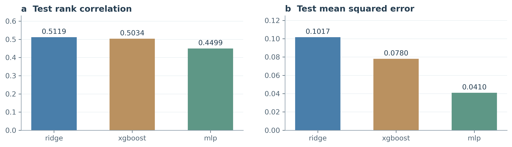
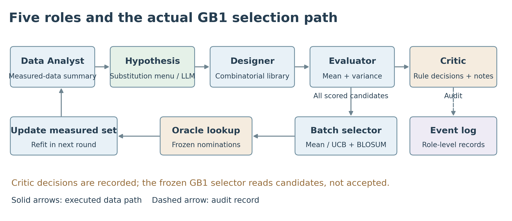
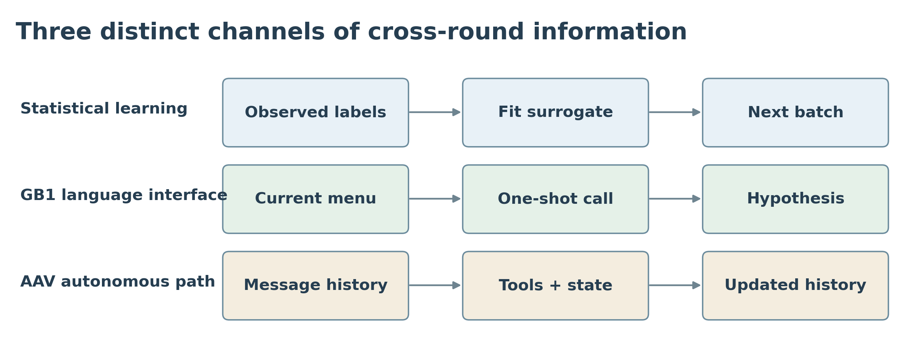
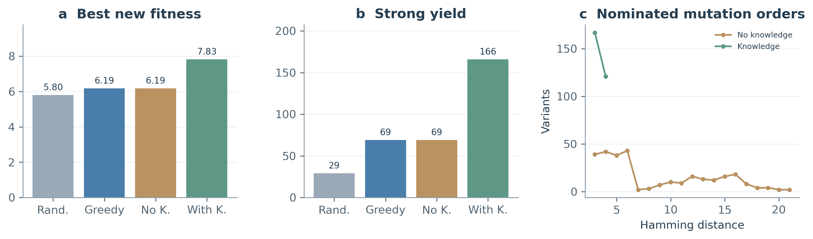
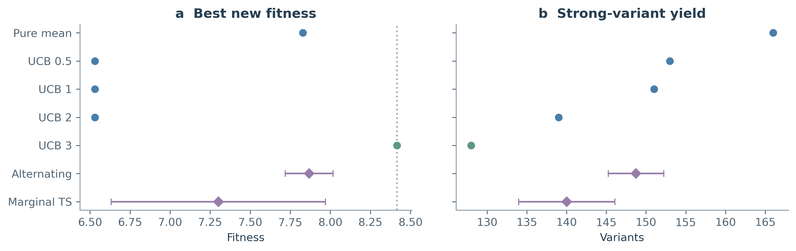
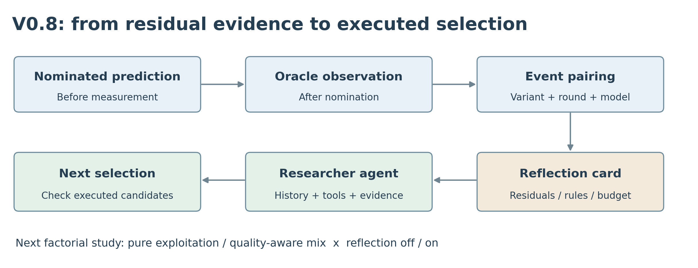
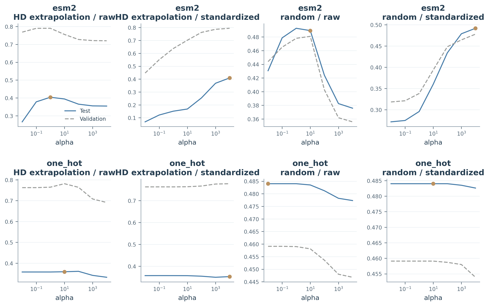

# 面向定向进化的可审计科学智能体

从预测模型、知识约束到实验反馈的受控研究 Zeyu Li · 研究报告 v0.6 · 2026 年 9 月 13 日

::: {.abstract}
**摘要**　我们构建了以实测适应度为反馈、以代理模型为预测工具、以角色化工作流为执行骨架的定向进化系统，在 GB1 与 AAV 固定测量池上研究三个问题：如何公平比较序列表征与预测器，知识配置何时改变搜索结果，以及语言模型通过什么路径影响实验决策。训练集内选择正则化强度后，ESM-2 表征在 GB1 跨突变距离测试中的 Spearman 相关达到 0.4039–0.4090，高于 one-hot 的 0.3530–0.3588。GB1 稀疏冷启动中，知识策略在三轮内找到池内全局最优，均值贪心与无知识策略停留在较低峰；AAV 知识消融显示，搜索范围约束同时改变了候选组成与强命中产量。进一步的事件审计将 LLM 接入后的绝对产量下降分解为实际查询数减少与命中比例变化，并识别出自然语言评审和最终选样之间的接线边界。V0.8 首轮冒烟补充了逐变体预测残差：反思注入改变了工具动作，但两臂六轮送测集合一致。上述结果支持将科学智能体定位为组织预测、实验与证据修订的研究者接口，并以可观测的决策变化评价其作用。
:::

::: {.cols}
## 1　研究问题与贡献

定向进化通过构建变体、测量功能与迭代选择，在有限实验预算内寻找具有目标性质的蛋白质。[1–3] 序列空间迅速随可变位点数增长；模型辅助搜索的价值在于把预算集中到有信息或有潜力的候选，而非穷举全部组合。

本项目把这一过程组织为可回放的计算实验。预测器输出候选的数值排序，知识模块表达搜索约束，Agent 组织假设、文库与工具调用，Oracle 返回预先封存的测量值。每轮新观测加入训练集，构成下一轮决策的证据基础。

研究贡献首先是建立了贯通数据、预测、设计、筛选与反馈的执行链，并明确区分 GB1 五角色流水线和 AAV 自主工具调用两条路径。其次，我们用参数扫描、冷启动分层与知识消融，把“模型好不好”和“搜索策略有没有用”拆成可检验的问题。最后，通过突变阶数、保守性和残差审计，解释局部高分候选与失败推荐如何形成。

这些贡献共同回答一个方法问题：科学智能体的进步应当表现为更合理的实验选择，以及能够追溯到观测的假设修订。语言流畅性可以改善研究接口，但其价值需要通过实际执行链来验证。
:::

<!-- PAGE -->
## 2　数据、评测协议与证据口径

| 维度 | GB1 | AAV |
|---|---|---|
| 研究对象 | 四个可变位点，WT 为 VDGV | 28 残基变异窗口 |
| 数据来源 | 组合突变适应度测量 [4] | 衣壳变体测量、FLIP 清洗子集 [5,6] |
| 冷启动 | easy 5,000；hard 2,168；sparse 77 | HD≤2，10,433 条 |
| 单轮预算 × 轮数 | 96 × 3 | 48 × 6 |
| 强命中阈值 | fitness ≥ 4.0 | 原消融 ≥ 2.615913579904 |
| 查询返回 | 固定池已有测量 | 固定池已有测量 |

::: {.cols}
### 2.1　先预测，再揭示测量

每轮先根据已测集合训练模型并冻结提名，再由查表 Oracle 揭示这些序列的适应度。模型与候选选择过程使用当时已测标签；完整测量表承担离线模拟实验的功能。GB1 理论组合数为 160,000，实测池包含 149,361 条，缺测的 10,639 条不作为可查询候选。

AAV 使用可对齐的替换子集；候选为冷启动之外的 HD>2 序列。这里的 HD 是相对参考序列的 Hamming 距离。知识消融允许无知识臂访问较宽的候选范围，而固定预测器矩阵对所有配置使用同一 HD≤4、BLOSUM≥0 的门禁。两类实验分别回答“约束整个搜索空间”和“在相同空间中改变采集”的问题。

### 2.2　把找峰与批次产量分开

本文报告新增查询中的最高适应度、累计 top-10 均值、强命中数和实际查询数。GB1 有益命中定义为 fitness>1.0，即优于野生型。最佳值回答是否找到高峰，命中数回答有限预算产生多少候选，命中比例则以实际查询数为分母。

AAV 候选池最高值为 8.416205，但冷启动中已有适应度 9.536457 的序列。因此 AAV 的“达峰”指找到新增候选池的峰，不表示超过初始已知最优。该定义在后文统一沿用。

### 2.3　重复与版本

GB1 随机策略报告五个 seed 的均值与总体标准差；三条模型策略为 seed 42 的轨迹。AAV 知识消融为 seed 0，atomic 与 checkpoint 是执行模式。固定预测器实验区分确定性重复与随机采集的 30 个 seed。图表只在实际具有随机重复的地方绘制误差棒。

报告 v0.6 是文档版本；agentic-v0.5、v0.6、v0.7 与 V0.8 是实验或代码版本，二者不一一对应。历史 v0.6 与 v0.7 从 v0.5 分叉，故其结果应各自与共同基线比较。本文冻结既有产物，并单列新收到的 V0.8 第一轮证据。
:::

<!-- PAGE -->
## 3　预测工具：评价目标决定模型选择

| 模型 | 测试 Spearman | 测试 Pearson | 测试 MSE | top-k 重合率 |
|---|---:|---:|---:|---:|
| Ridge | 0.5119 | 0.4116 | 0.1017 | 0.50 |
| XGBoost | 0.5034 | 0.6013 | 0.0780 | 0.50 |
| MLP | 0.4499 | 0.8191 | 0.0410 | 0.65 |

::: {.cols}
### 3.1　排序与数值误差提供互补证据

Ridge 的测试 Spearman 最高，MLP 的 Pearson、MSE 与 top-k 重合率更好。这个结果表明，“最佳预测器”依赖决策目标：若采集只使用排序，秩相关更直接；若比较预期收益或校准不确定性，数值误差同样重要。蛋白质基准也强调多种测量任务和评价方式的区别。[7,8]

Ridge 提供可检查的线性基线；梯度提升与 MLP 引入非线性拟合能力。[9,10] 模型复杂度增加并未在本次划分中同步提升所有指标。因此系统保留预测器接口，通过一致的数据划分与指标表选择工具，而不是预先把复杂模型当作优胜者。

### 3.2　不确定性需要实际变化

GB1 预测链采用 bootstrap 重采样训练多个估计器，以预测分歧构成候选方差。该做法使相同模型族能够输出均值之外的信息，为探索项提供输入。当前表中三类预测器均具有非零方差范围。

模型分歧反映重采样和拟合的敏感性，并非经过独立校准的概率保证。我们将其作为采集启发式，与均值排序进行对照；这样可以直接观察探索项是否改变实际批次和最终产量。低样本蛋白质工程中的模型不确定性和表征选择，需要结合具体实验预算进行评价。[11]

### 3.3　预测器验证与闭环验证衔接

离线测试回答已定义分布上的预测能力，闭环实验回答选样后能否取得更好的观测。模型可能在总体误差上更优，却在高分尾部或外推区间排序失准。后续结果因此同时保留预测表、逐轮轨迹与候选级证据，避免用一个相关系数代替整个搜索过程。
:::

<!-- PAGE -->
## 3.4　ESM 表征：比较时控制尺度与正则化

| 划分 | one-hot raw | one-hot std | ESM-2 raw | ESM-2 std |
|---|---:|---:|---:|---:|
| random | 0.4840 | 0.4840 | 0.4893 | 0.4916 |
| HD extrapolation | 0.3588 | 0.3530 | 0.4039 | 0.4090 |
| HD 所选 α | 10 | 10,000 | 1 | 10,000 |

::: {.cols}
### 公平比较首先是训练协议问题

ESM 从大量蛋白质序列中学习统计表征，能够提供不同于独立位点编码的上下文信息。[12,13] 但把相同 α 直接用于 one-hot 和 ESM，并不意味着两者受到可比的正则化：不同特征尺度会改变惩罚项相对于数据拟合项的作用。

固定 α 的消融中，ESM 标准化前后的结果相差较大。进一步对每种表征、划分和预处理分别扫描 α∈{0.01, 0.1, 1, 10, 100, 1000, 10000}，按训练集内 80/20 留出的 Spearman 选择参数，再全训练集重拟合，得到表中的测试结果。

原实现的标准化器在外层训练集上拟合；内层验证用于选择 α，外层测试标签不参与选择。这一细节随源代码快照保留，便于复查训练协议。

### 在外推任务中观察表征收益

调参后，ESM-2 在 HD 外推测试中比 one-hot 高 0.0451（raw）与 0.0560（std）。两个预处理条件的方向一致，说明本次 Ridge 实验中的表征收益具有比固定 α 单点比较更清晰的证据。随机划分下两者差距较小。

因此，蛋白质预训练表征是值得纳入预测工具箱的候选。已有研究也探索了预训练与少样本工程、进化信息和变异效应预测的结合。[14–16] 本项目的闭环收益仍应由使用该表征的 campaign 单独检验；本节数据直接支持的是 Ridge 层的表征比较。
:::

<!-- PAGE -->
## 4　从五个角色到一次可执行实验

::: {.cols}
### 4.1　分析、假设与文库设计

Data Analyst 读取已测序列和适应度，汇总位点及替换信息。代码中的 position gains 是含相应位置突变样本的平均适应度，并不是以野生型为对照识别出的因果增益。这个汇总为设计提供经验线索。

Hypothesis Generator 输出替换菜单。确定性路径按已测支持选取每个位点的候选替换；接入 LLM 时，由语言接口从菜单组织组合建议。Library Designer 将各位置替换与野生型残基做笛卡尔积，去除全野生型、冲突或不可测组合。GB1 默认每位点最多八种替换，形成至多 9⁴ 个含野生型的原始组合，再经过集合处理得到可评估文库。

这使“假设”具有执行含义：它改变哪些序列进入下一步评估，而不只是附在结果旁的一段解释。

### 4.2　评分、规则与批次选择

Fitness Evaluator 用当轮代理模型输出文库中各候选的预测均值和方差。Critic 则运行确定性知识规则，并对预算内、通过规则的候选请求自然语言评语。默认每轮最多十条 LLM 评语，按传入候选顺序分配；这不是对全库进行十条“最高分专家评审”。

冻结 GB1 consumer 的一个关键接线事实是：selector 读取 `candidates`，而不是 `accepted`。因此规则判定在该 consumer 中承担审计角色，实际选择由采集分数和可测、未测条件驱动。我们据此描述结果中的知识作用，不将所有 Critic 拒绝都解释为已生效的筛除。

无知识策略按均值排序；知识策略使用均值 + 0.75×标准差 + 0.30×BLOSUM 得分。BLOSUM 提供替换先验，[23] 探索项鼓励关注模型分歧较大的候选。[18] 排序完成后冻结批次，再交给 Oracle 返回测量。
:::

<!-- PAGE -->
## 4.3　跨轮反馈究竟传递什么

::: {.cols}
### 统计学习形成基础闭环

每轮查询产生新标签，扩充已测集合，并在下一轮重新拟合 surrogate。即使语言端口采用单轮调用，这条反馈仍持续工作。GB1 sparse 轨迹中，知识策略的新增最佳值依次为 6.0421、7.5547 和 8.7620；它体现了采集与更新相互作用的执行结果。

反馈的可解释性来自记录：当时掌握了哪些数据，模型如何评分，哪些候选被提名，以及实验返回了什么。事件流把这些步骤保留下来，使最终指标可以回到产生它的决策过程。

### 两条语言路径有不同的信息条件

GB1 的 LLM 假设接口虽然接收 report 参数，但冻结实现实际发给模型的是替换名称菜单，没有传入完整分析数值，也未携带历史消息。该接口适合检验“语言模型组织菜单”对文库的影响，不能与能够读取历轮残差的研究者接口混为一谈。

AAV 的自主研究路径保留 message history，由模型调用 `analyze_measured`、文库构造、测试及知识图查询工具。分析工具暴露已测高分序列、富集信号和模型验证结果；回溯配置还提供轨迹与停滞状态。每轮工具状态随新观测更新。

### 历史、测量与反思卡的区别

保留对话历史使模型能够延续上下文；统计重拟合使预测器吸收新标签；结构化残差卡则把“原先预测与后来测量的差异”显式交给下一轮决策者。三者是不同的实现能力。

V0.8 在这一基础上新增逐变体的提名时预测、测量与残差事件，并将异常观测注入反思臂的下一轮 prompt。第八章单列首轮冒烟结果，用实际批次比较检验这条新增通道是否产生行为效果。
:::

<!-- PAGE -->
## 5　知识如何进入搜索与解释

::: {.cols}
### 5.1　可执行知识与经验图谱

系统中的知识既包括 HD 和 BLOSUM 等显式规则，也包括从已测标签形成的突变共现、富集和上下文关系。前者表达允许搜索的范围，后者把已有实验压缩为候选解释。AAV 自主路径从 measured set 构建图，并针对提名调用突变上下文查询。

这种图谱的主要价值是连接具体替换、观测与建议。富集表示已有样本中的关联；它会受采样策略和覆盖影响。因此图谱适合帮助研究者形成可检验的组合假设，而不是把共现直接解释为突变之间的因果机制。

GB1 的残基集中度给出一种直观的搜索诊断：该运行的 top-10 记录中，V54 位点全部选择 A，而其他位置保留更多变化。它说明高分提名收敛到了怎样的组成，便于进一步检查是否过早缩窄文库。

### 5.2　保守性作为可检查的先验

我们用 ESM-2 逐位 masked-token 的 20 种氨基酸分布熵表示位置保守性。熵越低，分布越集中。AAV 候选峰含 D0Q、S17E 与 V18A：对应保守性名次为第 1、第 26 和第 4，熵为 1.2339、2.9035 与 2.8555 nats（窗口零基坐标）。

这构成对硬保守性筛选的具体提醒：若排除最保守位置上的替换，D0Q 可能先于组合评估被移除。当前实现将保守性用于事后分析，没有把它接入在线筛选，因此这里讨论的是潜在筛选后果。

AAV 的保守性名次与最大单点增益相关为 ρ=0.4028（p=0.0335，n=28），与有益比例相关为 0.2972（p=0.1246）。这些不同指标表明自然序列先验与特定 assay 功能之间存在需要实测检验的关系。GB1 仅四个位点，相应 ρ=0.2、p=0.8，作为描述保留。
:::

<!-- PAGE -->
## 6　闭环结果：知识价值随冷启动而变化

| 冷启动 | 随机：最高值，均值±σ | 贪心：最高值 / 强命中 | 无知识：最高值 / 强命中 | 知识：最高值 / 强命中 |
|---|---:|---:|---:|---:|
| easy | 3.6742 ± 0.8200 | 8.7620 / 81 | 8.7620 / 95 | 8.7620 / 86 |
| hard | 4.6113 ± 1.8501 | 8.7620 / 43 | 8.7620 / 50 | 8.7620 / 65 |
| sparse | 4.0461 ± 0.7203 | 5.7720 / 29 | 5.7720 / 27 | 8.7620 / 33 |

::: {.cols}
### 6.1　信息充足时看批次分布

easy 冷启动提供 5,000 个随机测量，三条模型策略均找到全局最优 FWAA。此时最高值已饱和，批次统计继续提供区分：无知识策略的强命中数为 95，高于知识策略的 86；知识策略的有益命中为 250，高于无知识的 244 和贪心的 239。

这两个排序并不矛盾。强命中衡量高阈值以上的尾部产量，有益命中衡量超过野生型的广度。知识配置在此次运行中改变了批次分布，不能仅用其中一个指标概括全部收益。

### 6.2　稀疏冷启动揭示搜索分层

hard 使用 HD≤2 的 2,168 条测量，三条模型策略最终均达峰，但知识策略强命中更多。sparse 仅有 HD≤1 的 77 条测量，贪心与无知识策略停在 5.7720，知识策略则通过三轮到达 8.7620。

这一单 seed 分层为后续研究提供了明确机制假设：当低阶观测不足以支撑可靠均值排序时，探索项与替换先验可能帮助搜索离开当前高分区域。它也指出了应优先重复的条件，而不是把所有冷启动合并后报告一个平均收益。

本组知识处理同时包含 UCB 与 BLOSUM；其联合配置的表现已被观测，两个组成项的独立效应需要因子消融。随机策略的误差范围相互重叠，不据单次高低解释不同 regime 的随机优势。
:::

<!-- PAGE -->
## 6.3　Live LLM：产量、查询数与选择比例

| 配置 | 实际查询 | 强命中 | 强命中 / 查询 | 有益命中 | 有益 / 查询 |
|---|---:|---:|---:|---:|---:|
| 确定性，无知识 | 288 | 50 | 17.36% | 182 | 63.19% |
| Live LLM，无知识 | 105 | 32 | 30.48% | 88 | 83.81% |
| 确定性，知识 | 288 | 65 | 22.57% | 204 | 70.83% |
| Live LLM，知识 | 197 | 59 | 29.95% | 140 | 71.07% |

::: {.cols}
### 数值下降对应怎样的执行变化

两次运行具有相同冷启动、名义预算与 Oracle；随机和贪心路径不经过语言端口，保留相同对照行为。接入 gpt-5.6-sol 后，两条 Agent 的绝对强命中和有益命中均下降，但实际查询也从 288 减少到 105 和 197。

事件流显示，无知识臂三轮分别测了 5、96、4 条，知识臂测了 5、96、96 条。预算利用率为 36.46% 和 68.40%。以实际查询为分母，两条 LLM 臂的强命中比例反而更高。由此可见，绝对产量下降包含了文库收缩与吞吐变化，不能直接等同于候选质量下降。

### 语言参与度与消费者接线

本次 GB1 Critic 在 90 秒超时设置下，50 次尝试中产生 27 条实质评语，23 次回退。假设来源为无知识臂 llm/fallback/llm、知识臂 llm/fallback/fallback。该运行测量的是包含回退的语言接入系统。

审计还发现，知识臂实际提名的 197 条候选均对应同轮 Critic 的 rejected 判定。原因是第四章所述 selector 读取全部 candidates。故本对照中的知识收益应归于实际生效的采集配置，不能归功于 Critic 拒绝过滤或自然语言评语。

这些观测将下一步改进落到可操作的问题：保证有效文库与预算填充，明确评审判定如何被消费者使用，并在等实际查询量下比较选择质量。事件审计使这些问题能够由执行证据提出，而非从终局分数猜测。
:::

<!-- PAGE -->
## 6.4　AAV 知识消融：候选空间与产量一起变化

| 策略 | 新增最佳 fitness | 强命中（atomic） | 强命中（checkpoint） |
|---|---:|---:|---:|
| random | 5.8015 | 29 | 29 |
| greedy | 6.1862 | 69 | 69 |
| Agent，无知识 | 6.1862 | 69 | 53 |
| 知识 Agent | 7.8290 | 166 | 166 |

::: {.cols}
### 约束对搜索组成产生直接影响

知识臂相对无知识臂的最佳值提高 1.6428，强命中增加 97（atomic）或 113（checkpoint）。所有策略完成 288 次查询，知识臂提名的 167 条 HD3 与 121 条 HD4 占满预算；无知识臂平均 HD 为 8.53，知识臂为 3.42。

两臂提名集合交集为 65，Jaccard 系数为 0.1272。这表明知识配置确实改变了被测候选，而不只是给同一批序列附上不同的解释。HD 与 BLOSUM 门禁在此路径中实际参与候选池构造和测试验证。

### 将预测支持与组合搜索相衔接

AAV 的 28 位点空间较宽，低阶训练数据对较远组合的支持不均匀。门禁将预算集中于更接近训练分布的组合，在本次运行中获得更多强命中。与 GB1 easy 的最高值饱和对照，这一结果支持按冷启动覆盖与搜索空间设计知识处理。

标签打乱对照给出观测 CV Spearman 0.9059、打乱后 0.0254，说明该验证管线捕获了标签相关的可预测信号。跨阶测试仍需另行考察，第七章展示其与同分布验证的差别。

### 解释联合处理的效果

本实验的知识增强包含搜索范围和先验规则，Agent 路径还具有历史语言调用及回退。因此 97 个额外强命中是这一配置的配对差值，不能进一步拆成某个语言模块的独立贡献。atomic 与 checkpoint 是执行方式对照，分别报告；重复实验将用于检验该差值的稳定程度。
:::

<!-- PAGE -->
## 6.5　相同候选池中的采集策略权衡

| 采集配置 | 最佳值，均值±σ | 强命中，均值±σ | 达峰 | 独特轨迹 |
|---|---:|---:|---:|---:|
| Mean | 7.8290 | 166 | 否 | 1 |
| UCB 0.5 | 6.5309 | 153 | 否 | 1 |
| UCB 1 | 6.5309 | 151 | 否 | 1 |
| UCB 2 | 6.5309 | 139 | 否 | 1 |
| UCB 3 | 8.4162 | 128 | 是，第 3 轮 | 1 |
| Alternating | 7.8681 ± 0.1490 | 148.73 ± 3.49 | 2/30 | 30 |
| Gaussian Thompson | 7.3017 ± 0.6684 | 140.03 ± 6.06 | 3/30 | 30 |

::: {.cols}
### 最高值与命中数形成真实权衡

在相同门禁下，Mean 取得 166 个强命中但停在 7.8290；UCB 3 找到 8.4162 候选峰，强命中降至 128。更强探索并未沿所有指标单调改善：UCB 0.5、1、2 都停在同一较低峰。

这说明探索参数应与目标函数和实验成本一起确定。若希望积累一批高质量候选，均值策略在该配置下更有吸引力；若任务重视发现稀有峰，容忍较低批次产量的探索可能值得测试。贝叶斯优化中的 UCB 与改进量方法均体现了对采集目标的显式建模。[18,19]

### 随机重复提供另一层证据

Alternating 与 Gaussian Thompson 分别在 30 次运行中达峰 2 次和 3 次，对应 Wilson 95% 区间约 1.85%–21.32% 与 3.46%–25.62%。小次数的差别不足以稳定排序两者，却揭示了达峰事件的稀疏性。

确定性策略即使保存了多条 seed 记录，候选轨迹仍一致；将其计作 30 次独立随机成功会夸大证据量。本表直接列独特轨迹，使重复的含义可检查。该矩阵固定模型与门禁，不包含 LLM，因此用于解释采集行为本身。
:::

<!-- PAGE -->
## 7　组合效应：突变阶数与数据覆盖

| 数据集 | 训练阶 → 测试阶 | 训练 / 测试数 | 所选 α | 测试 Spearman |
|---|---|---:|---:|---:|
| AAV | 0..1 → 2 | 533 / 9,900 | 0.01 | 0.8749 |
| AAV | 0..2 → 3 | 10,433 / 6,124 | 1 | 0.6155 |
| GB1 | 0..1 → 2 | 77 / 2,091 | 0.01 | 0.6580 |
| GB1 | 0..2 → 3 | 2,168 / 26,019 | 10 | 0.5589 |

::: {.cols}
### 7.1　验证分布必须对应研究问题

AAV 0..2→3 的内层留出验证相关为 0.9094，而 HD3 测试相关为 0.6155。前者描述训练阶数范围内的预测，后者直接检验跨阶外推。两者的落差提醒我们，随机留出分数不能替代目标外推分布上的验证。

这也是设置 GB1 冷启动分层的原因：改变初始测量覆盖，可以观察模型在低阶数据起步时如何组织组合搜索，而不仅是在较密集的随机样本中继续插值。

### 7.2　测量拓扑影响机制解释

对 k 阶变体，本文的“直接低阶完整率”要求其全部 k 个（k−1）阶组成变体均已测量；这不等于所有更低阶子集都完整。AAV HD3 的完整率为 31.17%，HD4 为 2.24%；GB1 对应为 96.22% 与 94.26%。

因此 AAV 高阶组合经常缺少用于分解相互作用的直接对照。其按阶数统计的 fitness 中位数也反映各阶已测样本的选择组成，不能单凭这些组间统计断言“增加一次突变”的因果效果。

### 7.3　残差把高分与失配联系起来

AAV HD2、HD3、HD4 的加性残差中位数分别为 −2.56、−5.20、−8.04，表现出随阶数加深的系统性高估。这提供了选择更丰富模型和设计诊断组合的依据。高阶上位效应研究也强调，组合测量与所用参考背景决定了相互作用的定义。[17]
:::

<!-- PAGE -->
## 7.4　局部上位效应：一组可追溯的组合

| 组合 | WT | A | B | C | AC | BC | ABC |
|---|---:|---:|---:|---:|---:|---:|---:|
| fitness | −0.9182 | 0.3020 | 3.2874 | 0.8896 | 2.0879 | 5.7702 | 8.4162 |

::: {.cols}
### 从可测量的差异开始解释

由单点效应相加得到 ABC 的预期为 6.3154，实际为 8.4162，差值 +2.1008。该数值明确表明，单点相加低估了这个三点组合；它为进一步研究相互作用提供了具体对象。

与此同时，AB=D0Q+S17E 在整个固定测量表中缺失。没有该对照，完整三阶分解中的相应项无法直接识别。因此 +2.1008 在这里称为相对单点加性的偏离，而不等同于已分离出的纯三阶相互作用系数。

### 发现高峰与解释高峰是两个任务

ABC 本身存在于候选池，因此低阶缺测并不阻止算法找到它：上一节 UCB 3 已在第 3 轮达峰。缺少 AB 限制的是对局部机制的完整识别，查表预算增加也无法生成表外 AB 的新测量。

这一区分使后续实验目标更具体。若目标是发现池内高值，继续研究采集与预测排序；若目标是解释组合机制，则需要获得缺失对照，或明确采用带假设的统计估计。固定池评测能够回答前者，并暴露后者需要补测的位置。

### 从成功组合回看失败推荐

现有局部分析中，ABC 的预测均值为 6.3668，在完整候选中排第 2,758，在门禁池中排第 426。另一端，按预测选出的首批 48 条平均预测为 11.3065，平均实测为 2.8838。模型既可能低估有利组合，也可能高估看似有希望的区域。

因此残差记录应覆盖整个送测批次，特别是高预测、低测量的样本。只保留每轮 top-10 会选择性保留成功者，使下一轮诊断看不到失败的具体序列和背景。V0.8 为这一问题提供了新增观测通道。
:::

<!-- PAGE -->
## 7.5　科学智能体的角色：组织预测与证据修订

::: {.cols}
### 研究者能力与预测模型能力的分工

通用 LLM 的训练目标主要围绕语言与知识表征；特定 assay 的序列—功能映射则需要领域数据、合适的归纳偏置和实验校准。将通用语言生成直接作为位点适应度的数值预测器，会引入训练目标与任务目标之间的错配。

蛋白质语言模型也需要处理这种任务适配。ESM 所学习的序列统计可以改善表征，却不自动等价于某一实验环境中的功能测量。第四页的外推收益与第十三页的组合失配可以同时成立：一个有用的预测工具仍有值得诊断的误差结构。

因此，我们把 Agent 的合理职责定义为选择和调用预测工具，检查适用条件，组织候选和实验，在新观测后修订假设。这个定位类似人类研究者的工作方式：研究者也依赖计算模型与测量来判断序列功能，专业性体现于提出有区分力的实验和处理相互冲突的证据。

### 把研究者定位转成可测验收标准

工具型科学 Agent、实验自动化与自主实验室的研究提供了这一方向的相关背景。[20–22,30] 本项目进一步采用事件证据评估研究者接口：哪些新观测被读取，哪项假设因此改变，哪个工具参数被修改，最后是否出现不同的送测序列。

这种评估与蛋白质结构预测、序列设计及生成模型的目标各有侧重。[24,26–29] 结构、生成与实验规划可作为工具层扩展；本报告的主要证据来自固定池优化。若未来同时优化多项功能或实验成本，还需要显式的多目标定义与选择准则。[25]

### 已完成的工程交付

系统交付包含预测器接口、角色与工具执行、规则验证、事件回放和交互 Demo。新版 Demo 展示预测器阶梯、α 扫描、冷启动轨迹及知识分析；本报告从对应数据重绘静态图，保证打印可读性和数字来源一致。

归档事件使用 gzip 保留完整记录，清单保存产物哈希；事件存储支持截断尾部恢复。其锁的保证限于同一 EventStore 实例内的线程，不延伸为跨进程写入保证。安装与运行入口、生产脚本和版本产物共同构成复现链，报告图表另附冻结快照和重建脚本。

### 当前证据指向的改进重点

研究的主要不确定性集中在策略重复、外推校准与执行接口。GB1 非随机策略和 AAV 知识消融需要更多独立运行；表征比较中的 Ridge 收益需要转移到闭环再检验；GB1 的 Critic 消费路径需要与其预期职责对齐。

这些问题具有明确的下一步：按同一查询预算重做语言介入对照，分别控制知识组成项，并将失败残差与下一轮实际决策绑定。我们以这些可检验的改进为后续实验目标。
:::

<!-- PAGE -->
## 8　V0.8 首轮：反思信息进入了哪一层

| AAV 冒烟对照，seed 42 | control | reflexion |
|---|---:|---:|
| 残差记录 / 下一轮注入 | 记录 / 不注入 | 记录 / 注入 |
| 跳转工具触发轮次 | 5 | 2、5 |
| 六轮送测集合的逐轮交集 | 48/48，全部六轮 | 与 control 相同 |
| 实际查询 / 强命中 | 288 / 157 | 288 / 157 |
| 新增最佳 fitness | 8.4162 | 8.4162 |
| LLM 轮次成功（超时 240 秒） | 6/6 | 6/6 |

::: {.cols}
### 8.1　把预测与观测成对记录

首轮实验使用 one-hot 与成对交互 surrogate、48×6 预算、知识门禁和纯利用构型。两臂都在提名时记录预测，再获得 Oracle 测量并计算 residual=measured−predicted；只有 reflexion 臂将前轮残差信息注入下一轮 prompt。因此处理变量是残差的语言可见性。

这项记录使失败推荐具有可检查的对象。例如第 1 轮的一条序列预测为 8.3319，实测 −0.2235，残差 −8.5554；它被纳入下一轮的高估低适应度案例。运行预先设置的低值阈值为 0.2，报告将其视为本实验的操作性分类，而非独立的生物学致死判定。

### 8.2　动作提前，送测集合保持一致

反思臂在第 2 轮调用 `redirect_batch`，对照臂在第 5 轮调用。原始事件显示，提前调用时 `signature_size=0`，尚无用于跳离的簇签名。批次比较进一步显示，两臂六轮每轮的 48 个序列集合完全相同，最终 288 个查询及测量产量也一致。

纯利用路径的 compose 事件均记录 requested=1.0、effective=1.0；该运行没有表现出利用比例的实际调整。因而新增反思信息改变了工具动作，却没有通过当前构型转化为不同的实验选择。提前调用本身不作为搜索收益。

### 8.3　自述与行为应分别验证

反思臂总结声称依据残差排除了两个低适应度背景并优先采用实测支持的 motif。然而该臂实际测量的序列集合与对照完全一致。这个案例表明，包含“根据失败调整”的自然语言总结，并不自动证明选择行为已经调整。

首轮为单 seed 冒烟，适合定位信息、动作与执行之间的连接，不用于断言反思普遍有效或无效。本轮每臂 6/6 的成功率对应 240 秒超时，与 GB1 的 90 秒 Critic 调用属于不同任务、不同计数单位和运行条件，不作可靠性升幅比较。
:::

<!-- PAGE -->
## 8.4　后续设计与研究结论

::: {.cols}
### 正在进行的因子实验

第二轮采用采集构型×反思开关的 2×2 设计：纯利用与质量感知混合分别配对反思关闭和开启。其目的是判断，当利用比例确实能够改变批次时，残差信息是否产生不同的选样，并进一步影响收益。本版接收时该轮仍在运行，因此不填入结果或预判方向。

评价先检查注入内容是否到达模型，再检查 requested 与 effective 参数、跳转是否有有效簇签名，最后比较逐轮候选交集、残差 motif 再次出现率、命中数及预算使用。若候选发生分叉，多 seed 配对将进一步检验稳定性。

报告 v0.7 将接收四臂配置、代码提交、原始事件、逐轮指标、seed 清单及实际预算，并在同条件下汇总效应。第一轮冒烟保留为机制诊断证据，不与第二轮异构配置直接合并。

### 本阶段的研究结论

首先，预测工具的评价必须对齐特征尺度、调参协议与外推目标。GB1 Ridge 的 α 扫描为 ESM 表征提供了清晰的跨距离收益证据，同时说明单一固定参数比较容易混淆模型与训练配置。

其次，知识和采集的作用取决于数据覆盖与任务目标。稀疏 GB1 与 AAV 的对照显示了具体配置改变搜索结果的案例；固定池采集矩阵进一步揭示找峰与强命中产量之间的权衡。

最后，科学 Agent 的评价需要贯通信息、动作、候选与测量。GB1 的实际预算审计和 V0.8 的批次一致性对照，把语言参与的影响定位到执行链中的具体环节。这为下一阶段建立能够依据失败修改实验的研究者接口，提供了可复查的基线和验收方法。
:::

<!-- PAGE -->
## 附录 A　完整正则化扫描与复现索引

::: {.cols}
完整曲线保留随机划分与 HD 外推、raw 与 standardized、one-hot 与 ESM-2 的全部组合。读图时先比较验证选择得到的测试值，再观察参数敏感性；仅比较曲线中的最高测试点会改变训练协议。

报告正文基于 v0.5 编辑底稿重写。收到的参考 v0.6 稿与讨论纪要保存在 `reference_received/`。正文图表来自 `evidence/` 的冻结数据，路径与 SHA-256 对照见 `sources.json`；V0.8 首轮是标记了来源的补充快照。

在报告目录运行 `python3 build/figures.py` 和 `python3 build/build.py`，再运行 `node build/render.cjs` 生成独立 HTML 与双栏 PDF。构建不触发实验、模型训练或在线 LLM 调用。实际依赖与验收结果见 README 和 verification.md。

报告的基础代码锚点为 `80f4447`。首轮 V0.8 补充来自实验任务归档，不以该基础锚点代替其独立运行来源。每张图的绘图程序与输入快照一起交付，便于后续报告在新证据到来时重建。
:::

<!-- PAGE -->
<!-- REFERENCES -->
## 参考文献

::: {.refs}

[1] YANG K K, WU Z, ARNOLD F H. Machine-learning-guided directed evolution for protein engineering[J]. Nature Methods, 2019, 16(8): 687-694. [DOI: 10.1038/s41592-019-0496-6](https://doi.org/10.1038/s41592-019-0496-6)

[2] STEMMER W P C. Rapid evolution of a protein in vitro by DNA shuffling[J]. Nature, 1994, 370(6488): 389-391. [DOI: 10.1038/370389a0](https://doi.org/10.1038/370389a0)

[3] REETZ M T, CARBALLEIRA J D. Iterative saturation mutagenesis (ISM) for rapid directed evolution of functional enzymes[J]. Nature Protocols, 2007, 2(4): 891-903. [DOI: 10.1038/nprot.2007.72](https://doi.org/10.1038/nprot.2007.72)

[4] WU N C, DAI L, OLSON C A, et al. Adaptation in protein fitness landscapes is facilitated by indirect paths[J]. eLife, 2016, 5: e16965. [DOI: 10.7554/elife.16965](https://doi.org/10.7554/elife.16965)

[5] BRYANT D H, BASHIR A, SINAI S, et al. Deep diversification of an AAV capsid protein by machine learning[J]. Nature Biotechnology, 2021, 39(6): 691-696. [DOI: 10.1038/s41587-020-00793-4](https://doi.org/10.1038/s41587-020-00793-4)

[6] DALLAGO C, MOU J, JOHNSTON K E, et al. FLIP: Benchmark tasks in fitness landscape inference for proteins[C]//Proceedings of the Neural Information Processing Systems Track on Datasets and Benchmarks. 2021, 1. [会议原文](https://datasets-benchmarks-proceedings.neurips.cc/paper_files/paper/2021/file/2b44928ae11fb9384c4cf38708677c48-Paper-round2.pdf)

[7] NOTIN P, KOLLASCH A, RITTER D, et al. ProteinGym: Large-Scale Benchmarks for Protein Fitness Prediction and Design[C]//Advances in Neural Information Processing Systems. 2023, 36. [会议原文](https://proceedings.neurips.cc/paper_files/paper/2023/hash/cac723e5ff29f65e3fcbb0739ae91bee-Abstract-Datasets_and_Benchmarks.html)

[8] SARKISYAN K S, BOLOTIN D A, MEER M V, et al. Local fitness landscape of the green fluorescent protein[J]. Nature, 2016, 533(7603): 397-401. [DOI: 10.1038/nature17995](https://doi.org/10.1038/nature17995)

[9] HOERL A E, KENNARD R W. Ridge Regression: Biased Estimation for Nonorthogonal Problems[J]. Technometrics, 1970, 12(1): 55-67. [DOI: 10.1080/00401706.1970.10488634](https://doi.org/10.1080/00401706.1970.10488634)

[10] FRIEDMAN J H. Greedy function approximation: A gradient boosting machine[J]. The Annals of Statistics, 2001, 29(5): 1189-1232. [DOI: 10.1214/aos/1013203451](https://doi.org/10.1214/aos/1013203451)

[11] WITTMANN B J, YUE Y, ARNOLD F H. Informed training set design enables efficient machine learning-assisted directed protein evolution[J]. Cell Systems, 2021, 12(11): 1026-1045.e7. [DOI: 10.1016/j.cels.2021.07.008](https://doi.org/10.1016/j.cels.2021.07.008)

[12] RIVES A, MEIER J, SERCU T, et al. Biological structure and function emerge from scaling unsupervised learning to 250 million protein sequences[J]. Proceedings of the National Academy of Sciences, 2021, 118(15): e2016239118. [DOI: 10.1073/pnas.2016239118](https://doi.org/10.1073/pnas.2016239118)

[13] LIN Z, AKIN H, RAO R, et al. Evolutionary-scale prediction of atomic-level protein structure with a language model[J]. Science, 2023, 379(6637): 1123-1130. [DOI: 10.1126/science.ade2574](https://doi.org/10.1126/science.ade2574)

[14] BISWAS S, KHIMULYA G, ALLEY E C, et al. Low-N protein engineering with data-efficient deep learning[J]. Nature Methods, 2021, 18(4): 389-396. [DOI: 10.1038/s41592-021-01100-y](https://doi.org/10.1038/s41592-021-01100-y)

[15] FRAZER J, NOTIN P, DIAS M, et al. Disease variant prediction with deep generative models of evolutionary data[J]. Nature, 2021, 599(7883): 91-95. [DOI: 10.1038/s41586-021-04043-8](https://doi.org/10.1038/s41586-021-04043-8)

[16] HOPF T A, INGRAHAM J B, POELWIJK F J, et al. Mutation effects predicted from sequence co-variation[J]. Nature Biotechnology, 2017, 35(2): 128-135. [DOI: 10.1038/nbt.3769](https://doi.org/10.1038/nbt.3769)

[17] POELWIJK F J, SOCOLICH M, RANGANATHAN R. Learning the pattern of epistasis linking genotype and phenotype in a protein[J]. Nature Communications, 2019, 10(1): 4213. [DOI: 10.1038/s41467-019-12130-8](https://doi.org/10.1038/s41467-019-12130-8)

[18] SRINIVAS N, KRAUSE A, KAKADE S M, et al. Information-Theoretic Regret Bounds for Gaussian Process Optimization in the Bandit Setting[J]. IEEE Transactions on Information Theory, 2012, 58(5): 3250-3265. [DOI: 10.1109/tit.2011.2182033](https://doi.org/10.1109/tit.2011.2182033)

[19] JONES D R, SCHONLAU M, WELCH W J. Efficient Global Optimization of Expensive Black-Box Functions[J]. Journal of Global Optimization, 1998, 13(4): 455-492. [DOI: 10.1023/a:1008306431147](https://doi.org/10.1023/a:1008306431147)

[20] BRAN A M, COX S, SCHILTER O, et al. Augmenting large language models with chemistry tools[J]. Nature Machine Intelligence, 2024, 6(5): 525-535. [DOI: 10.1038/s42256-024-00832-8](https://doi.org/10.1038/s42256-024-00832-8)

[21] BOIKO D A, MACKNIGHT R, KLINE B, et al. Autonomous chemical research with large language models[J]. Nature, 2023, 624(7992): 570-578. [DOI: 10.1038/s41586-023-06792-0](https://doi.org/10.1038/s41586-023-06792-0)

[22] KING R D, ROWLAND J, OLIVER S G, et al. The Automation of Science[J]. Science, 2009, 324(5923): 85-89. [DOI: 10.1126/science.1165620](https://doi.org/10.1126/science.1165620)

[23] HENIKOFF S, HENIKOFF J G. Amino acid substitution matrices from protein blocks[J]. Proceedings of the National Academy of Sciences, 1992, 89(22): 10915-10919. [DOI: 10.1073/pnas.89.22.10915](https://doi.org/10.1073/pnas.89.22.10915)

[24] JUMPER J, EVANS R, PRITZEL A, et al. Highly accurate protein structure prediction with AlphaFold[J]. Nature, 2021, 596(7873): 583-589. [DOI: 10.1038/s41586-021-03819-2](https://doi.org/10.1038/s41586-021-03819-2)

[25] DEB K, PRATAP A, AGARWAL S, et al. A fast and elitist multiobjective genetic algorithm: NSGA-II[J]. IEEE Transactions on Evolutionary Computation, 2002, 6(2): 182-197. [DOI: 10.1109/4235.996017](https://doi.org/10.1109/4235.996017)

[26] DAUPARAS J, ANISHCHENKO I, BENNETT N, et al. Robust deep learning–based protein sequence design using ProteinMPNN[J]. Science, 2022, 378(6615): 49-56. [DOI: 10.1126/science.add2187](https://doi.org/10.1126/science.add2187)

[27] WATSON J L, JUERGENS D, BENNETT N R, et al. De novo design of protein structure and function with RFdiffusion[J]. Nature, 2023, 620(7976): 1089-1100. [DOI: 10.1038/s41586-023-06415-8](https://doi.org/10.1038/s41586-023-06415-8)

[28] ANISHCHENKO I, PELLOCK S J, CHIDYAUSIKU T M, et al. De novo protein design by deep network hallucination[J]. Nature, 2021, 600(7889): 547-552. [DOI: 10.1038/s41586-021-04184-w](https://doi.org/10.1038/s41586-021-04184-w)

[29] MADANI A, KRAUSE B, GREENE E R, et al. Large language models generate functional protein sequences across diverse families[J]. Nature Biotechnology, 2023, 41(8): 1099-1106. [DOI: 10.1038/s41587-022-01618-2](https://doi.org/10.1038/s41587-022-01618-2)

[30] HÄSE F, ROCH L M, ASPURU-GUZIK A. Next-Generation Experimentation with Self-Driving Laboratories[J]. Trends in Chemistry, 2019, 1(3): 282-291. [DOI: 10.1016/j.trechm.2019.02.007](https://doi.org/10.1016/j.trechm.2019.02.007)

:::
