# 面向定向进化的可审计科学智能体

预测工具、契约接口与证据驱动的实验选择 Zeyu Li · 研究报告 v0.7 · 2026 年 9 月 13 日 <a href="https://github.com/FairladyZ625/protein-directed-evolution-agent">GitHub · FairladyZ625/protein-directed-evolution-agent</a>

::: {.abstract}
**摘要**　我们构建了连接预测、文库设计与测量反馈的定向进化系统，在 GB1 与 AAV 固定测量池上比较预测工具、知识配置与 Agent 接口。继表征和冷启动对照之后，两轮 AAV 因子实验进一步检验残差证据如何进入实验选择。旧契约下，反思开关对应的送测集合保持一致，20 次文库构造均采用工具默认分配；新契约下，Agent 显式设置比例并使用可追溯的替换排除列表，观察到不同的送测批次。该结果把科学 Agent 的评价推进到工具参数与实际候选层。当前实验为单 seed 机制证据：接口使用、证据来源和优化收益分别核验，后者需经独立重复确认。
:::

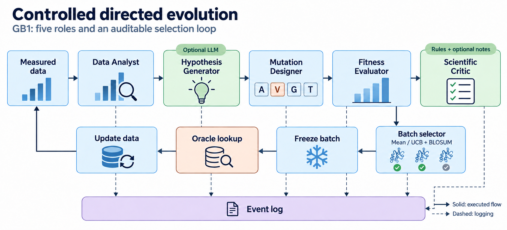

::: {.cols}
## 1　背景与问题定义

定向进化在有限实验预算内，通过变体构建、测量和迭代选择寻找目标性质。[1–3] 我们将过程组织成可回放的计算实验：代理模型负责数值预测，知识配置约束或引导搜索，Agent 组织假设与工具调用，Oracle 揭示封存的实测标签。

本研究形成了三类结果：控制特征尺度与正则化的预测工具比较；分冷启动和候选范围的闭环对照；连接模型误差、工具动作与送测集合的行为分析。正文按试题要求依次介绍数据、预测模型、Agent、知识增强、实验结果、失败分析与未来拓展；附录提供完整配置与复现资料。

我们关注三个相互连接的问题：在目标分布上，哪种预测工具更适合排序候选；在初始观测较少时，怎样组织有限预算；获得与预期不符的测量后，研究者接口是否真的改变了下一步选择。每个问题分别落到模型测试、配对搜索和事件级对照。新增契约实验进一步检查：残差证据能否被表达为可执行的工具参数。

这样的设计使候选发现与机制解释可以相互支撑。实验既记录高分序列，也保留失败推荐的预测与实测差异；研究判断沿着数据、假设、工具和测量逐步建立，而不依赖模型对自身能力的描述。
:::
<!-- PAGE -->
## 2　数据集介绍

| 数据维度 | GB1 | AAV2 |
|---|---|---|
| 功能任务 | 蛋白结合适应度 | 衣壳包装功能 |
| 可变区域 | V39、D40、G41、V54 | 28 残基窗口 |
| 参考序列表示 | VDGV（四位点基序） | 见下方窗口序列 |
| 实测数据范围 | 149,361 条组合 | 清洗后 38,265 条窗口序列 |
| 基本冷启动 | 随机 5,000；HD≤2：2,168；HD≤1：77 | HD≤2：10,433 |
| 单轮预算 × 轮数 | 96 × 3 | 48 × 6 |

::: {.cols}
### 2.1　GB1：密集的四位点组合景观

GB1 数据来自 Wu 等的组合突变研究。[4] 四位点理论空间包含 160,000 种组合，其中 149,361 条具有实测标签。参考基序 VDGV 的 fitness 为 1.000，观测最高值由 FWAA 保持，为 8.761966。缺测的 10,639 种组合不作为查表 Oracle 的可查询候选。

三种冷启动分别用于研究数据覆盖的影响：easy 随机选取 5,000 条，hard 使用 HD≤2 的 2,168 条，sparse 使用 HD≤1 的 77 条。每个运行中，已知集合与其余可测候选分开维护，不将不同冷启动的轨迹拼接。

### 2.2　AAV2：较宽的衣壳变异窗口

AAV 数据来自 Bryant 等的衣壳包装实验，并采用 FLIP 的任务与清洗口径。[5,6] 本地替换子集包含 38,265 条可对齐的 28 残基序列。参考窗口为：

`DEEEIRTTNPVATEQYGSVSTNLQRGNR`

其本地 fitness 为 −0.918194。HD≤2 的初始已知集为 10,433 条，HD>2 候选为 27,832 条。不同实验按声明的知识门禁进一步构造可选范围，具体配置分别保留在附录 A、E、H。

D0Q、S17E 与 V18A 均采用窗口零基坐标。GB1 的结合适应度与 AAV 的包装分数代表不同测量目标，不直接比较绝对数值。

### 2.3　清洗、划分与标签使用

预处理检查长度、标准氨基酸字符、重复项和突变坐标，并记录输入与划分。监督预测器的训练/验证/测试划分，用于评价所定义分布上的预测能力；campaign 的冷启动/未知候选划分，则模拟实验逐轮揭示标签。两者具有不同用途。

每轮先根据当前已知标签训练模型并冻结提名，再从固定测量表读取候选结果。新标签加入下一轮训练集。
令 $M_t,Q_t$ 分别为已测与未测序列集，冻结批次 $B_t$ 经测量后更新：

$$M_t=M_{t-1}\cup B_t,\qquad Q_t=Q_{t-1}\setminus B_t.$$

AAV 候选池最高值为8.416205，池内没有超过初始最优9.536457的候选。初始集合中高于候选峰的仅3条，分数为9.536457、8.645017、8.438084，均为HD2。这是数据划分决定的评测范围：报告的“达峰”表示发现未知候选池最优，不将未超过初始最优作为Agent失败。

完整阈值、重复数与数据访问约定见附录 A。
:::
<!-- PAGE -->
## 3　适应度预测模型

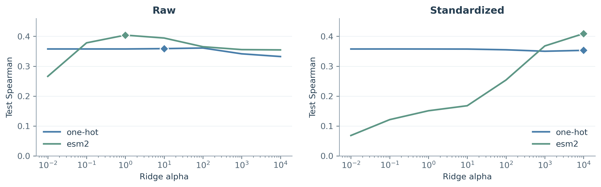

| 测试划分 | one-hot raw / std | ESM-2 raw / std |
|---|---:|---:|
| random | 0.4840 / 0.4840 | 0.4893 / 0.4916 |
| HD extrapolation | 0.3588 / 0.3530 | 0.4039 / 0.4090 |

::: {.cols}
### 3.1　表征与正则化选择

Ridge 的目标为：

$$\min_{b,w}\ \|y-b\mathbf 1-\Phi w\|_2^2+\alpha\|w\|_2^2.$$

其中 $\Phi$ 为特征矩阵，截距 $b$ 不受惩罚，$\alpha$ 为正则化强度。加性、成对表示与集成方差完整定义见附录 L。

ESM 从蛋白质序列中学习上下文表征。[12,13] 不同特征的尺度改变了 Ridge 惩罚项的实际作用，直接使用相同 α 并非公平比较。我们对每种表征、划分与预处理分别扫描 α，在训练集内留出验证选择，再用外层测试评价。

调参后，ESM-2 在 HD 外推中比 one-hot 高 0.0451（raw）和 0.0560（std），方向在两种预处理下相同。随机划分的差距更小。这为在外推任务中使用蛋白质表征提供了具体依据，也说明训练协议本身是模型比较的重要组成部分。

### 3.2　回归器与不确定性

Ridge、XGBoost 与 MLP 的阶梯测试则呈现指标分工：Ridge 的秩相关最高，MLP 的数值误差与 top-k 重合率更好。工具选择应对应后续采集目标；离线预测收益还要通过实际使用该工具的闭环运行来检验。[7–11,14–16]

GB1 预测链通过 bootstrap 重采样获得模型分歧，用于采集的不确定性项。分歧是重采样敏感性指标，仍需结合实际选样结果评价，不能直接作为已校准的概率保证。
:::

| one-hot 预测器 | 测试 Spearman | 测试 Pearson | 测试 MSE | top-k 重合率 |
|---|---:|---:|---:|---:|
| Ridge | 0.5119 | 0.4116 | 0.1017 | 0.50 |
| XGBoost | 0.5034 | 0.6013 | 0.0780 | 0.50 |
| MLP | 0.4499 | 0.8191 | 0.0410 | 0.65 |

相同5,000/2,000/2,000训练、验证与测试划分；完整说明见附录B.1。本表与上方表征α扫描分别评价模型族和表征配置。

<!-- PAGE -->
## 4　LLM Agent 设计

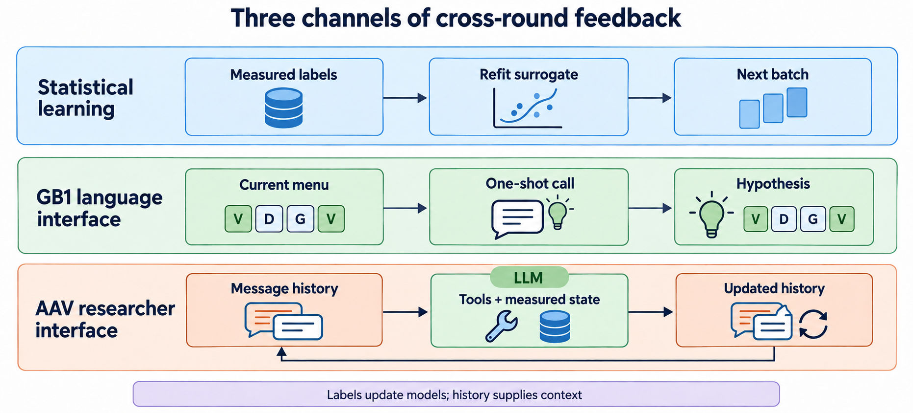

::: {.cols}
### 4.1　让假设成为可执行的文库

五角色流水线先由 Data Analyst 汇总已测替换与适应度；Hypothesis Generator 组织替换菜单；Mutation Designer 将各位点替换组合为可测文库；Fitness Evaluator 输出预测均值和方差；Scientific Critic 记录规则判定与预算内的评语。

GB1 默认每个位点最多选择八种替换，再与野生型残基组合，交给模型评分。无知识策略使用均值排序，知识配置加入不确定性探索与 BLOSUM 替换先验。[18,23] 假设因此可以通过文库改变实验的搜索范围。

冻结 GB1 路径的 selector 读取全部已评分 candidates，而不是 Critic 的 accepted 子集。因此正文将其知识作用描述为实际生效的采集配置；判定与最终选择的关系详见附录 C、D。AAV 自主路径则把 HD/BLOSUM 门禁用于候选池及测试验证。

### 4.2　闭环依赖哪些信息

每轮测量扩充训练集，下一轮重新拟合 surrogate。这条统计反馈在确定性运行中同样成立。GB1 的语言假设接口只接收当轮替换名称菜单；AAV 自主接口保留消息历史，并通过分析、组合、测试和知识查询工具读取更新后的状态。AAV 新增的 v09 契约允许显式比例与 motif 排除；它与旧契约组成第六、七章的对照。

工具契约在本文指提示词、工具参数模式与执行约束的组合。两种接口提供的信息条件不同。保留对话帮助延续上下文，重拟合更新数值预测，而逐变体残差卡将“原先判断与后来测量的差异”显式交给下一轮决策者。把这三条通道分开，才能检验每项能力实际贡献了什么。

### 4.3　知识既服务选样，也服务解释

HD 与 BLOSUM 表达显式搜索范围和替换先验；由实测数据形成的共现与富集关系提供候选上下文。经验图谱把序列、观测和建议连接起来，用于提出可检验的组合假设。它所记录的关联受采样覆盖影响，应与实验对照共同解释。
:::
<!-- PAGE -->
## 5　知识增强方法

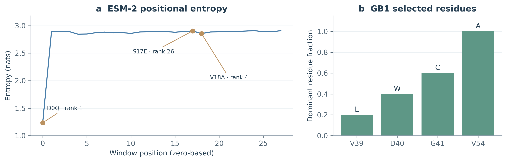

::: {.cols}
### 5.1　可执行的突变规则

知识模块表达氨基酸合法性、序列长度、突变数量与替换先验。AAV路径将HD≤4与BLOSUM≥0用于候选范围和测试验证；GB1冻结路径的知识采集为：

$$\begin{aligned}a_t(x)={}&\hat\mu_t(x)+0.75\hat\sigma_t(x)\\&+0.30s_{\mathrm{BLOSUM}}(x).\end{aligned}$$

$\hat\mu,\hat\sigma$ 为预测均值和模型分歧的标准差；一般UCB与AAV混合采集的区别见附录L.2。规则约束和排序先验分别影响“哪些候选可选”与“先测哪些候选”，其实际接线见附录C、D。[23]

### 5.2　由观测形成的经验图谱

知识图谱连接变体、突变、位点及实测功能。AAV研究者工具从已测标签形成共现、富集与候选上下文，辅助解释为什么组合某些替换。关联受样本覆盖与先前采集影响，因此作为提出假设的依据，与实际测量共同检验。

有无知识增强的比较同时记录选样集合与产量。AAV两臂提名Jaccard为0.1272，显示配置确实改变了被测序列；GB1不同冷启动下的结果则提示知识价值依赖观测覆盖。完整结果归入第六章。

### 5.3　保守性先验与实测功能

ESM-2 的逐位 masked-token 熵提供一种保守性代理。AAV 候选峰中的 D0Q 位于该窗口最保守的位置，V18A 为第 4，S17E 为第 26。若用强保守性规则提前排除替换，可能移除组成有利组合的候选。

这也说明，蛋白质序列的统计规律与特定 assay 的功能并非同一目标。ESM 可以改善表征，同时仍需要任务数据和实验校准；第三章的预测收益与第七章的组合失配能够同时成立。

:::
<!-- PAGE -->
## 6　虚拟定向进化实验结果

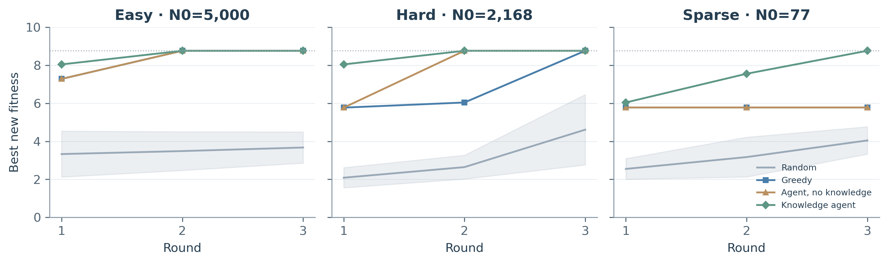

| 冷启动 | 随机：最高值，均值±σ | 贪心：最高值 / 强命中 | 无知识：最高值 / 强命中 | 知识：最高值 / 强命中 |
|---|---:|---:|---:|---:|
| easy | 3.6742 ± 0.8200 | 8.7620 / 81 | 8.7620 / 95 | 8.7620 / 86 |
| hard | 4.6113 ± 1.8501 | 8.7620 / 43 | 8.7620 / 50 | 8.7620 / 65 |
| sparse | 4.0461 ± 0.7203 | 5.7720 / 29 | 5.7720 / 27 | 8.7620 / 33 |

::: {.cols}
### 6.1　信息覆盖改变策略分层

easy 中三条模型策略均达到全局最优，此时最高值已经饱和，批次统计继续提供区分：无知识策略的强命中为 95，知识策略为 86；后者的有益命中却更多，250 对 244。高阈值尾部产量与优于野生型的广度回答不同问题。

sparse 只有 77 条低阶测量。贪心与无知识策略停在 5.7720，知识策略依次达到 6.0421、7.5547 和 8.7620。这一单 seed 分层提示：当均值排序的观测支持较弱时，探索项与先验的联合配置可能帮助搜索转移。其组成项和稳定性应通过后续因子消融与重复检验。

### 6.2　语言接入首先改变了文库和吞吐

GB1 live-LLM 与 hard 使用相同名义预算，但无知识和知识臂实际只完成 105、197 次查询，对照均为 288。绝对强命中从 50/65 降到 32/59；按实际查询归一化后，比例却由 17.36%/22.57% 升到 30.48%/29.95%。

同条件复现中，两条 LLM 臂又各只完成 5 次查询。这将问题定位到语言菜单、回退和有效文库的接口：终局产量差包含预算使用差异，不能直接解释为候选质量或独立知识收益。完整逐轮提名、调用成功与 Critic 消费路径审计置于附录 D。
:::
<!-- PAGE -->
## AAV：知识配置与采集目标的权衡（第六章续）

| 对照 | 无知识 Agent | 知识 Agent |
|---|---:|---:|
| 新增最佳 fitness | 6.1862 | 7.8290 |
| 强命中（atomic） | 69 | 166 |
| 平均提名 HD | 8.53 | 3.42 |
| 实际查询 | 288 | 288 |

::: {.cols}
### 6.3　约束改变了被测序列

AAV 的较宽搜索空间使训练覆盖成为突出问题。知识臂将预算限制在 HD≤4、BLOSUM≥0 的区域，提名由 167 条 HD3 与 121 条 HD4 构成；与无知识臂的集合交集为 65，Jaccard 系数为 0.1272。

该配置相对无知识臂提高最佳值 1.6428，并增加 97 个强命中。它改变的是实际送测组成，表明搜索范围与先验可以作为实验设计变量。这里观测到的是联合配置的效果；两种执行模式与完整策略表分别保留于附录。

### 6.4　找峰与积累高分候选并不等价

固定预测器、统一候选门禁后，Mean 产生 166 个强命中但停在 7.8290；UCB 3 找到 8.4162 的候选峰，强命中为 128。较强探索在这次配置中换来了峰值发现，同时改变了批次产量。[18,19]

探索参数也没有单调收益：UCB 0.5、1、2 均停在 6.5309。随机采集的 30 seed 实验显示，Alternating 与 Gaussian Thompson 分别达峰 2 次和 3 次。确定性配置的重复记录对应同一轨迹；独立轨迹数、误差范围和达峰区间在附录 E 中完整呈现。

这些结果把策略选择转化为明确的研究决策：是希望积累较多高质量候选，还是愿意为稀有峰投入探索预算。Agent 应帮助研究者明确目标、选择工具并解释权衡，而不是用一个最终分数概括全部表现。
:::
<!-- PAGE -->
## AAV：采集与工具契约的因子实验（第六章续）

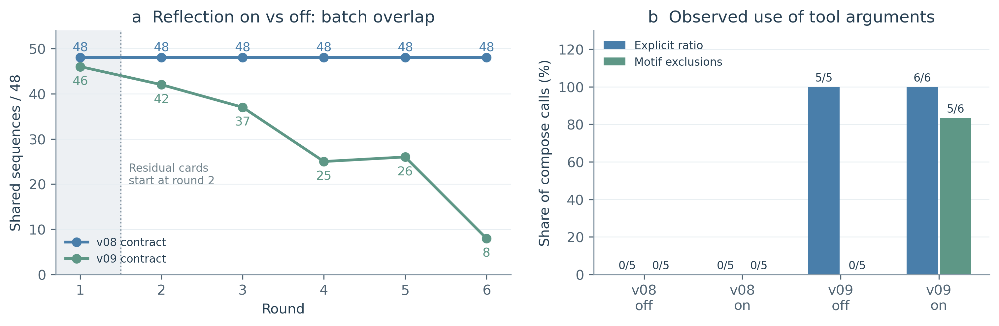

| 契约 × 反思（48×6） | 达峰轮 | strong | 复现率（r2–6） | 后段复现率（r4–6） |
|---|---:|---:|---:|---:|
| v08 · 关 | 2 | 158 | 23.75% | 13.89% |
| v08 · 开 | 2 | 158 | 23.75% | 13.89% |
| v09 · 关 | 2 | 153 | 28.33% | 20.14% |
| v09 · 开 | 2 | 160 | 19.58% | 6.25% |

四臂在第2轮均到达8.4162候选峰。复现率为含有上一轮低值相关替换的候选数/候选总数，合并计数后求比例；定义、分子分母与探索性后段窗口见附录H.5。

::: {.cols}
### 6.5　先检验采集档位，再检验契约

第一轮正式 2×2 比较质量感知/纯利用与反思开/关。两个采集档位内，六轮反思对照均为 48/48 重叠；跨档位的交集为 42、37、33、31、33、32，说明比较方法能识别真实的候选变化。

四臂 20 次 compose 的 allocation_source 全为工具默认值，agent_requested 为 0。requested_exploit_ratio 在未传参时回显默认值，不能当作主动设参的证据。完整因子表见附录 H.2。

### 6.6　契约变化后的可观测行为

第二轮固定质量感知采集，比较 v08/v09 契约与反思开关。旧契约对照仍全同，新契约对照的交集为 46、42、37、25、26、8。总体重叠降低，但并非逐轮严格递减；第一轮差异先于残差注入。

v09 两臂共 11 次 compose 都显式设置比例，反思臂还使用了替换排除入口。四臂预算均花满，LLM 各成功 6/6，超时为 0。峰值在第2轮后饱和，复现率提供另一种行为区分：v09-off后段为20.14%，v09-on为6.25%。它们分别以各臂前一轮观测构造参照，不能当作共同黑名单上的错误率。表中结果为单次描述，稳定性仍需独立重复。
:::

<!-- PAGE -->
## AAV：12×6预算对照（第六章续）

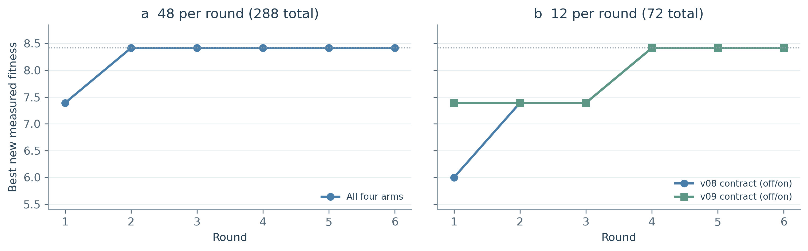

| 12×6 契约 · 反思 | 达峰轮 | strong / 实测 | 复现率 r2–6 | 后段率 r4–6 |
|---|---:|---:|---:|---:|
| v08 · 关 | 4 | 39/72 | 10.00% | 11.11% |
| v08 · 开 | 4 | 39/72 | 10.00% | 11.11% |
| v09 · 关 | 4 | 39/72 | 6.67% | 2.78% |
| v09 · 开 | 4 | 42/72 | 1.67% | 2.78% |

::: {.cols}
### 6.7　达峰更晚，但峰值仍未区分反思

预算由48×6降为12×6后，四臂均在第4轮达到8.4162，较大批次的共同第2轮更晚；按整批查询计数则为48次，而较大批次为96次。这两个口径分别描述轮次与测量数，不能混用。

本次小预算延后了峰值饱和，但四臂的最终峰值和达峰轮仍相同。v09两臂的实际批次从第3轮分叉，交集依次12、12、9、6、7、7；峰值曲线隐藏了这些选择差异。

### 6.8　行为指标需要跨协议检查

v09反思臂取得42个强命中，其余为39。整体复现计数为1/60，对照为4/60；但两条v09臂的后段计数同为1/36。48×6下明显的后段差异没有在这一协议中保持，因此不将单个窗口或单次差值概括为普遍收益。

小预算下，反思开/关的前两轮批次相同，首次分叉与第3轮首次非空排除请求同时出现，提供了比48×6首轮已不同更清晰的时序观察。无反思臂第6轮也使用了排除工具，说明关闭结构化残差卡不等于没有测量证据或不能使用工具。完整参数与分母见附录H.6。
:::
<!-- PAGE -->
## 7　失败案例分析

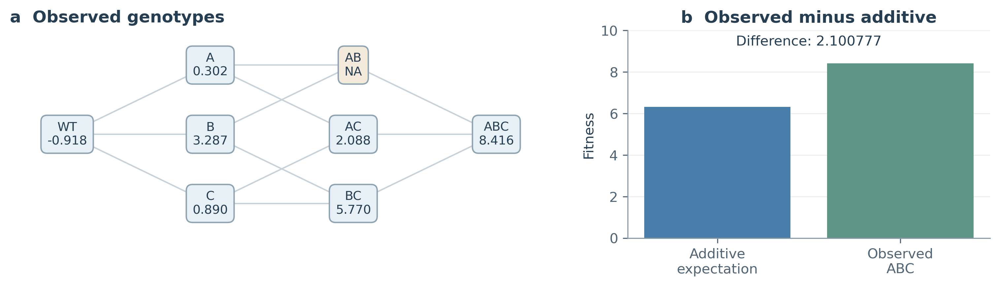

::: {.cols}
### 7.1　外推验证揭示模型适用范围

AAV 用 0..1 阶训练预测 HD2，测试 Spearman 为 0.8749；用 0..2 阶训练预测 HD3，测试为 0.6155，低于该训练范围内的留出验证 0.9094。评价分布应与目标阶数对应，随机留出能力不能替代跨阶能力。

测量拓扑也影响解释。AAV HD3 变体中，仅 31.17% 拥有全部直接 HD2 组成变体的测量；HD4 的对应比例为 2.24%。GB1 的覆盖密集得多。完整按阶数分布、训练规模与覆盖定义见附录 F。

### 7.2　一组可以逐项追溯的上位效应

ABC 的单点加性预期与偏离为：

$$\hat f_{\mathrm{add}}(ABC)=f_A+f_B+f_C-2f_{WT},$$
$$\Delta_{\mathrm{add}}=f_{ABC}-\hat f_{\mathrm{add}}(ABC).$$

由实测值得到6.3154与+2.1008。该偏离表明单点相加低估了组合；完整三阶差分和缺测项见附录L.3。[17]

AB 在整个查表池中缺失，因此上述差值应称为相对单点加性的偏离，而不是已经分离出的纯三阶系数。缺失对照影响机制识别，却不阻止找到 ABC 本身：固定采集矩阵中的 UCB 3 已在第 3 轮达峰。

若目标是发现池内高值，可继续改进排序与采集；若目标是解释局部组合机制，则需要补测缺失对照或明确采用统计假设。两种任务需要不同的证据。

### 7.3　失败推荐同样需要进入反馈

局部分析中，ABC 的模型均值为 6.3668，在门禁池中排第 426；而首批 48 个高预测候选平均预测 11.3065、平均实测 2.8838。模型同时存在低估有效组合与高估其他区域的情况。

因此下一轮诊断应看到完整送测批次的预测—测量配对，而不只看到成功的 top-10。逐变体残差让失败案例具有具体序列、数值与背景，为研究者修改实验提供对象。
:::
<!-- PAGE -->
## 工具契约与证据使用（第七章续）

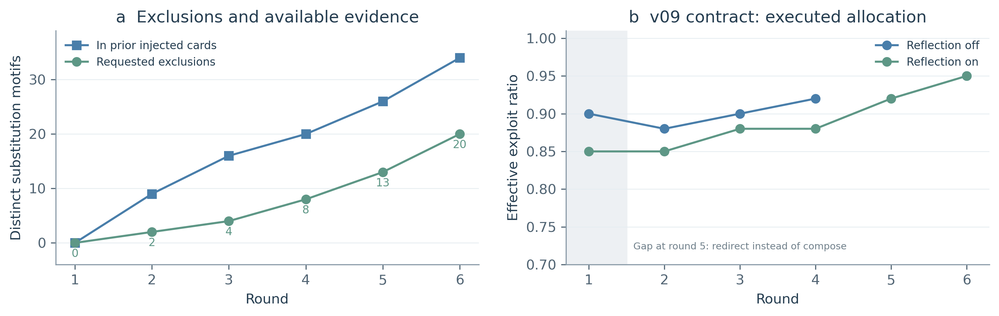

::: {.cols}
### 7.4　从语言证据到可执行参数

48×6下，v09 反思臂的排除列表从 0 增长到 20 个替换，每次请求均是此前累积卡片证据的子集，且对应轮的实际批次没有包含被请求排除的替换。卡片累计标记 34 个高估低适应度相关 motif，Agent 选择其中 20 个进入参数。这提供了一条可复核的证据—参数—候选链。

motif 表示在已测低适应度变体中出现的替换，不等于该替换在所有背景中都不利。排除来源可追溯，说明了动作依据；是否排除了有价值的组合仍需通过结果与对照评价。

### 7.5　分叉的来源需要分层分析

在48×6协议中，第一轮尚未注入残差，两个 v09 臂就分别选择 0.90 与 0.85 的利用比例，批次重叠为 46/48。因而后续全部分叉不能归因于残差卡本身。同一 seed 约束本地随机过程，也不能保证远端 LLM 每次输出相同。

契约处理同时调整提示与轮次模板、释放利用比例下限并增加排除参数；固定代码中的停滞提示注入路径也不同。各项贡献尚未拆开。本文的结论是接口被实际使用、排除可追溯且批次有差异；优化收益与各组成项的作用需进一步检验。

### 7.6　研究者与预测器的职责分工

通用 LLM 的训练主要围绕语言与知识表征；特定环境下的序列—功能映射需要领域数据、归纳偏置与测量校准。直接让通用语言生成承担适应度数值预测，会引入任务目标与训练目标之间的错配。

我们据此将 Agent 定位为研究者接口：选择预测工具，检查其适用范围，组织候选与对照实验，并在新证据到来时修订假设。人类研究者同样依赖模型和测量判断序列功能，专业性体现在提出有区分力的实验、发现误差并处理冲突证据。

工具型科学 Agent、自动化实验和自主实验室提供了相关研究背景。[20–22,30] 在本项目中，评价这一能力要追踪新观测是否被读取、工具参数是否改变，以及最终是否产生不同的送测序列。
:::
<!-- PAGE -->
## 8　改进建议与未来拓展

::: {.cols}
### 8.1　内环执行与外环改进

执行器、验证器和控制器构成内环，管理实验、结果与预算。记忆器与改进器构成外环，整理失败证据，提出预测器、采集或流程修改。

验证器检查实验结果，回归门评价系统改动。提案先进入沙箱，在冻结协议和独立任务上与原策略比较；通过后用于后续执行，拒绝则保留原策略。每次修改记录版本与理由。

### 8.2　把工具契约作为实验设计对象

契约应能表达证据，并匹配实际批量。12×6反思臂的五次比例请求虽从0.90变为0.95，实际分配均为11个利用、1个探索。评价需贯通请求、执行分配和最终候选；参数被使用不等于选样改变。替换排除提供另一种表达入口，其独立贡献可用组件消融检验。

执行约束由环境保证，证据驱动的选择由Agent组织。十二臂未调用check_knowledge，但启用的HD/BLOSUM门禁仍在送测入口执行。下一步可保持门禁不变，加入拒绝理由反馈，检验Agent是否改善候选提议（附录H.7）。

### 8.3　停止、多目标与生成设计

在实验前检验指标区分力：两种预算的峰值均饱和，需同时跟踪产量、覆盖和复现率。达到功能要求后进入独立确认，或比较期望信息价值与实验成本（附录I）；池内最大值仅供离线评测，不作为真实实验的在线停止信号。

多目标任务可同时测量活性、稳定性和表达，再比较非支配候选。[25] 结构预测[24]可作为辅助分析工具；ProteinMPNN、RFdiffusion、幻觉设计或ProGen可作为候选生成工具；生成序列需独立评价或湿实验测量，超出当前查表池的验证范围。[26–29]

### 8.4　连接自动化实验平台

当前事件已保存提名时预测、测量与残差。对接设备时，可沿用这条追溯链，并扩充样本标识、异步回执、测量单位和重复测量；纳入失败、重试与人工确认。[30] 从查表转向湿实验还需验证这些新增契约。

下一阶段以独立seed配对验证和契约组件消融为优先；外环改进与预设参数搜索比较，计入额外调用成本，再评价结构特征、生成设计与强化学习的增量价值。
:::
<!-- PAGE -->
<!-- REFERENCES -->
## 参考文献

::: {.refs}

[1] YANG K K, WU Z, ARNOLD F H. Machine-learning-guided directed evolution for protein engineering[J]. Nature Methods, 2019, 16(8): 687-694. [DOI: 10.1038/s41592-019-0496-6](https://doi.org/10.1038/s41592-019-0496-6)

[2] STEMMER W P C. Rapid evolution of a protein in vitro by DNA shuffling[J]. Nature, 1994, 370(6488): 389-391. [DOI: 10.1038/370389a0](https://doi.org/10.1038/370389a0)

[3] REETZ M T, CARBALLEIRA J D. Iterative saturation mutagenesis (ISM) for rapid directed evolution of functional enzymes[J]. Nature Protocols, 2007, 2(4): 891-903. [DOI: 10.1038/nprot.2007.72](https://doi.org/10.1038/nprot.2007.72)

[4] WU N C, DAI L, OLSON C A, et al. Adaptation in protein fitness landscapes is facilitated by indirect paths[J]. eLife, 2016, 5: e16965. [DOI: 10.7554/elife.16965](https://doi.org/10.7554/elife.16965)

[5] BRYANT D H, BASHIR A, SINAI S, et al. Deep diversification of an AAV capsid protein by machine learning[J]. Nature Biotechnology, 2021, 39(6): 691-696. [DOI: 10.1038/s41587-020-00793-4](https://doi.org/10.1038/s41587-020-00793-4)

[6] DALLAGO C, MOU J, JOHNSTON K E, et al. FLIP: Benchmark tasks in fitness landscape inference for proteins[C]//Proceedings of the Neural Information Processing Systems Track on Datasets and Benchmarks. 2021, 1. [会议原文](https://datasets-benchmarks-proceedings.neurips.cc/paper_files/paper/2021/file/2b44928ae11fb9384c4cf38708677c48-Paper-round2.pdf)

[7] NOTIN P, KOLLASCH A, RITTER D, et al. ProteinGym: Large-Scale Benchmarks for Protein Fitness Prediction and Design[C]//Advances in Neural Information Processing Systems. 2023, 36. [会议原文](https://proceedings.neurips.cc/paper_files/paper/2023/hash/cac723e5ff29f65e3fcbb0739ae91bee-Abstract-Datasets_and_Benchmarks.html)

[8] SARKISYAN K S, BOLOTIN D A, MEER M V, et al. Local fitness landscape of the green fluorescent protein[J]. Nature, 2016, 533(7603): 397-401. [DOI: 10.1038/nature17995](https://doi.org/10.1038/nature17995)

[9] HOERL A E, KENNARD R W. Ridge Regression: Biased Estimation for Nonorthogonal Problems[J]. Technometrics, 1970, 12(1): 55-67. [DOI: 10.1080/00401706.1970.10488634](https://doi.org/10.1080/00401706.1970.10488634)

[10] FRIEDMAN J H. Greedy function approximation: A gradient boosting machine[J]. The Annals of Statistics, 2001, 29(5): 1189-1232. [DOI: 10.1214/aos/1013203451](https://doi.org/10.1214/aos/1013203451)

[11] WITTMANN B J, YUE Y, ARNOLD F H. Informed training set design enables efficient machine learning-assisted directed protein evolution[J]. Cell Systems, 2021, 12(11): 1026-1045.e7. [DOI: 10.1016/j.cels.2021.07.008](https://doi.org/10.1016/j.cels.2021.07.008)

[12] RIVES A, MEIER J, SERCU T, et al. Biological structure and function emerge from scaling unsupervised learning to 250 million protein sequences[J]. Proceedings of the National Academy of Sciences, 2021, 118(15): e2016239118. [DOI: 10.1073/pnas.2016239118](https://doi.org/10.1073/pnas.2016239118)

[13] LIN Z, AKIN H, RAO R, et al. Evolutionary-scale prediction of atomic-level protein structure with a language model[J]. Science, 2023, 379(6637): 1123-1130. [DOI: 10.1126/science.ade2574](https://doi.org/10.1126/science.ade2574)

[14] BISWAS S, KHIMULYA G, ALLEY E C, et al. Low-N protein engineering with data-efficient deep learning[J]. Nature Methods, 2021, 18(4): 389-396. [DOI: 10.1038/s41592-021-01100-y](https://doi.org/10.1038/s41592-021-01100-y)

[15] FRAZER J, NOTIN P, DIAS M, et al. Disease variant prediction with deep generative models of evolutionary data[J]. Nature, 2021, 599(7883): 91-95. [DOI: 10.1038/s41586-021-04043-8](https://doi.org/10.1038/s41586-021-04043-8)

[16] HOPF T A, INGRAHAM J B, POELWIJK F J, et al. Mutation effects predicted from sequence co-variation[J]. Nature Biotechnology, 2017, 35(2): 128-135. [DOI: 10.1038/nbt.3769](https://doi.org/10.1038/nbt.3769)

[17] POELWIJK F J, SOCOLICH M, RANGANATHAN R. Learning the pattern of epistasis linking genotype and phenotype in a protein[J]. Nature Communications, 2019, 10(1): 4213. [DOI: 10.1038/s41467-019-12130-8](https://doi.org/10.1038/s41467-019-12130-8)

[18] SRINIVAS N, KRAUSE A, KAKADE S M, et al. Information-Theoretic Regret Bounds for Gaussian Process Optimization in the Bandit Setting[J]. IEEE Transactions on Information Theory, 2012, 58(5): 3250-3265. [DOI: 10.1109/tit.2011.2182033](https://doi.org/10.1109/tit.2011.2182033)

[19] JONES D R, SCHONLAU M, WELCH W J. Efficient Global Optimization of Expensive Black-Box Functions[J]. Journal of Global Optimization, 1998, 13(4): 455-492. [DOI: 10.1023/a:1008306431147](https://doi.org/10.1023/a:1008306431147)

[20] BRAN A M, COX S, SCHILTER O, et al. Augmenting large language models with chemistry tools[J]. Nature Machine Intelligence, 2024, 6(5): 525-535. [DOI: 10.1038/s42256-024-00832-8](https://doi.org/10.1038/s42256-024-00832-8)

[21] BOIKO D A, MACKNIGHT R, KLINE B, et al. Autonomous chemical research with large language models[J]. Nature, 2023, 624(7992): 570-578. [DOI: 10.1038/s41586-023-06792-0](https://doi.org/10.1038/s41586-023-06792-0)

[22] KING R D, ROWLAND J, OLIVER S G, et al. The Automation of Science[J]. Science, 2009, 324(5923): 85-89. [DOI: 10.1126/science.1165620](https://doi.org/10.1126/science.1165620)

[23] HENIKOFF S, HENIKOFF J G. Amino acid substitution matrices from protein blocks[J]. Proceedings of the National Academy of Sciences, 1992, 89(22): 10915-10919. [DOI: 10.1073/pnas.89.22.10915](https://doi.org/10.1073/pnas.89.22.10915)

[24] JUMPER J, EVANS R, PRITZEL A, et al. Highly accurate protein structure prediction with AlphaFold[J]. Nature, 2021, 596(7873): 583-589. [DOI: 10.1038/s41586-021-03819-2](https://doi.org/10.1038/s41586-021-03819-2)

[25] DEB K, PRATAP A, AGARWAL S, et al. A fast and elitist multiobjective genetic algorithm: NSGA-II[J]. IEEE Transactions on Evolutionary Computation, 2002, 6(2): 182-197. [DOI: 10.1109/4235.996017](https://doi.org/10.1109/4235.996017)

[26] DAUPARAS J, ANISHCHENKO I, BENNETT N, et al. Robust deep learning–based protein sequence design using ProteinMPNN[J]. Science, 2022, 378(6615): 49-56. [DOI: 10.1126/science.add2187](https://doi.org/10.1126/science.add2187)

[27] WATSON J L, JUERGENS D, BENNETT N R, et al. De novo design of protein structure and function with RFdiffusion[J]. Nature, 2023, 620(7976): 1089-1100. [DOI: 10.1038/s41586-023-06415-8](https://doi.org/10.1038/s41586-023-06415-8)

[28] ANISHCHENKO I, PELLOCK S J, CHIDYAUSIKU T M, et al. De novo protein design by deep network hallucination[J]. Nature, 2021, 600(7889): 547-552. [DOI: 10.1038/s41586-021-04184-w](https://doi.org/10.1038/s41586-021-04184-w)

[29] MADANI A, KRAUSE B, GREENE E R, et al. Large language models generate functional protein sequences across diverse families[J]. Nature Biotechnology, 2023, 41(8): 1099-1106. [DOI: 10.1038/s41587-022-01618-2](https://doi.org/10.1038/s41587-022-01618-2)

[30] HÄSE F, ROCH L M, ASPURU-GUZIK A. Next-Generation Experimentation with Self-Driving Laboratories[J]. Trends in Chemistry, 2019, 1(3): 282-291. [DOI: 10.1016/j.trechm.2019.02.007](https://doi.org/10.1016/j.trechm.2019.02.007)

:::
<!-- PAGE -->
## 附录 A　完整数据与评测协议

| 维度 | GB1 | AAV |
|---|---|---|
| 研究对象 | 四个可变位点，WT 为 VDGV | 28 残基变异窗口 |
| 数据来源 | 组合突变适应度测量 [4] | 衣壳变体测量、FLIP 清洗子集 [5,6] |
| 冷启动 | easy 5,000；hard 2,168；sparse 77 | HD≤2，10,433 条 |
| 单轮预算 × 轮数 | 96 × 3 | 48 × 6 |
| 强命中阈值 | fitness ≥ 4.0 | 原消融 ≥ 2.615913579904 |
| 查询返回 | 固定池已有测量 | 固定池已有测量 |

::: {.cols}
### 先预测，再揭示测量

每轮先根据已测集合训练模型并冻结提名，再由查表 Oracle 揭示这些序列的适应度。模型与候选选择过程使用当时已测标签；完整测量表承担离线模拟实验的功能。GB1 理论组合数为 160,000，实测池包含 149,361 条，缺测的 10,639 条不作为可查询候选。

AAV 使用可对齐的替换子集；候选为冷启动之外的 HD>2 序列。这里的 HD 是相对参考序列的 Hamming 距离。知识消融允许无知识臂访问较宽的候选范围，而固定预测器矩阵对所有配置使用同一 HD≤4、BLOSUM≥0 的门禁。两类实验分别回答“约束整个搜索空间”和“在相同空间中改变采集”的问题。

### 把找峰与批次产量分开

本文报告新增查询中的最高适应度、累计 top-10 均值、强命中数和实际查询数。GB1 有益命中定义为 fitness>1.0，即优于野生型。最佳值回答是否找到高峰，命中数回答有限预算产生多少候选，命中比例则以实际查询数为分母。

AAV 候选池最高值为 8.416205，但冷启动中已有适应度 9.536457 的序列。因此AAV的任务是发现新增候选池的峰，而非要求查表算法超出该池的最高值。该范围由数据划分决定，不作为Agent失败判据；完整清洗子集和最高值检查保存在evidence/aav-domain/。

### 重复与版本

GB1 随机策略报告五个 seed 的均值与总体标准差；三条模型策略为 seed 42 的轨迹。AAV 知识消融为 seed 0，atomic 与 checkpoint 是执行模式。固定预测器实验区分确定性重复与随机采集的 30 个 seed。图表只在实际具有随机重复的地方绘制误差棒。

报告 v0.6 是文档版本；agentic-v0.5、v0.6、v0.7 与 V0.8 是实验或代码版本，二者不一一对应。历史 v0.6 与 v0.7 从 v0.5 分叉，故其结果应各自与共同基线比较。本文冻结既有产物，并单列新收到的 V0.8 第一轮证据。
:::
<!-- PAGE -->
## 附录 B.1　预测器阶梯与评价指标

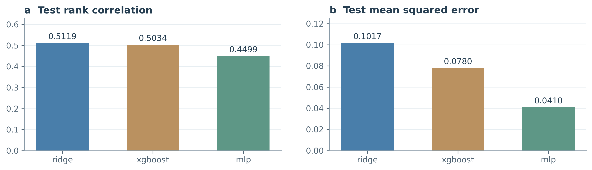

| 模型 | 测试 Spearman | 测试 Pearson | 测试 MSE | top-k 重合率 |
|---|---:|---:|---:|---:|
| Ridge | 0.5119 | 0.4116 | 0.1017 | 0.50 |
| XGBoost | 0.5034 | 0.6013 | 0.0780 | 0.50 |
| MLP | 0.4499 | 0.8191 | 0.0410 | 0.65 |

::: {.cols}
### 排序与数值误差提供互补证据

Ridge 的测试 Spearman 最高，MLP 的 Pearson、MSE 与 top-k 重合率更好。这个结果表明，“最佳预测器”依赖决策目标：若采集只使用排序，秩相关更直接；若比较预期收益或校准不确定性，数值误差同样重要。蛋白质基准也强调多种测量任务和评价方式的区别。[7,8]

Ridge 提供可检查的线性基线；梯度提升与 MLP 引入非线性拟合能力。[9,10] 模型复杂度增加并未在本次划分中同步提升所有指标。因此系统保留预测器接口，通过一致的数据划分与指标表选择工具，而不是预先把复杂模型当作优胜者。

### 不确定性需要实际变化

GB1 预测链采用 bootstrap 重采样训练多个估计器，以预测分歧构成候选方差。该做法使相同模型族能够输出均值之外的信息，为探索项提供输入。当前表中三类预测器均具有非零方差范围。

模型分歧反映重采样和拟合的敏感性，并非经过独立校准的概率保证。我们将其作为采集启发式，与均值排序进行对照；这样可以直接观察探索项是否改变实际批次和最终产量。低样本蛋白质工程中的模型不确定性和表征选择，需要结合具体实验预算进行评价。[11]

### 预测器验证与闭环验证衔接

离线测试回答已定义分布上的预测能力，闭环实验回答选样后能否取得更好的观测。模型可能在总体误差上更优，却在高分尾部或外推区间排序失准。后续结果因此同时保留预测表、逐轮轨迹与候选级证据，避免用一个相关系数代替整个搜索过程。
:::
<!-- PAGE -->
## 附录 B.2　完整正则化扫描

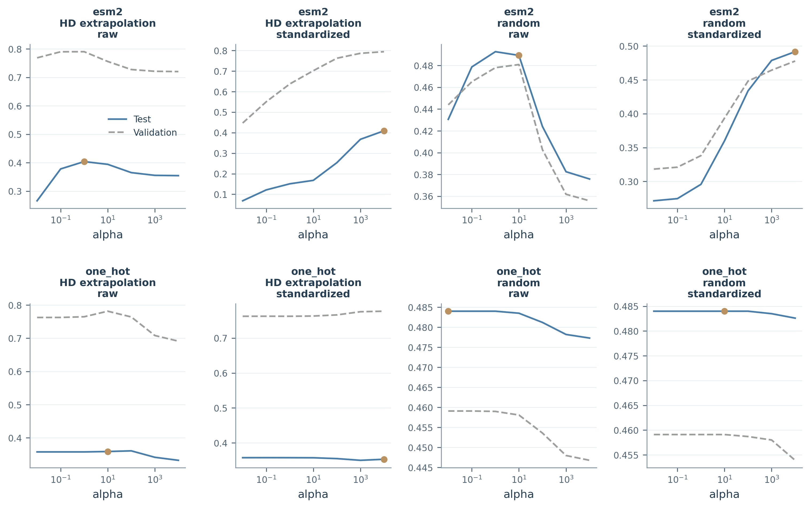

::: {.cols}
完整曲线保留随机划分与 HD 外推、raw 与 standardized、one-hot 与 ESM-2 的全部组合。读图时先比较验证选择得到的测试值，再观察参数敏感性；仅比较曲线中的最高测试点会改变训练协议。

:::

| 表征 | 划分 | 预处理 | 验证所选 α | 测试 Spearman |
|---|---|---|---:|---:|
| one_hot | random | raw | 0.01 | 0.4840 |
| one_hot | random | std | 10 | 0.4840 |
| esm2 | random | raw | 10 | 0.4893 |
| esm2 | random | std | 10000 | 0.4916 |
| one_hot | HD 外推 | raw | 10 | 0.3588 |
| one_hot | HD 外推 | std | 10000 | 0.3530 |
| esm2 | HD 外推 | raw | 1 | 0.4039 |
| esm2 | HD 外推 | std | 10000 | 0.4090 |

α∈{0.01,0.1,1,10,100,1000,10000}。原实现的标准化器在外层训练集拟合，内层80/20留出选择α，再在全训练集重拟合；外层测试标签不参与选择。表征比较范围为 Ridge，不延伸为所有模型族的结论。

<!-- PAGE -->
## 附录 C　角色接口与实际消费者接线

::: {.cols}
### 分析、假设与文库设计

Data Analyst 读取已测序列和适应度，汇总位点及替换信息。代码中的 position gains 是含相应位置突变样本的平均适应度，并不是以野生型为对照识别出的因果增益。这个汇总为设计提供经验线索。

Hypothesis Generator 输出替换菜单。确定性路径按已测支持选取每个位点的候选替换；接入 LLM 时，由语言接口从菜单组织组合建议。Library Designer 将各位置替换与野生型残基做笛卡尔积，去除全野生型、冲突或不可测组合。GB1 默认每位点最多八种替换，形成至多 9⁴ 个含野生型的原始组合，再经过集合处理得到可评估文库。

这使“假设”具有执行含义：它改变哪些序列进入下一步评估，而不只是附在结果旁的一段解释。

### 评分、规则与批次选择

Fitness Evaluator 用当轮代理模型输出文库中各候选的预测均值和方差。Critic 则运行确定性知识规则，并对预算内、通过规则的候选请求自然语言评语。默认每轮最多十条 LLM 评语，按传入候选顺序分配；这不是对全库进行十条“最高分专家评审”。

冻结 GB1 consumer 的一个关键接线事实是：selector 读取 `candidates`，而不是 `accepted`。因此规则判定在该 consumer 中承担审计角色，实际选择由采集分数和可测、未测条件驱动。我们据此描述结果中的知识作用，不将所有 Critic 拒绝都解释为已生效的筛除。

无知识策略按均值排序；知识策略使用均值 + 0.75×标准差 + 0.30×BLOSUM 得分。BLOSUM 提供替换先验，[23] 探索项鼓励关注模型分歧较大的候选。[18] 排序完成后冻结批次，再交给 Oracle 返回测量。

### 统计学习形成基础闭环

每轮查询产生新标签，扩充已测集合，并在下一轮重新拟合 surrogate。即使语言端口采用单轮调用，这条反馈仍持续工作。GB1 sparse 轨迹中，知识策略的新增最佳值依次为 6.0421、7.5547 和 8.7620；它体现了采集与更新相互作用的执行结果。

反馈的可解释性来自记录：当时掌握了哪些数据，模型如何评分，哪些候选被提名，以及实验返回了什么。事件流把这些步骤保留下来，使最终指标可以回到产生它的决策过程。

### 两条语言路径有不同的信息条件

GB1 的 LLM 假设接口虽然接收 report 参数，但冻结实现实际发给模型的是替换名称菜单，没有传入完整分析数值，也未携带历史消息。该接口适合检验“语言模型组织菜单”对文库的影响，不能与能够读取历轮残差的研究者接口混为一谈。

AAV 的自主研究路径保留 message history，由模型调用 `analyze_measured`、文库构造、测试及知识图查询工具。分析工具暴露已测高分序列、富集信号和模型验证结果；回溯配置还提供轨迹与停滞状态。每轮工具状态随新观测更新。

### 历史、测量与反思卡的区别

保留对话历史使模型能够延续上下文；统计重拟合使预测器吸收新标签；结构化残差卡则把“原先预测与后来测量的差异”显式交给下一轮决策者。三者是不同的实现能力。

V0.8 新增逐变体的提名时预测、测量与残差事件。v0.9 进一步改变工具契约，使替换级证据能够进入排除参数。首轮、采集因子和契约因子三组观察分别列于附录 H；正文第六、七章比较实际参数与批次。
:::
<!-- PAGE -->
## 附录 D　GB1 语言调用、预算与复现实验

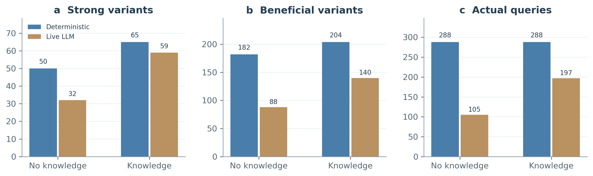

| 配置 | 实际查询 | 强命中 | 强命中 / 查询 | 有益命中 | 有益 / 查询 |
|---|---:|---:|---:|---:|---:|
| 确定性，无知识 | 288 | 50 | 17.36% | 182 | 63.19% |
| Live LLM，无知识 | 105 | 32 | 30.48% | 88 | 83.81% |
| 确定性，知识 | 288 | 65 | 22.57% | 204 | 70.83% |
| Live LLM，知识 | 197 | 59 | 29.95% | 140 | 71.07% |

::: {.cols}
### 数值下降对应怎样的执行变化

两次运行具有相同冷启动、名义预算与 Oracle；随机和贪心路径不经过语言端口，保留相同对照行为。接入 gpt-5.6-sol 后，两条 Agent 的绝对强命中和有益命中均下降，但实际查询也从 288 减少到 105 和 197。

事件流显示，无知识臂三轮分别测了 5、96、4 条，知识臂测了 5、96、96 条。预算利用率为 36.46% 和 68.40%。以实际查询为分母，两条 LLM 臂的强命中比例反而更高。由此可见，绝对产量下降包含了文库收缩与吞吐变化，不能直接等同于候选质量下降。

### 语言参与度与消费者接线

本次 GB1 Critic 在 90 秒超时设置下，50 次尝试中产生 27 条实质评语，23 次回退。假设来源为无知识臂 llm/fallback/llm、知识臂 llm/fallback/fallback。该运行测量的是包含回退的语言接入系统。

审计还发现，知识臂实际提名的 197 条候选均对应同轮 Critic 的 rejected 判定。原因是附录 C 所述 selector 读取全部 candidates。故该路径实际生效的是采集分数；在实际预算与回退路径不同的条件下，观测差值不能单独归因于知识，更不能归功于 Critic 拒绝过滤或自然语言评语。

同为 90 秒超时条件的 workflow-v1.2 独立复现中，两条 LLM 臂各只完成 5 次查询，强命中均为 3，随后因无新候选停止。与 v1.1 的 105/197 次查询分开观察，两次运行显示语言菜单与回退路径会造成较大的预算使用差异。这进一步将改进重点落在有效文库、预算填充与等实际查询量比较，而非从绝对产量判断语言模型的普遍优劣。来源：evidence/gb1_llm_replication.json 及配套事件。
:::
<!-- PAGE -->
## 附录 E.1　AAV 知识消融与执行模式

| 策略 | 新增最佳 fitness | 强命中（atomic） | 强命中（checkpoint） |
|---|---:|---:|---:|
| random | 5.8015 | 29 | 29 |
| greedy | 6.1862 | 69 | 69 |
| Agent，无知识 | 6.1862 | 69 | 53 |
| 知识 Agent | 7.8290 | 166 | 166 |

::: {.cols}
### 约束对搜索组成产生直接影响

知识臂相对无知识臂的最佳值提高 1.6428，强命中增加 97（atomic）或 113（checkpoint）。所有策略完成 288 次查询，知识臂提名的 167 条 HD3 与 121 条 HD4 占满预算；无知识臂平均 HD 为 8.53，知识臂为 3.42。

两臂提名集合交集为 65，Jaccard 系数为 0.1272。这表明知识配置确实改变了被测候选，而不只是给同一批序列附上不同的解释。HD 与 BLOSUM 门禁在此路径中实际参与候选池构造和测试验证。

### 将预测支持与组合搜索相衔接

AAV 的 28 位点空间较宽，低阶训练数据对较远组合的支持不均匀。门禁将预算集中于更接近训练分布的组合，在本次运行中获得更多强命中。与 GB1 easy 的最高值饱和对照，这一结果支持按冷启动覆盖与搜索空间设计知识处理。

标签打乱对照给出观测 CV Spearman 0.9059、打乱后 0.0254，说明该验证管线捕获了标签相关的可预测信号。跨阶测试仍需另行考察，附录 F 展示其与同分布验证的差别。

### 解释联合处理的效果

本实验的知识增强包含搜索范围和先验规则，Agent 路径还具有历史语言调用及回退。因此 97 个额外强命中是这一配置的配对差值，不能进一步拆成某个语言模块的独立贡献。atomic 与 checkpoint 是执行方式对照，分别报告；重复实验将用于检验该差值的稳定程度。
:::
<!-- PAGE -->
## 附录 E.2　固定预测器与采集矩阵

| 采集配置 | 最佳值，均值±σ | 强命中，均值±σ | 达峰 | 独特轨迹 |
|---|---:|---:|---:|---:|
| Mean | 7.8290 | 166 | 否 | 1 |
| UCB 0.5 | 6.5309 | 153 | 否 | 1 |
| UCB 1 | 6.5309 | 151 | 否 | 1 |
| UCB 2 | 6.5309 | 139 | 否 | 1 |
| UCB 3 | 8.4162 | 128 | 是，第 3 轮 | 1 |
| Alternating | 7.8681 ± 0.1490 | 148.73 ± 3.49 | 2/30 | 30 |
| Gaussian Thompson | 7.3017 ± 0.6684 | 140.03 ± 6.06 | 3/30 | 30 |

::: {.cols}
### 最高值与命中数形成真实权衡

在相同门禁下，Mean 取得 166 个强命中但停在 7.8290；UCB 3 找到 8.4162 候选峰，强命中降至 128。更强探索并未沿所有指标单调改善：UCB 0.5、1、2 都停在同一较低峰。

这说明探索参数应与目标函数和实验成本一起确定。若希望积累一批高质量候选，均值策略在该配置下更有吸引力；若任务重视发现稀有峰，容忍较低批次产量的探索可能值得测试。贝叶斯优化中的 UCB 与改进量方法均体现了对采集目标的显式建模。[18,19]

### 随机重复提供另一层证据

Alternating 与 Gaussian Thompson 分别在 30 次运行中达峰 2 次和 3 次，对应 Wilson 95% 区间约 1.85%–21.32% 与 3.46%–25.62%。小次数的差别不足以稳定排序两者，却揭示了达峰事件的稀疏性。

确定性策略即使保存了多条 seed 记录，候选轨迹仍一致；将其计作 30 次独立随机成功会夸大证据量。本表直接列独特轨迹，使重复的含义可检查。该矩阵固定模型与门禁，不包含 LLM，因此用于解释采集行为本身。
:::
<!-- PAGE -->
## 附录 F　完整突变阶数与覆盖分析

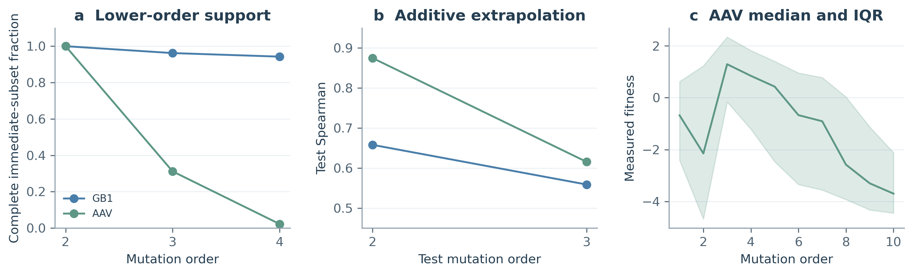

| 数据集 | 训练阶 → 测试阶 | 训练 / 测试数 | 所选 α | 测试 Spearman |
|---|---|---:|---:|---:|
| AAV | 0..1 → 2 | 533 / 9,900 | 0.01 | 0.8749 |
| AAV | 0..2 → 3 | 10,433 / 6,124 | 1 | 0.6155 |
| GB1 | 0..1 → 2 | 77 / 2,091 | 0.01 | 0.6580 |
| GB1 | 0..2 → 3 | 2,168 / 26,019 | 10 | 0.5589 |

::: {.cols}
### 验证分布必须对应研究问题

AAV 0..2→3 的内层留出验证相关为 0.9094，而 HD3 测试相关为 0.6155。前者描述训练阶数范围内的预测，后者直接检验跨阶外推。两者的落差提醒我们，随机留出分数不能替代目标外推分布上的验证。

这也是设置 GB1 冷启动分层的原因：改变初始测量覆盖，可以观察模型在低阶数据起步时如何组织组合搜索，而不仅是在较密集的随机样本中继续插值。

### 测量拓扑影响机制解释

对 k 阶变体，本文的“直接低阶完整率”要求其全部 k 个（k−1）阶组成变体均已测量；这不等于所有更低阶子集都完整。AAV HD3 的完整率为 31.17%，HD4 为 2.24%；GB1 对应为 96.22% 与 94.26%。

因此 AAV 高阶组合经常缺少用于分解相互作用的直接对照。其按阶数统计的 fitness 中位数也反映各阶已测样本的选择组成，不能单凭这些组间统计断言“增加一次突变”的因果效果。

### 残差把高分与失配联系起来

AAV HD2、HD3、HD4 的加性残差中位数分别为 −2.56、−5.20、−8.04，表现出随阶数加深的系统性高估。这提供了选择更丰富模型和设计诊断组合的依据。高阶上位效应研究也强调，组合测量与所用参考背景决定了相互作用的定义。[17]
:::
<!-- PAGE -->
## 附录 G　保守性与局部组合的补充统计

| 替换（零基坐标） | 保守性名次 / 28 | 熵（nats） |
|---|---:|---:|
| D0Q | 1 | 1.2339 |
| S17E | 26 | 2.9035 |
| V18A | 4 | 2.8555 |

::: {.cols}
### 可执行知识与经验图谱

系统中的知识既包括 HD 和 BLOSUM 等显式规则，也包括从已测标签形成的突变共现、富集和上下文关系。前者表达允许搜索的范围，后者把已有实验压缩为候选解释。AAV 自主路径从 measured set 构建图，并针对提名调用突变上下文查询。

这种图谱的主要价值是连接具体替换、观测与建议。富集表示已有样本中的关联；它会受采样策略和覆盖影响。因此图谱适合帮助研究者形成可检验的组合假设，而不是把共现直接解释为突变之间的因果机制。

GB1 的残基集中度给出一种直观的搜索诊断：该运行的 top-10 记录中，V54 位点全部选择 A，而其他位置保留更多变化。它说明高分提名收敛到了怎样的组成，便于进一步检查是否过早缩窄文库。

### 保守性作为可检查的先验

我们用 ESM-2 逐位 masked-token 的 20 种氨基酸分布熵表示位置保守性。熵越低，分布越集中。AAV 候选峰含 D0Q、S17E 与 V18A：对应保守性名次为第 1、第 26 和第 4，熵为 1.2339、2.9035 与 2.8555 nats（窗口零基坐标）。

这构成对硬保守性筛选的具体提醒：若排除最保守位置上的替换，D0Q 可能先于组合评估被移除。当前实现将保守性用于事后分析，没有把它接入在线筛选，因此这里讨论的是潜在筛选后果。

AAV 的保守性名次与最大单点增益相关为 ρ=0.4028（p=0.0335，n=28），与有益比例相关为 0.2972（p=0.1246）。这些不同指标表明自然序列先验与特定 assay 功能之间存在需要实测检验的关系。GB1 仅四个位点，相应 ρ=0.2、p=0.8，作为描述保留。

### 局部组合的完整测量

WT −0.918194；A 0.302016；B 3.287418；C 0.889606；AB 缺测；AC 2.087894；BC 5.770209；ABC 8.416205。A=D0Q、B=S17E、C=V18A。

相对单点加性的偏离为 +2.1008，缺失 AB 使纯三阶分解无法直接识别。ABC 的预测均值为 6.366779，全池排名 2,758、门禁池排名 426；首批高预测 48 条的平均预测/实测为 11.306529/2.883794。上述数值属于局部分析配置，不能与不同门禁构型的排名直接互换。
:::
<!-- PAGE -->
## 附录 H.1　历史首轮冒烟：配置与行为证据

| AAV 冒烟对照，seed 42 | control | reflexion |
|---|---:|---:|
| 残差记录 / 下一轮注入 | 记录 / 不注入 | 记录 / 注入 |
| 跳转工具触发轮次 | 5 | 2、5 |
| 六轮送测集合的逐轮交集 | 48/48，全部六轮 | 与 control 相同 |
| 实际查询 / 强命中 | 288 / 157 | 288 / 157 |
| 新增最佳 fitness | 8.4162 | 8.4162 |
| LLM 轮次成功（超时 240 秒） | 6/6 | 6/6 |

::: {.cols}
### 把预测与观测成对记录

首轮实验使用 one-hot 与成对交互 surrogate、48×6 预算、知识门禁和纯利用构型。两臂都在提名时记录预测，再获得 Oracle 测量并计算 residual=measured−predicted；只有 reflexion 臂将前轮残差信息注入下一轮 prompt。因此处理变量是残差的语言可见性。

这项记录使失败推荐具有可检查的对象。例如第 1 轮的一条序列预测为 8.3319，实测 −0.2235，残差 −8.5554；它被纳入下一轮的高估低适应度案例。运行预先设置的低值阈值为 0.2，报告将其视为本实验的操作性分类，而非独立的生物学致死判定。

### 动作提前，送测集合保持一致

首轮冒烟中，反思臂在第 2 轮调用 `redirect_batch`，对照臂在第 5 轮调用；这一提前调用在后续正式采集因子实验中未再出现。原始事件显示，提前调用时 `signature_size=0`，尚无用于跳离的簇签名。批次比较进一步显示，两臂六轮每轮的 48 个序列集合完全相同，最终 288 个查询及测量产量也一致。

该首轮的 compose 事件均为 allocation_source=v06_pure_exploit_default，表示工具默认分配；requested=1.0 在未传参分支回显默认值，不能据此认定 Agent 主动请求了纯利用。因而新增反思信息改变了工具动作，却没有通过当前构型转化为不同的实验选择。提前调用本身不作为搜索收益。

### 自述与行为应分别验证

反思臂总结声称依据残差排除了两个低适应度背景并优先采用实测支持的 motif。然而该臂实际测量的序列集合与对照完全一致。这个案例表明，包含“根据失败调整”的自然语言总结，并不自动证明选择行为已经调整。

首轮为单 seed 冒烟，适合定位信息、动作与执行之间的连接，不用于断言反思普遍有效或无效。本轮每臂 6/6 的成功率对应 240 秒超时，与 GB1 的 90 秒 Critic 调用属于不同任务、不同计数单位和运行条件，不作可靠性升幅比较。
:::
<!-- PAGE -->
## 附录 H.2　V0.8：采集档位 × 残差反思

| 采集档 · 反思 | 强命中 | 新增最佳值 | 参数来源 | 显式比例 / compose | 注入字符 | 秒 |
|---|---:|---:|---|---:|---:|---:|
| 质量感知 · 关 | 158 | 8.4162 | adaptive_default | 0/5 | 0 | 238 |
| 质量感知 · 开 | 158 | 8.4162 | adaptive_default | 0/5 | 6007 | 298 |
| 纯利用 · 关 | 157 | 8.4162 | v06_pure_exploit_default | 0/5 | 0 | 231 |
| 纯利用 · 开 | 157 | 8.4162 | v06_pure_exploit_default | 0/5 | 6075 | 283 |

::: {.cols}
### 完整运行条件

AAV、one-hot、成对交互 surrogate、知识门禁、48×6预算、seed42；四臂固定backtrack=semi。模型为gpt-5.6-sol，超时240秒，不重试。该组候选池27,832条，门禁后2,515条。各臂288/288预算，LLM成功6/6，超时和轮次错误为0。强命中阈值为2.6159；所有臂到达8.4162候选峰，仍低于初始已知9.536457。

### 候选集合和有效处理

同采集档内反思开/关六轮均为48/48交集。质量感知与纯利用之间每轮都有差异，交集依次42、37、33、31、33、32；哈希不同表示集合不相等，不表示交集为零。

质量感知默认的实际构成为第1轮42利用/6探索、第2轮44/4、第3轮47/1；第4轮起的compose为48/0，第5轮由redirect替代。四臂均在第5轮调用redirect，首轮冒烟的第2轮提前跳转未在该组运行中重复。

### 反思处理确实进入调用记录

两个反思臂分别产生5次卡片注入、6007和6075字符。增加的文本和墙钟说明系统传递了额外输入，并不直接证明模型采用了其中的推理。是否使用证据，需要继续核对工具参数与实际候选。

### 默认值与主动选择的区别

20次compose全部使用工具默认分配。代码在exploit_ratio=None时计算默认值并写入requested_exploit_ratio；只有显式传参分支才标agent_requested。因此参数来源字段是判断主动设参的依据，随后再读requested/effective以观察执行约束。

原始metrics、压缩事件与stdout日志均已在evidence/v08/中冻结。本报告对十二条新事件链逐条验证序号、前向哈希和残差恒等式；归档是复制已有实验，不是本轮重跑。
:::
<!-- PAGE -->
## 附录 H.3　V0.9：工具契约 × 残差反思

| 契约 · 反思 | 显式比例 / compose | 非空排除 | strong | top-10均值 | 秒 |
|---|---:|---:|---:|---:|---:|
| v08 · 关 | 0/5 | 不可用 | 158 | 6.8528 | 238 |
| v08 · 开 | 0/5 | 不可用 | 158 | 6.8528 | 266 |
| v09 · 关 | 5/5 | 0/5 | 153 | 6.8528 | 527 |
| v09 · 开 | 6/6 | 5/6 | 160 | 6.7102 | 573 |

| 轮次 | 1 | 2 | 3 | 4 | 5 | 6 |
|---|---:|---:|---:|---:|---:|---:|
| v08反思对照交集 / 48 | 48 | 48 | 48 | 48 | 48 | 48 |
| v09反思对照交集 / 48 | 46 | 42 | 37 | 25 | 26 | 8 |
| v09-on此前卡片motif数 | 0 | 9 | 16 | 20 | 26 | 34 |
| v09-on请求排除数 | 0 | 2 | 4 | 8 | 13 | 20 |

::: {.cols}
### 同条件与独立运行来源

四臂固定AAV、one-hot、epistasis、guardrail、acquisition=v05、backtrack=semi、seed42、48×6和240秒超时。各臂成功6/6，预算288，超时与轮次错误均为0；共用一个seed，不作为四个独立seed。门禁后候选为2,515条；旧固定预测器矩阵使用另一候选范围，跨研究不将绝对计数当配对效应。

新研究中的v08-off与前一研究v05-off，六轮集合哈希逐一相同；两条事件流时间戳不同，来自不同运行。这支持默认路径的结果复现。v09两臂的墙钟为527/573秒，旧契约为238/266秒，作为实际成本记录。

### 排除列表的逐轮核对

对每次compose，先汇总此前卡片中over>0的motif，再核对请求排除集。全部请求均有卡片出处；对应实际批次不含当轮排除的替换。第6轮排除20个、累计卡片覆盖34个，二者不是同一个计数。

最终排除集为A11S、D0K、E1D、E2Q、L22E、L22I、N21D、N21E、Q14H、Q14L、Q23E、R24N、R27W、S17N、S19G、T6A、T7V、V10E、Y15F、Y15W。排除基于样本背景中的相关观测，不据此认定替换具有普遍致死性。

### 时间顺序与卡片内容

第一张残差卡在第2轮注入。v09两臂第1轮利用比例已为0.90/0.85，集合已不同。两契约反思臂的五张卡片全文哈希均不同；总字符数为6007/7409。它们使用同类提取机制，但操作说明和后续测量内容不同，不能描述为相同输入文本的严格对照。
:::
<!-- PAGE -->
## 附录 H.4　工具契约的实现与解释

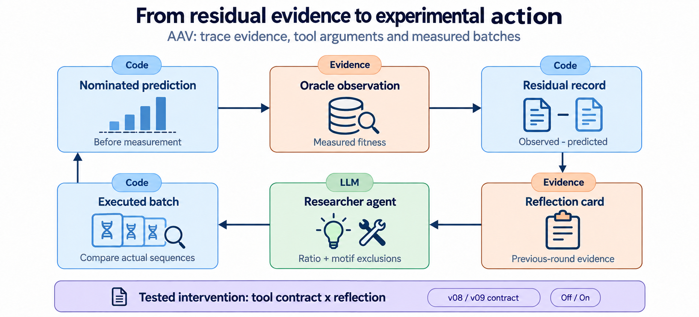

::: {.cols}
### 接口中的复合处理

固定提交377a614中的v09分支调整系统提示和轮次模板、释放利用比例下限、在工具schema中加入exclude_motifs，并改变反思卡末尾的操作说明。旧schema不包含排除参数。新工具按motif过滤后形成批次，候选不足时返回exclusion_too_strict，不静默缩批。

实际实现先获得模型分数，再筛选可选候选并构造批次。因此准确描述为“在选样前排除”，而非“在模型评分前排除”。

### 下限约束并未清空可行区间

_enforce_exploit_floor在CV≥0.8时设置0.8下限，最后两轮提高到0.9。即使默认比例为1.0，第四轮仍允许0.8–1.0，末两轮仍允许0.9–1.0。它限制探索幅度，不能据此断言任何下调都不可能。提示词偏好默认和标量接口无法表达具体替换排除，是另两层不同的约束。

### 停滞提示也要按调用分支核对

v09轮次模板进入专用分支；旧semi分支中追加的HARD STALL DETECTOR文本和stall_flag事件不在该分支生成。分析工具仍提供轨迹。实际v09两臂stall_flags均空，而旧契约记录第5、6轮。因此即使命令行都写semi，也不能把停滞提示视为完全相同的处理条件，更不能单独以无redirect证明反思收益。

### 本版采用的解释范围

两轮实验提供接口使用和行为变化的可核验证据。工具契约约束了证据可被表达为哪些动作；模型如何使用入口和是否产生收益，则是后续评价问题。复合处理、第一轮差异与单seed共同限定了归因范围。工程交接中的解释建议经过上述代码与事件核对后用于本报告。
:::
<!-- PAGE -->
## 附录 H.5　复现率、分母与峰值饱和

| 契约 · 反思（48×6） | r2–6复现候选 / 总数 | 合并率 | r4–6复现候选 / 总数 | 后段率 |
|---|---:|---:|---:|---:|
| v08 · 关 | 57/240 | 23.75% | 20/144 | 13.89% |
| v08 · 开 | 57/240 | 23.75% | 20/144 | 13.89% |
| v09 · 关 | 68/240 | 28.33% | 29/144 | 20.14% |
| v09 · 开 | 47/240 | 19.58% | 9/144 | 6.25% |

::: {.cols}
### 逐轮参照与合并计算

对轮次r，先从同一臂r−1轮实测fitness<0.2的序列中取所有替换，构成参照集合。再统计当前批次中含至少一个参照替换的候选，每个候选最多计一次。r1没有前轮，因此整体分母覆盖r2–6；48×6协议的整体分母为240，后段r4–6为144。

汇总使用总复现候选数除以总候选数，而非无权平均逐轮百分比。当前各轮等长时二者数值相同，但合并计数保留了可检查的分母。汇总层遇到无可用数据返回None，不把缺数据填成零。

### 与排除证据指标的差别

复现率使用上一轮所有低值样本中的替换，不要求预测高估；排除来源核对则使用此前累积注入卡片中over>0的替换。这是两个不同参照集合，不能把34个卡片motif或20个排除motif直接当作复现率的分母。

每个臂具有自己的前轮观测，所以指标同时反映历史测量与下一轮选择。共享替换不等于当前候选必然失败，较低复现率也不直接等于较高fitness。正文同时报告强命中、峰值及工具使用，避免由单一指标代替科学判断。

### 后段窗口与解释范围

第4–6轮是本轮分析中额外展示的后段窗口，属于探索性分段，r2–6整体结果同时保留。v09两臂r1已经不同，不能说r2之前所有臂都拥有完全相同的轨迹。

后段计数29/144与9/144形成清晰的单次行为差异；这不构成跨seed收益或统计显著性的证据。后续验证需在分析前固定窗口与主要指标。

### 48×6的峰值饱和

契约对照四臂均在第2轮达到候选池峰，此后四轮的峰值无法继续区分策略。strong与复现率仍随批次构成变化，分别描述产量和重复使用最近低值相关替换的程度。12×6结果见正文及附录H.6；它延后了共同达峰轮，但各臂峰值仍相同。各协议保留实际查询分母。
:::
<!-- PAGE -->
## 附录 H.6　12×6：完整运行与反思对照

| 契约 · 反思 | 显式比例 / compose | 非空排除 | strong | top-10均值 | 秒 |
|---|---:|---:|---:|---:|---:|
| v08 · 关 | 0/6 | 不可用 | 39 | 6.2944 | 278 |
| v08 · 开 | 0/6 | 不可用 | 39 | 6.2944 | 270 |
| v09 · 关 | 5/5 | 1/5 | 39 | 6.2944 | 615 |
| v09 · 开 | 5/5 | 3/5 | 42 | 6.4694 | 420 |

| 契约 · 反思 | r2–6复现 / 总数 | r4–6复现 / 总数 | 六轮反思对照交集 / 12 |
|---|---:|---:|---|
| v08 · 关 | 6/60 | 4/36 | 12、12、12、12、12、12 |
| v08 · 开 | 6/60 | 4/36 | 12、12、12、12、12、12 |
| v09 · 关 | 4/60 | 1/36 | 12、12、9、6、7、7 |
| v09 · 开 | 1/60 | 1/36 | 12、12、9、6、7、7 |

::: {.cols}
### 运行与可比范围

四臂固定AAV、one_hot、epistasis、guardrail、acquisition=v05、backtrack=semi、seed42，预算12×6。均完成72次查询、6/6 LLM轮次，240秒超时设置下无超时或轮次错误。各臂数据和stdout在evidence/v09-b12/归档。

预算参数通过V09_BUDGET=12进入同一运行脚本。377a614至04cf186之间的Agent主体与数据加载器未变化；04cf186新增指标汇总和预算入口。本次不是多seed重复，LLM运行差异仍需随事件记录解释。

### 排除入口的使用与证据来源

v09-on从第3轮开始请求排除N21D、R5S、T6Q，第5轮起加入D0K，均可在此前注入卡片中找到出处。该臂在第4轮使用redirect；其余compose比例为0.90、0.90、0.90、0.90、0.95。

v09-off第6轮请求排除E2Q，该臂没有结构化残差卡。上一轮实际测量了5个含E2Q的候选，fitness范围−0.1498至2.0619；模型自述依据近期测量选择排除。报告将参数和这些观测分别保留，不把模型自述当作内部因果解释，也不把“没有注入卡”简称为“无证据”。

### 与48×6的联系

两种预算的v08反思对照均未改变集合；v09对照均出现批次差异，但首次分叉时点、后段复现率和工具动作不同。较大预算的后段差异为29/144对9/144，小预算则同为1/36。跨协议观察说明，应同时保留整体/后段指标与fitness，不只选择最有利的一列。

四臂在第4轮达到候选峰，而最大已知值仍由冷启动集合持有。这一范围由数据切分决定；批次选择与实验产量是本任务的评价对象。
:::
<!-- PAGE -->
## 附录 H.7　协议敏感性与第八章的设计依据

| 协议 · v09臂 | compose所在轮 | 实际利用/探索分配（依轮序） |
|---|---|---|
| 48×6 · 反思关 | 1、2、3、4、6 | 43/5、42/6、43/5、44/4、46/2 |
| 48×6 · 反思开 | 1、2、3、4、5、6 | 41/7、41/7、42/6、42/6、44/4、46/2 |
| 12×6 · 反思关 | 1、2、3、5、6 | 11/1、11/1、11/1、11/1、12/0 |
| 12×6 · 反思开 | 1、2、3、5、6 | 11/1、11/1、11/1、11/1、11/1 |

::: {.cols}
### 连续请求经过整数分配

实现采用$n_{\mathrm{exploit}}=\operatorname{round}(n\rho)$，随后截断到$[0,n]$。在比例区间$[0.85,1]$内，批量48可表达41至48共8种利用数量，批量12可表达10至12共3种。Python采用平局取偶：当$10.5<12\rho<11.5$时映射为11，端点分别为10和12；不能将下端0.875写成包含在11/1区间内。

小预算反思臂五次请求对应相同11/1，说明连续参数变化可能被舍入消除。但固定分配仍可选出不同序列，排除列表与候选状态仍在变化。二者应分别审计，不能据数量恒定称整个选择机制失去作用。

### 观察没有唯一锁定成因

大预算下v09-off的strong为153，低于旧契约158；小预算两者均39，且v09-off的整体复现率更低。由此不能把“开放自主性降低产量”作为跨协议结论。整数分配提供了一个可检验解释，尚未单独控制比例、排除、提示和随机调用以识别各自贡献，故不把strong差归因于已证实的“探索税”。

离散排除可以在两种批量中表达同一替换约束，但其候选覆盖、收益和代价仍可能依赖预算。两个协议中观察到的使用行为，不等于其效应与批量无关。后段复现率在12×6的新契约两臂相同，也应保留。

### 环境约束与知识推理

十二臂原始事件中check_knowledge调用数均为0。代码在启用guardrail时于test入口执行门禁，compose也预筛候选；这说明可选查询未使用与约束未执行是不同问题。该计数只覆盖这些自主实验臂，不能外推到其他执行路径。

下一步保持门禁执行一致，比较是否向Agent返回候选被拒的原因、经验图谱和替代方向。这项实验检验“知识是否帮助推理”，区别于现有no-knowledge联合消融检验的“移除知识配置后发生什么”。

### 饱和后的预算仍有其他用途

48×6在r2达峰，此后192/288预算占三分之二；12×6在r4达峰，此后24/72占三分之一。这些查询对最高值已无区分力，但仍贡献产量与失败观测，不统称为浪费。跨协议保留分母、参考历史和不确定性；同协议内进行方法比较。
:::
<!-- PAGE -->
## 附录 I　后续配对验证与数据接收

::: {.cols}
### 多 seed 验证已具备明确触发条件

v09 已出现批次分叉，下一步应在独立 seed 中检验其稳定性。本版完成已有十二臂的机制分析，不把单 seed 的 153/160 当作稳定效应。建议后续固定 v09 契约与质量感知采集，在每个新 seed 内配对反思开/关，并保留旧契约作为必要的回归对照。

在运行前声明 seed 集合、最大预算和停止规则；不得因为初步方向改变 seed 或追加到期望结论为止。3–5 个新 seed 可作为初步重复，配对差及区间仍须反映小样本不确定性。

### 使初始条件可比较

记录并比较第一轮的比例、批次和工具参数；若两臂在残差注入前已经不同，应将这一差异作为解释起点。可另设固定首批实验，或在同一已测状态下回放不同卡片的对照，以更直接隔离残差信息的作用。记录本地随机种子、模型、时间与实际响应，避免把同 seed 等同于相同 LLM 轨迹。

### 拆分契约的组成项

当前契约是提示/轮次模板、利用比例约束、排除接口及卡片操作说明的联合处理。后续可分层消融这些组件，并单独对齐停滞提示路径。除产量外，检查候选覆盖、被排除组合的潜在价值与模型调用成本。排除有出处是可追溯性指标，不直接等于科学正确性。

### 目标与信息价值驱动的停止

设 V(D) 为数据D下最大期望决策效用，批次B的信息价值可写为：

$$\mathrm{EVI}(B)=\mathbb E_Y[V(D\cup\{B,Y\})]-V(D).$$

比较EVI与成本，需要明确效用、成本模型和预测校准；单个批次低EVI不代表所有后续实验无价值。达到预设工程阈值后进入独立确认，固定池最大值不作为真实实验的在线停止信号。

### 接收完整证据

每臂交付代码版本、完整命令、seed、特征与模型、门禁、契约及反思开关；附原始事件、指标、日志和实际预算。逐变体保留提名时预测、测量和残差；逐调用保留allocation_source、requested/effective、排除列表、来源轮次与卡片原文。

分析次序为参数来源与实际约束、预测时间顺序、实测批次、命中与成本、独立重复。每一步均使用实际执行记录；已有历史观察保留原版本，不以新结果改写其发生事实。
:::
<!-- PAGE -->
## 附录 J　工程交付、复现与图像制作

::: {.cols}
### 已完成的工程交付

系统交付包含预测器接口、角色与工具执行、规则验证、事件回放和交互 Demo。新版 Demo 展示预测器阶梯、α 扫描、冷启动轨迹及知识分析；本报告从对应数据重绘静态图，保证打印可读性和数字来源一致。

归档事件使用 gzip 保留完整记录，清单保存产物哈希；事件存储支持截断尾部恢复。其锁的保证限于同一 EventStore 实例内的线程，不延伸为跨进程写入保证。安装与运行入口、生产脚本和版本产物共同构成复现链，报告图表另附冻结快照和重建脚本。

### 当前证据指向的改进重点

研究的主要不确定性集中在策略重复、外推校准与执行接口。GB1 非随机策略和 AAV 知识消融需要更多独立运行；表征比较中的 Ridge 收益需要转移到闭环再检验；GB1 的 Critic 消费路径需要与其预期职责对齐。

这些问题具有明确的下一步：按同一查询预算重做语言介入对照，分别控制知识组成项，并将失败残差与下一轮实际决策绑定。我们以这些可检验的改进为后续实验目标。

### 报告重建与附属材料

正文与附录共同构成可阅读报告；原始 JSON、事件和代码快照随 evidence/ 交付。以 `sources.json` 固定 112 项输入。v0.5 底稿、本轮重排前稿以及收到的另一版 v0.6 均予保留；参考稿用于理解讨论，科学结论以源代码和冻结测量为准。

依次运行 `python3 build/figures.py`、`python3 build/build.py`、`node build/render.cjs` 与 `python3 build/verify.py` 重建、检查报告。Python 需 numpy、matplotlib、beautifulsoup4、PyMuPDF；另需 Pandoc、Playwright 与 Chrome。此过程不运行实验或在线 LLM。

### 插画与数据图的制作

图 1、3与S6使用内置生图工具，图11复用v0.5的生图输出；这些图延续 v0.5 的纯白背景、柔和蓝绿与简洁图标风格；提示词和输出哈希见 imagegen-prompts.json。接口未提供具体模型版本选择。其余统计图从冻结数值生成，保留可编辑 SVG 与高分辨率 PNG。插画用于解释机制，不承担定量证据。

所有图像内嵌在离线 HTML 中。引用记录、配置、调用与缺测细节在本附录直接呈现，原始事件保留机器可复核版本。
:::

<!-- PAGE -->
## 附录 K.1　证据文件与原始来源索引

快照路径相对evidence/，原始路径相对仓库；完整SHA-256、编码与版本见sources.json。旧交接保留历史，新解释以原始数据和当前工程交接为准。数据归档是复制既有运行，不是重跑。清洗AAV子集记录原始CSV指纹和过滤代码。

| # | 快照 | 原始来源 |
|---|---|---|
| 1 | `gb1_easy.json` | `harness/reports/workflow-v1.1/gb1/campaign_easy.metrics.json` |
| 2 | `gb1_hard.json` | `harness/reports/workflow-v1.1/gb1/campaign_hard.metrics.json` |
| 3 | `gb1_sparse.json` | `harness/reports/workflow-v1.1/gb1/campaign_sparse.metrics.json` |
| 4 | `gb1_llm.json` | `harness/reports/workflow-v1.1/gb1/campaign_llm.metrics.json` |
| 5 | `alpha.json` | `harness/reports/workflow-v1.0/gb1/predictor_alpha_sweep.json` |
| 6 | `scaling.json` | `harness/reports/workflow-v1.0/gb1/predictor_ladder_scaling_ablation.json` |
| 7 | `predictors.json` | `harness/reports/workflow-v1.1/gb1/predictor_metrics.json` |
| 8 | `aav_atomic.json` | `harness/reports/knowledge-ablation/atomic-seed0/metrics.json` |
| 9 | `aav_checkpoint.json` | `harness/reports/knowledge-ablation/checkpoint-seed0/metrics.json` |
| 10 | `aav_multiseed.json` | `harness/context/research/v07-multiseed-evidence/summary.json` |
| 11 | `epistasis.json` | `reports/final-report-v0.5/evidence/epistasis.json` |
| 12 | `aav_mechanism.md` | `harness/context/research/v07-peak-mechanism.md` |
| 13 | `multiseed_protocol.md` | `harness/context/research/v07-multiseed-robustness.md` |
| 14 | `handoff.md` | `harness/reports/REPORT-HANDOFF.md` |
| 15 | `v08-proposal-received.md` | `reports/v0.8-proposal-event-stream-reflexion.md` |
| 16 | `gb1_mutation_order.json` | `harness/reports/analysis-v0.1/gb1/mutation_order.json` |
| 17 | `gb1_conservation.json` | `harness/reports/analysis-v0.1/gb1/conservation.json` |
| 18 | `aav_mutation_order.json` | `harness/reports/analysis-v0.1/aav/mutation_order.json` |

<!-- PAGE -->
## 附录 K.2　证据文件与原始来源索引

快照路径相对evidence/，原始路径相对仓库；完整SHA-256、编码与版本见sources.json。旧交接保留历史，新解释以原始数据和当前工程交接为准。数据归档是复制既有运行，不是重跑。清洗AAV子集记录原始CSV指纹和过滤代码。

| # | 快照 | 原始来源 |
|---|---|---|
| 19 | `aav_conservation.json` | `harness/reports/analysis-v0.1/aav/conservation.json` |
| 20 | `code/agent/pipeline.py` | `agent/pipeline.py` |
| 21 | `code/evolution/campaign.py` | `evolution/campaign.py` |
| 22 | `code/agent/auto_researcher.py` | `agent/auto_researcher.py` |
| 23 | `code/agent/llm.py` | `agent/llm.py` |
| 24 | `code/knowledge/validators.py` | `knowledge/validators.py` |
| 25 | `code/knowledge/rules.yaml` | `knowledge/rules.yaml` |
| 26 | `code/events/store.py` | `events/store.py` |
| 27 | `code/models/train_ladder.py` | `models/train_ladder.py` |
| 28 | `code/models/alpha_sweep.py` | `models/alpha_sweep.py` |
| 29 | `code/features/conservation.py` | `features/conservation.py` |
| 30 | `code/analysis/mutation_order.py` | `analysis/mutation_order.py` |
| 31 | `code/app/demo.py` | `app/demo.py` |
| 32 | `gb1_easy.events.jsonl.gz` | `harness/reports/workflow-v1.1/gb1/campaign_easy.events.jsonl.gz` |
| 33 | `gb1_hard.events.jsonl.gz` | `harness/reports/workflow-v1.1/gb1/campaign_hard.events.jsonl.gz` |
| 34 | `gb1_sparse.events.jsonl.gz` | `harness/reports/workflow-v1.1/gb1/campaign_sparse.events.jsonl.gz` |
| 35 | `gb1_llm.events.jsonl.gz` | `harness/reports/workflow-v1.1/gb1/campaign_llm.events.jsonl.gz` |
| 36 | `v08-smoke-1seed.md` | `harness/tasks/task_91e931121d3ae400a0a2be246b-v0-8-aav/artifacts/smoke-1seed.md` |

<!-- PAGE -->
## 附录 K.3　证据文件与原始来源索引

快照路径相对evidence/，原始路径相对仓库；完整SHA-256、编码与版本见sources.json。旧交接保留历史，新解释以原始数据和当前工程交接为准。数据归档是复制既有运行，不是重跑。清洗AAV子集记录原始CSV指纹和过滤代码。

| # | 快照 | 原始来源 |
|---|---|---|
| 37 | `handoff-update-v08.md` | `harness/reports/REPORT-HANDOFF.md` |
| 38 | `v08-control.metrics.json` | `harness/tasks/task_91e931121d3ae400a0a2be246b-v0-8-aav/artifacts/smoke-control.metrics.json` |
| 39 | `v08-control.events.jsonl.gz` | `harness/tasks/task_91e931121d3ae400a0a2be246b-v0-8-aav/artifacts/smoke-control.events.jsonl.gz` |
| 40 | `v08-reflexion.metrics.json` | `harness/tasks/task_91e931121d3ae400a0a2be246b-v0-8-aav/artifacts/smoke-reflexion.metrics.json` |
| 41 | `v08-reflexion.events.jsonl.gz` | `harness/tasks/task_91e931121d3ae400a0a2be246b-v0-8-aav/artifacts/smoke-reflexion.events.jsonl.gz` |
| 42 | `gb1_llm_replication.json` | `harness/reports/workflow-v1.2/gb1/campaign_llm.metrics.json` |
| 43 | `gb1_llm_replication.events.jsonl` | `harness/reports/workflow-v1.2/gb1/campaign_llm.events.jsonl` |
| 44 | `handoff-update-replication.md` | `harness/reports/REPORT-HANDOFF.md` |
| 45 | `engineering/v07-handoff.md` | `reports/final-report-v0.6/v07-handoff-from-engineering.md` |
| 46 | `engineering/handoff-current.md` | `harness/reports/REPORT-HANDOFF.md` |
| 47 | `engineering/v08-factorial.md` | `harness/tasks/task_91e931121d3ae400a0a2be246b-v0-8-aav/artifacts/factorial-2x2-seed42.md` |
| 48 | `engineering/v09-contract.md` | `harness/tasks/task_feb731c779788be5bfff65e979-v0-9/artifacts/contract-2x2-seed42.md` |
| 49 | `code-v09/agent/auto_researcher.py` | `agent/auto_researcher.py` |
| 50 | `code-v09/events/reflexion.py` | `events/reflexion.py` |
| 51 | `code-v09/scripts/run_v08_factorial.sh` | `scripts/run_v08_factorial.sh` |
| 52 | `code-v09/scripts/run_v09_contract.sh` | `scripts/run_v09_contract.sh` |
| 53 | `code-v09/scripts/compare_v08_arms.py` | `scripts/compare_v08_arms.py` |
| 54 | `code-v09/tests/test_auto_researcher_contract.py` | `tests/test_auto_researcher_contract.py` |

<!-- PAGE -->
## 附录 K.4　证据文件与原始来源索引

快照路径相对evidence/，原始路径相对仓库；完整SHA-256、编码与版本见sources.json。旧交接保留历史，新解释以原始数据和当前工程交接为准。数据归档是复制既有运行，不是重跑。清洗AAV子集记录原始CSV指纹和过滤代码。

| # | 快照 | 原始来源 |
|---|---|---|
| 55 | `code-v09/tests/test_reflexion.py` | `tests/test_reflexion.py` |
| 56 | `code-v09/tests/test_auto_researcher_backtrack.py` | `tests/test_auto_researcher_backtrack.py` |
| 57 | `code-v09/events/store.py` | `events/store.py` |
| 58 | `v08/acq-v05_reflexion-off_seed-42/metrics.json` | `tmp/v08-factorial/acq-v05_reflexion-off_seed-42/agentic.metrics.json` |
| 59 | `v08/acq-v05_reflexion-off_seed-42/events.jsonl.gz` | `tmp/v08-factorial/acq-v05_reflexion-off_seed-42/agentic.events.jsonl` |
| 60 | `v08/acq-v05_reflexion-off_seed-42/stdout.log` | `tmp/v08-factorial/acq-v05_reflexion-off_seed-42.stdout.log` |
| 61 | `v08/acq-v05_reflexion-off_seed-42/wall-seconds.txt` | `tmp/v08-factorial/acq-v05_reflexion-off_seed-42.wall-seconds.txt` |
| 62 | `v08/acq-v05_reflexion-on_seed-42/metrics.json` | `tmp/v08-factorial/acq-v05_reflexion-on_seed-42/agentic.metrics.json` |
| 63 | `v08/acq-v05_reflexion-on_seed-42/events.jsonl.gz` | `tmp/v08-factorial/acq-v05_reflexion-on_seed-42/agentic.events.jsonl` |
| 64 | `v08/acq-v05_reflexion-on_seed-42/stdout.log` | `tmp/v08-factorial/acq-v05_reflexion-on_seed-42.stdout.log` |
| 65 | `v08/acq-v05_reflexion-on_seed-42/wall-seconds.txt` | `tmp/v08-factorial/acq-v05_reflexion-on_seed-42.wall-seconds.txt` |
| 66 | `v08/acq-v06_reflexion-off_seed-42/metrics.json` | `tmp/v08-factorial/acq-v06_reflexion-off_seed-42/agentic.metrics.json` |
| 67 | `v08/acq-v06_reflexion-off_seed-42/events.jsonl.gz` | `tmp/v08-factorial/acq-v06_reflexion-off_seed-42/agentic.events.jsonl` |
| 68 | `v08/acq-v06_reflexion-off_seed-42/stdout.log` | `tmp/v08-factorial/acq-v06_reflexion-off_seed-42.stdout.log` |
| 69 | `v08/acq-v06_reflexion-off_seed-42/wall-seconds.txt` | `tmp/v08-factorial/acq-v06_reflexion-off_seed-42.wall-seconds.txt` |
| 70 | `v08/acq-v06_reflexion-on_seed-42/metrics.json` | `tmp/v08-factorial/acq-v06_reflexion-on_seed-42/agentic.metrics.json` |
| 71 | `v08/acq-v06_reflexion-on_seed-42/events.jsonl.gz` | `tmp/v08-factorial/acq-v06_reflexion-on_seed-42/agentic.events.jsonl` |
| 72 | `v08/acq-v06_reflexion-on_seed-42/stdout.log` | `tmp/v08-factorial/acq-v06_reflexion-on_seed-42.stdout.log` |

<!-- PAGE -->
## 附录 K.5　证据文件与原始来源索引

快照路径相对evidence/，原始路径相对仓库；完整SHA-256、编码与版本见sources.json。旧交接保留历史，新解释以原始数据和当前工程交接为准。数据归档是复制既有运行，不是重跑。清洗AAV子集记录原始CSV指纹和过滤代码。

| # | 快照 | 原始来源 |
|---|---|---|
| 73 | `v08/acq-v06_reflexion-on_seed-42/wall-seconds.txt` | `tmp/v08-factorial/acq-v06_reflexion-on_seed-42.wall-seconds.txt` |
| 74 | `v09/contract-v08_reflexion-off_seed-42/metrics.json` | `harness/reports/v09-contract/contract-v08_reflexion-off_seed-42/agentic.metrics.json` |
| 75 | `v09/contract-v08_reflexion-off_seed-42/events.jsonl.gz` | `harness/reports/v09-contract/contract-v08_reflexion-off_seed-42/agentic.events.jsonl.gz` |
| 76 | `v09/contract-v08_reflexion-off_seed-42/stdout.log` | `tmp/v09-contract/contract-v08_reflexion-off_seed-42.stdout.log` |
| 77 | `v09/contract-v08_reflexion-off_seed-42/wall-seconds.txt` | `tmp/v09-contract/contract-v08_reflexion-off_seed-42.wall-seconds.txt` |
| 78 | `v09/contract-v08_reflexion-on_seed-42/metrics.json` | `harness/reports/v09-contract/contract-v08_reflexion-on_seed-42/agentic.metrics.json` |
| 79 | `v09/contract-v08_reflexion-on_seed-42/events.jsonl.gz` | `harness/reports/v09-contract/contract-v08_reflexion-on_seed-42/agentic.events.jsonl.gz` |
| 80 | `v09/contract-v08_reflexion-on_seed-42/stdout.log` | `tmp/v09-contract/contract-v08_reflexion-on_seed-42.stdout.log` |
| 81 | `v09/contract-v08_reflexion-on_seed-42/wall-seconds.txt` | `tmp/v09-contract/contract-v08_reflexion-on_seed-42.wall-seconds.txt` |
| 82 | `v09/contract-v09_reflexion-off_seed-42/metrics.json` | `harness/reports/v09-contract/contract-v09_reflexion-off_seed-42/agentic.metrics.json` |
| 83 | `v09/contract-v09_reflexion-off_seed-42/events.jsonl.gz` | `harness/reports/v09-contract/contract-v09_reflexion-off_seed-42/agentic.events.jsonl.gz` |
| 84 | `v09/contract-v09_reflexion-off_seed-42/stdout.log` | `tmp/v09-contract/contract-v09_reflexion-off_seed-42.stdout.log` |
| 85 | `v09/contract-v09_reflexion-off_seed-42/wall-seconds.txt` | `tmp/v09-contract/contract-v09_reflexion-off_seed-42.wall-seconds.txt` |
| 86 | `v09/contract-v09_reflexion-on_seed-42/metrics.json` | `harness/reports/v09-contract/contract-v09_reflexion-on_seed-42/agentic.metrics.json` |
| 87 | `v09/contract-v09_reflexion-on_seed-42/events.jsonl.gz` | `harness/reports/v09-contract/contract-v09_reflexion-on_seed-42/agentic.events.jsonl.gz` |
| 88 | `v09/contract-v09_reflexion-on_seed-42/stdout.log` | `tmp/v09-contract/contract-v09_reflexion-on_seed-42.stdout.log` |
| 89 | `v09/contract-v09_reflexion-on_seed-42/wall-seconds.txt` | `tmp/v09-contract/contract-v09_reflexion-on_seed-42.wall-seconds.txt` |
| 90 | `code-metrics/reflexion.py` | `events/reflexion.py` |

<!-- PAGE -->
## 附录 K.6　证据文件与原始来源索引

快照路径相对evidence/，原始路径相对仓库；完整SHA-256、编码与版本见sources.json。旧交接保留历史，新解释以原始数据和当前工程交接为准。数据归档是复制既有运行，不是重跑。清洗AAV子集记录原始CSV指纹和过滤代码。

| # | 快照 | 原始来源 |
|---|---|---|
| 91 | `code-metrics/compare_v08_arms.py` | `scripts/compare_v08_arms.py` |
| 92 | `code-metrics/run_v09_contract.sh` | `scripts/run_v09_contract.sh` |
| 93 | `code-metrics/test_reflexion.py` | `tests/test_reflexion.py` |
| 94 | `aav-domain/cleaned.csv.gz` | `data/aav/full_data.csv` |
| 95 | `code-v09/evolution/datasets.py` | `evolution/datasets.py` |
| 96 | `v09-b12/contract-v08_reflexion-off_seed-42/metrics.json` | `tmp/v09-b12/contract-v08_reflexion-off_seed-42/agentic.metrics.json` |
| 97 | `v09-b12/contract-v08_reflexion-off_seed-42/events.jsonl.gz` | `tmp/v09-b12/contract-v08_reflexion-off_seed-42/agentic.events.jsonl` |
| 98 | `v09-b12/contract-v08_reflexion-off_seed-42/stdout.log` | `tmp/v09-b12/contract-v08_reflexion-off_seed-42.stdout.log` |
| 99 | `v09-b12/contract-v08_reflexion-off_seed-42/wall-seconds.txt` | `tmp/v09-b12/contract-v08_reflexion-off_seed-42.wall-seconds.txt` |
| 100 | `v09-b12/contract-v08_reflexion-on_seed-42/metrics.json` | `tmp/v09-b12/contract-v08_reflexion-on_seed-42/agentic.metrics.json` |
| 101 | `v09-b12/contract-v08_reflexion-on_seed-42/events.jsonl.gz` | `tmp/v09-b12/contract-v08_reflexion-on_seed-42/agentic.events.jsonl` |
| 102 | `v09-b12/contract-v08_reflexion-on_seed-42/stdout.log` | `tmp/v09-b12/contract-v08_reflexion-on_seed-42.stdout.log` |
| 103 | `v09-b12/contract-v08_reflexion-on_seed-42/wall-seconds.txt` | `tmp/v09-b12/contract-v08_reflexion-on_seed-42.wall-seconds.txt` |
| 104 | `v09-b12/contract-v09_reflexion-off_seed-42/metrics.json` | `tmp/v09-b12/contract-v09_reflexion-off_seed-42/agentic.metrics.json` |
| 105 | `v09-b12/contract-v09_reflexion-off_seed-42/events.jsonl.gz` | `tmp/v09-b12/contract-v09_reflexion-off_seed-42/agentic.events.jsonl` |
| 106 | `v09-b12/contract-v09_reflexion-off_seed-42/stdout.log` | `tmp/v09-b12/contract-v09_reflexion-off_seed-42.stdout.log` |
| 107 | `v09-b12/contract-v09_reflexion-off_seed-42/wall-seconds.txt` | `tmp/v09-b12/contract-v09_reflexion-off_seed-42.wall-seconds.txt` |
| 108 | `v09-b12/contract-v09_reflexion-on_seed-42/metrics.json` | `tmp/v09-b12/contract-v09_reflexion-on_seed-42/agentic.metrics.json` |

<!-- PAGE -->
## 附录 K.7　证据文件与原始来源索引

快照路径相对evidence/，原始路径相对仓库；完整SHA-256、编码与版本见sources.json。旧交接保留历史，新解释以原始数据和当前工程交接为准。数据归档是复制既有运行，不是重跑。清洗AAV子集记录原始CSV指纹和过滤代码。

| # | 快照 | 原始来源 |
|---|---|---|
| 109 | `v09-b12/contract-v09_reflexion-on_seed-42/events.jsonl.gz` | `tmp/v09-b12/contract-v09_reflexion-on_seed-42/agentic.events.jsonl` |
| 110 | `v09-b12/contract-v09_reflexion-on_seed-42/stdout.log` | `tmp/v09-b12/contract-v09_reflexion-on_seed-42.stdout.log` |
| 111 | `v09-b12/contract-v09_reflexion-on_seed-42/wall-seconds.txt` | `tmp/v09-b12/contract-v09_reflexion-on_seed-42.wall-seconds.txt` |
| 112 | `v07-handoff-02-protocol-and-chapter8.md` | `reports/final-report-v0.6/v07-handoff-02-protocol-and-chapter8.md` |
<!-- PAGE -->
## 附录 L.1　数学定义：协议、指标与预测模型

::: {.cols}
### 序列空间与标签揭示

$L$ 个可替换位置的理论序列空间为 $20^L$；固定测量池 $\Omega$ 是其中有标签的子集。令 $M_0,Q_0$ 为已知与未测序列集，$B_t\subseteq Q_{t-1}$ 为冻结的第t轮批次。标签揭示后：

$$M_t=M_{t-1}\cup B_t,$$
$$Q_t=Q_{t-1}\setminus B_t.$$

$S_T=\bigcup_{t=1}^{T}B_t$ 为新增测量集合；已测标签与序列关联存于训练数据。分别定义：

$$f_{\mathrm{new}}(T)=\max_{x\in S_T}f(x),$$
$$f_{\mathrm{all}}(T)=\max_{x\in M_0\cup S_T}f(x).$$

强命中数为 $N_{\mathrm{strong}}=\sum_{x\in S_T}\mathbf 1[f(x)\ge\tau]$。阈值 $\tau$ 按实验预先固定，分母为实际查询数，不是名义预算。AAV候选池上界低于初始最优，因此这两个最大值不同是任务划分的结果。

### 预测评价

Spearman 是真值与预测的秩相关，Pearson 是原值相关；秩并列按实现的平均秩处理。平方误差定义为：

$$\mathrm{MSE}=\frac1N\sum_{i=1}^{N}(y_i-\hat y_i)^2.$$

预测器阶梯的top-k重合率为 $|\operatorname{Top}_k(y)\cap\operatorname{Top}_k(\hat y)|/k$，其中 $k=\max(1,\lceil0.01N\rceil)$；2000条测试集对应20条，而不是一次campaign的批次大小。

### Ridge 与交互表示

$$\min_{b,w}\ \|y-b\mathbf 1-\Phi w\|_2^2+\alpha\|w\|_2^2.$$

$\Phi$ 可以是one-hot、ESM或显式交互特征；截距不受惩罚。v0.5中同一惩罚系数记为$\lambda$，本版统一为代码中的$\alpha$，避免与探索系数混淆。对特征和标签中心化后可写成原稿的$\min_w\|y-\Phi w\|^2+\alpha\|w\|^2$。

$$\hat f_{\mathrm{add}}(x)=b+\sum_i h_i(x_i),$$
$$\hat f_{\mathrm{pair}}(x)=\hat f_{\mathrm{add}}(x)+\sum_{i<j}J_{ij}(x_i,x_j).$$

成对模型由保留的one-hot列扩展二阶交互并做Ridge拟合；系数反映统计表示，不直接等于生物物理作用。AAV实现以训练集内80/20留出选择$\alpha\in\{1,10,100,300\}$，随后全已知集拟合均值；其预测方差另由三个bootstrap模型计算。
:::
<!-- PAGE -->
## 附录 L.2　数学定义：不确定性、采集与覆盖提案

::: {.cols}
### 集成分歧与均值来源

设 $K$ 个bootstrap估计为 $\hat f^{(k)}(x)$，先计算：

$$\bar f(x)=\frac1K\sum_{k=1}^{K}\hat f^{(k)}(x),$$
$$\hat\sigma^2(x)=\frac1K\sum_{k=1}^{K}\bigl(\hat f^{(k)}(x)-\bar f(x)\bigr)^2.$$

方差使用总体分母K。GB1普通集成以$\bar f$作为均值；AAV成对模型的$\hat\mu=\hat f_{\mathrm{full}}$来自全数据单次拟合，方差则来自三个固定重采样模型。二者不能都解释成同一组预测的样本统计量。

### UCB 与GB1知识分数

$$a_t^{\mathrm{UCB}}(x)=\hat\mu_t(x)+\beta\hat\sigma_t(x).$$

$\beta$控制探索强度。GB1知识配置另外加入$0.30s_{\mathrm{BLOSUM}}$，并用$\beta=0.75$。这些系数是具体配置；模型分歧不是已校准的后验区间，公式也不自动继承GP-UCB理论保证。[18]

### AAV比例混合采集

质量感知默认值依据验证秩相关$q_t$和进度$t/T$：

$$\rho_t^{\mathrm{def}}=\min\!\left(1,\max\!\left(0.4,q_t^2+0.3\frac{t}{T}\right)\right).$$

缺失或非有限$q_t$按0处理；纯利用默认为1。旧契约将实际比例设为$\max(\rho_t^{\mathrm{req}},\ell_t)$，高CV时$\ell_t=0.8$、末两轮为0.9；新契约释放该下限。allocation_source另行区分显式请求与默认回显。

对可选池足够大的n条批次，利用数为$\operatorname{clip}(\operatorname{round}(n\rho_t),0,n)$，其余按探索分数选择、去重并必要时补齐。实际探索排序为：

$$a_t^{\mathrm{explore}}(x)=\hat\mu_t(x)+3\hat\sigma_t(x)+u_x,$$
$$u_x\sim\operatorname{Uniform}(0,1).$$

这与纯UCB或几何距离最大化不同，公式对应固定代码的混合实现。

### 覆盖与结构权重：尚待验证的提案

令$P(x)$为候选含有的替换对，$n_t(p),n_B(p)$为历史/当前批次出现次数，$w_p\ge0$为权重：

$$C_t(x\mid B)=\frac1{|P(x)|}\sum_{p\in P(x)}\frac{w_p}{1+n_t(p)+n_B(p)}.$$

$P(x)$为空时定义C为0。它优先覆盖较少出现的组合，是启发式分数而非校准信息增益。若结构映射可靠，可探索：

$$w_{ij}=1+\exp[-(d_{ij}/d_0)^2],\qquad d_0>0.$$

$d_0$为待验证超参数，不是普适接触阈值。覆盖引导和结构加权在本版仍为提案，不归入已运行契约实验的处理。
:::
<!-- PAGE -->
## 附录 L.3　数学定义：上位效应、残差与行为评价

::: {.cols}
### 加性偏离与三阶差分

令A=D0Q、B=S17E、C=V18A。由WT和单点标签构造：

$$\hat f_{\mathrm{add}}(ABC)=f_A+f_B+f_C-2f_{WT}$$
$$=6.315428.$$

按保存到六位小数的局部数据，$f_{ABC}-\hat f_{\mathrm{add}}=2.100777$。纯三阶差分为：

$$\begin{aligned}\epsilon_{ABC}={}&f_{ABC}-f_{AB}-f_{AC}-f_{BC}\\&+f_A+f_B+f_C-f_{WT}.\end{aligned}$$

AB缺测，因此该差分不能直接识别；加性偏离不能全部归于三阶作用。v0.5的$8.416205-7.828968=0.587237$是与旧FULL轨迹的历史算术比较。本版保留其来源说明，不用它概括新契约对照，因为新对照已有不同的结果和预算。

### 提名时残差

$$r_t(x)=f(x)-\hat\mu_t^{\mathrm{nom}}(x).$$

预测值在Oracle标签加入和模型重拟合前冻结。后续重算的预测不能替代当时预测。残差卡将高估且实测低于0.2的观测归并为替换信息；0.2是操作性阈值，不是跨背景的生物致死定义。

### 复现率及合并分母

令$\mathcal M(x)$为序列的替换集合。上一轮低值相关替换集合为：

$$L_{t-1}=\bigcup_{\substack{x\in B_{t-1}\\f(x)<0.2}}\mathcal M(x).$$

当前复现候选数与窗口合并率为：

$$k_t=\sum_{x\in B_t}\mathbf1[\mathcal M(x)\cap L_{t-1}\ne\varnothing],$$
$$R_{\mathcal T}=\frac{\sum_{t\in\mathcal T}k_t}{\sum_{t\in\mathcal T}|B_t|}.$$

整体窗口为r2–6，后段为r4–6；分母为0时汇总值缺失（None）。各臂的$L_{t-1}$由自己的观测构造，所以R不等于在共同黑名单上的错误率。

### 排除列表的来源与实际过滤

令$E_{<t}$为此前卡片覆盖的替换，$X_t$为该次compose请求排除集，G为知识门禁池。核对$X_t\subseteq E_{<t}$，并检验：

$$Q_t^{\mathrm{allow}}=\{x\in Q_{t-1}\cap G:\mathcal M(x)\cap X_t=\varnothing\}.$$

该来源关系说明参数可追溯，不证明所有排除都具有正收益。实测批次必须来自允许集合并满足预算条件。

### 停止价值与公式恢复索引

EVI的定义和成本条件见附录I，继续作为设计提案。v0.5的14个显示公式块（其中数值续行单独成块），连同理论空间、UCB和结构距离核均已逐项对照。协议/最大值/Ridge/表示位于L.1，采集/覆盖/距离核位于L.2，上位差分和历史差值说明位于本页，EVI位于I；完整对照记录见formula-inventory.json。
:::
